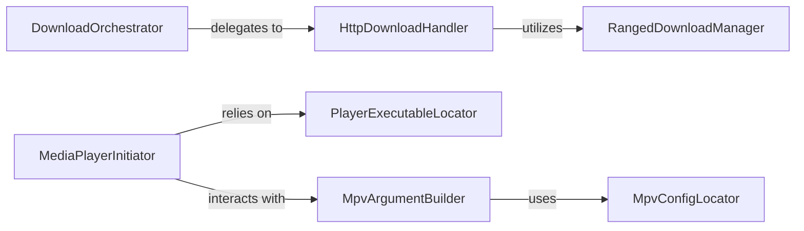

## Details

The `Media Playback & Download` subsystem is responsible for the final stages of media consumption, encompassing both the downloading of content and the initiation of external media players for streaming or local playback.

### DownloadOrchestrator
Manages the entire media download lifecycle, including preparation, execution, and potential post-processing. It acts as the primary interface for initiating downloads.

**Related Classes/Methods**:

- <a href="https://github.com/anime-dl/anime-downloader/blob/master/anime_downloader/downloader/base_downloader.py" target="_blank" rel="noopener noreferrer">`DownloadOrchestrator`</a>

### HttpDownloadHandler
Executes the core HTTP download operations. It handles the mechanics of fetching content from a URL.

**Related Classes/Methods**:

- <a href="https://github.com/anime-dl/anime-downloader/blob/master/anime_downloader/downloader/http_downloader.py" target="_blank" rel="noopener noreferrer">`HttpDownloadHandler`</a>

### RangedDownloadManager
Specializes in handling partial or resumable downloads by managing byte ranges, ensuring efficient and robust downloading.

**Related Classes/Methods**:

- <a href="https://github.com/anime-dl/anime-downloader/blob/master/anime_downloader/downloader/http_downloader.py" target="_blank" rel="noopener noreferrer">`RangedDownloadManager`</a>

### MediaPlayerInitiator
Initiates the playback of media by launching an external media player. It serves as the primary interface for streaming or playing downloaded content.

**Related Classes/Methods**:

- <a href="https://github.com/anime-dl/anime-downloader/blob/master/anime_downloader/players/baseplayer.py" target="_blank" rel="noopener noreferrer">`MediaPlayerInitiator`</a>

### PlayerExecutableLocator
Identifies and provides the correct executable path for the chosen media player based on the operating system and configuration, abstracting platform-specific details.

**Related Classes/Methods**:

- <a href="https://github.com/anime-dl/anime-downloader/blob/master/anime_downloader/players/baseplayer.py" target="_blank" rel="noopener noreferrer">`PlayerExecutableLocator`</a>

### MpvArgumentBuilder
Constructs the specific command-line arguments required to launch and configure the MPV media player, tailoring playback settings.

**Related Classes/Methods**:

- <a href="https://github.com/anime-dl/anime-downloader/blob/master/anime_downloader/players/mpv.py" target="_blank" rel="noopener noreferrer">`MpvArgumentBuilder`</a>

### MpvConfigLocator
Locates the configuration file for the MPV player, allowing for customized playback settings to be applied.

**Related Classes/Methods**:

- <a href="https://github.com/anime-dl/anime-downloader/blob/master/anime_downloader/players/mpv.py" target="_blank" rel="noopener noreferrer">`MpvConfigLocator`</a>

### [FAQ](https://github.com/CodeBoarding/GeneratedOnBoardings/tree/main?tab=readme-ov-file#faq)