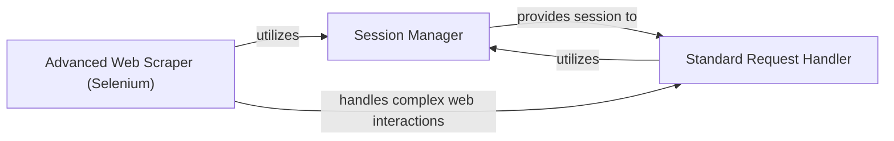

## Details

The web interaction subsystem of `anime_downloader` is built around a central `Session Manager` that provides a persistent and stateful HTTP session. This session is leveraged by two distinct components for web data retrieval: the `Standard Request Handler` and the `Advanced Web Scraper (Selenium)`. The `Standard Request Handler` offers a simplified interface for common HTTP GET/POST requests, directly utilizing the `Session Manager` for its operations. In parallel, the `Advanced Web Scraper (Selenium)` handles more complex web scraping scenarios, such as bypassing advanced protections, by orchestrating browser-based interactions. While both components rely on the underlying `Session Manager` for network connectivity and session management, they operate independently in terms of their request mechanisms, with the `Advanced Web Scraper` addressing needs beyond the capabilities of the `Standard Request Handler`.

### Session Manager
This component is responsible for managing a global, persistent HTTP session, typically leveraging `requests.Session`. It maintains connection pools, handles cookies, and applies default configurations (e.g., headers, proxies) across all requests. Its core function is to ensure efficient, stateful, and consistent interactions with web servers, acting as the foundational layer for all HTTP communication.

**Related Classes/Methods**:

- <a href="https://github.com/anime-dl/anime-downloader/blob/master/anime_downloader/session.py#L1-L1000" target="_blank" rel="noopener noreferrer">`anime_downloader.session`:1-1000</a>

### Standard Request Handler
Provides a simplified, high-level interface for making standard HTTP GET/POST requests. It abstracts away direct interaction with the underlying session object, offering a clean API for common web fetching tasks. This component acts as the primary entry point for most basic web data retrieval, potentially including features like response body logging for debugging.

**Related Classes/Methods**:

- <a href="https://github.com/anime-dl/anime-downloader/blob/master/anime_downloader/sites/helpers/request.py#L1-L1000" target="_blank" rel="noopener noreferrer">`anime_downloader.sites.helpers.request`:1-1000</a>

### Advanced Web Scraper (Selenium)
This component orchestrates advanced web scraping operations using Selenium. Its primary role is to navigate and bypass complex web challenges, such as Cloudflare protection, by simulating a real browser. It manages browser driver selection, caching of browser data, and provides a Selenium-based request mechanism for scenarios where simple HTTP requests are insufficient.

**Related Classes/Methods**:

- <a href="https://github.com/anime-dl/anime-downloader/blob/master/anime_downloader/sites/helpers/selescrape.py#L1-L1000" target="_blank" rel="noopener noreferrer">`anime_downloader.sites.helpers.selescrape`:1-1000</a>

### [FAQ](https://github.com/CodeBoarding/GeneratedOnBoardings/tree/main?tab=readme-ov-file#faq)