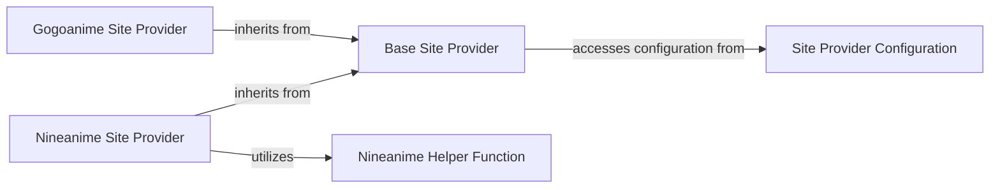

## Details

The `Site Provider System` is built around a clear **Plugin/Provider** architectural pattern. The `Base Site Provider` acts as the central abstraction, defining the contract for all site-specific implementations. Concrete providers like `Gogoanime Site Provider` and `Nineanime Site Provider` extend this base, providing specialized web scraping logic for their respective sites. The `Site Provider Configuration` component offers externalized settings that influence the behavior of these providers, promoting flexibility. Finally, the `Nineanime Helper Function` demonstrates how site-specific complexities can be encapsulated and utilized by a particular provider, maintaining modularity within the subsystem. This structure allows for easy addition of new site providers without modifying existing core logic.

### Base Site Provider
Serves as the abstract base class for all site-specific providers. It defines the common interface and core functionalities (e.g., `search`, `get_episode_url`, `get_anime_info`) that concrete site providers must implement. This component ensures a consistent API for the rest of the system to interact with different anime sources.

**Related Classes/Methods**:

- <a href="https://github.com/anime-dl/anime-downloader/blob/master/anime_downloader/sites/anime.py" target="_blank" rel="noopener noreferrer">`anime_downloader.sites.anime.BaseSiteProvider`</a>
- <a href="https://github.com/anime-dl/anime-downloader/blob/master/anime_downloader/sites/anime.py" target="_blank" rel="noopener noreferrer">`anime_downloader.sites.anime.BaseSiteProvider:search`</a>
- <a href="https://github.com/anime-dl/anime-downloader/blob/master/anime_downloader/sites/anime.py" target="_blank" rel="noopener noreferrer">`anime_downloader.sites.anime.BaseSiteProvider:get_episode_url`</a>
- <a href="https://github.com/anime-dl/anime-downloader/blob/master/anime_downloader/sites/anime.py" target="_blank" rel="noopener noreferrer">`anime_downloader.sites.anime.BaseSiteProvider:get_anime_info`</a>

### Gogoanime Site Provider
A concrete implementation of the `Base Site Provider` tailored for scraping anime data and video sources specifically from Gogoanime. It contains the specific web scraping logic, including HTML parsing and URL extraction, required to interact with the Gogoanime website.

**Related Classes/Methods**:

- <a href="https://github.com/anime-dl/anime-downloader/blob/master/anime_downloader/sites/gogoanime.py#L47-L116" target="_blank" rel="noopener noreferrer">`anime_downloader.sites.gogoanime.Gogoanime`:47-116</a>

### Nineanime Site Provider
Another concrete implementation of the `Base Site Provider`, designed to retrieve anime data and video sources from Nineanime. This component handles the unique challenges of Nineanime's website structure and any specific decoding requirements for its video source URLs.

**Related Classes/Methods**:

- <a href="https://github.com/anime-dl/anime-downloader/blob/master/anime_downloader/sites/nineanime.py#L12-L61" target="_blank" rel="noopener noreferrer">`anime_downloader.sites.nineanime.Nineanime`:12-61</a>

### Site Provider Configuration
Manages and provides configuration settings that influence the behavior of site providers, particularly concerning how video sources are sorted or prioritized. This component allows for flexible and customizable behavior of the scraping process without altering the core logic of individual providers.

**Related Classes/Methods**:

- <a href="https://github.com/anime-dl/anime-downloader/blob/master/anime_downloader/sites/anime.py#L326-L328" target="_blank" rel="noopener noreferrer">`anime_downloader.sites.anime.config`:326-328</a>

### Nineanime Helper Function
A utility component specifically designed to perform string decoding or parsing operations required by the `Nineanime Site Provider`. This encapsulates site-specific, often complex, logic for handling obfuscated or specially formatted video URLs, ensuring the `Nineanime Site Provider` remains focused on higher-level scraping tasks.

**Related Classes/Methods**:

- <a href="https://github.com/anime-dl/anime-downloader/blob/master/anime_downloader/sites/nineanime.py#L70-L138" target="_blank" rel="noopener noreferrer">`anime_downloader.sites.nineanime.decodeString`:70-138</a>

### [FAQ](https://github.com/CodeBoarding/GeneratedOnBoardings/tree/main?tab=readme-ov-file#faq)