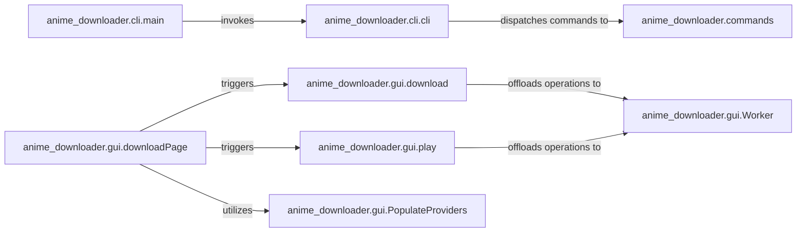

## Details

The `anime-downloader` project is structured around two primary interfaces: a Command-Line Interface (CLI) and a Graphical User Interface (GUI). The CLI flow begins with `anime_downloader.cli.main` which invokes `anime_downloader.cli.cli` to parse and dispatch user commands to specific implementations within `anime_downloader.commands`. The GUI, centered around `anime_downloader.gui.downloadPage`, manages user interactions for downloading and playback. It triggers `anime_downloader.gui.download` and `anime_downloader.gui.play` for respective operations. Both `anime_downloader.gui.download` and `anime_downloader.gui.play` offload intensive tasks to `anime_downloader.gui.Worker` to maintain UI responsiveness. Additionally, `anime_downloader.gui.downloadPage` utilizes `anime_downloader.gui.PopulateProviders` to dynamically display available content sources. This architecture ensures a clear separation of concerns between the user interfaces and the underlying operational logic, with a dedicated worker for background processing in the GUI.

### anime_downloader.cli.main
The initial entry point for the command-line application. It sets up the CLI environment and initiates the command parsing process, acting as the bootstrap for the CLI.

**Related Classes/Methods**:

- <a href="https://github.com/anime-dl/anime-downloader/blob/master/anime_downloader/cli.py#L74-L87" target="_blank" rel="noopener noreferrer">`anime_downloader.cli.main`:74-87</a>

### anime_downloader.cli.cli
The core command-line interface handler. It acts as the central dispatcher for all CLI commands, parsing user input and delegating to specific command implementations.

**Related Classes/Methods**:

- <a href="https://github.com/anime-dl/anime-downloader/blob/master/anime_downloader/cli.py#L56-L69" target="_blank" rel="noopener noreferrer">`anime_downloader.cli.cli`:56-69</a>

### anime_downloader.commands
A collection of modules, each implementing a specific command-line operation (e.g., `config`, `watch`). These modules encapsulate the logic for handling distinct CLI user requests.

**Related Classes/Methods**:

- <a href="https://github.com/anime-dl/anime-downloader/blob/master/anime_downloader/commands" target="_blank" rel="noopener noreferrer">`anime_downloader.commands`</a>

### anime_downloader.gui.downloadPage
The primary graphical user interface panel. It serves as the central hub for user interactions related to downloading and playback, integrating various GUI functionalities.

**Related Classes/Methods**:

- <a href="https://github.com/anime-dl/anime-downloader/blob/master/anime_downloader/gui.py#L52-L112" target="_blank" rel="noopener noreferrer">`anime_downloader.gui.downloadPage`:52-112</a>

### anime_downloader.gui.download
Manages the initiation and monitoring of download tasks within the GUI, preparing requests for background processing.

**Related Classes/Methods**:

- <a href="https://github.com/anime-dl/anime-downloader/blob/master/anime_downloader/gui.py#L141-L150" target="_blank" rel="noopener noreferrer">`anime_downloader.gui.download`:141-150</a>

### anime_downloader.gui.play
Manages the initiation and monitoring of media playback tasks within the GUI, preparing requests for background processing.

**Related Classes/Methods**:

- <a href="https://github.com/anime-dl/anime-downloader/blob/master/anime_downloader/gui.py#L158-L165" target="_blank" rel="noopener noreferrer">`anime_downloader.gui.play`:158-165</a>

### anime_downloader.gui.Worker
A utility component that executes long-running or potentially blocking operations in a separate thread, ensuring the GUI remains responsive during intensive tasks.

**Related Classes/Methods**:

- <a href="https://github.com/anime-dl/anime-downloader/blob/master/anime_downloader/gui.py#L13-L25" target="_blank" rel="noopener noreferrer">`anime_downloader.gui.Worker`:13-25</a>

### anime_downloader.gui.PopulateProviders
A GUI utility responsible for dynamically retrieving and displaying the list of available content providers, bridging the UI with the core provider-based architecture.

**Related Classes/Methods**:

- <a href="https://github.com/anime-dl/anime-downloader/blob/master/anime_downloader/gui.py#L133-L139" target="_blank" rel="noopener noreferrer">`anime_downloader.gui.PopulateProviders`:133-139</a>

### [FAQ](https://github.com/CodeBoarding/GeneratedOnBoardings/tree/main?tab=readme-ov-file#faq)