```mermaid
graph LR
    User_Interface_UI_["User Interface (UI)"]
    Application_Core_State["Application Core & State"]
    Site_Provider_System["Site Provider System"]
    Media_Content_Resolver["Media Content Resolver"]
    Media_Playback_Download["Media Playback & Download"]
    Network_Web_Utilities["Network & Web Utilities"]
    User_Interface_UI_ -- "User commands, input, configuration requests." --> Application_Core_State
    Application_Core_State -- "Displays search results, status updates." --> User_Interface_UI_
    Application_Core_State -- "Requests anime search/episode lists for a chosen site." --> Site_Provider_System
    Application_Core_State -- "Triggers download/playback of selected content." --> Media_Playback_Download
    Application_Core_State -- "Fetches anime metadata from external APIs/websites." --> Network_Web_Utilities
    Site_Provider_System -- "Performs web scraping requests to anime sites." --> Network_Web_Utilities
    Site_Provider_System -- "Passes intermediate video page URLs for stream extraction." --> Media_Content_Resolver
    Media_Content_Resolver -- "Makes requests to video hosting sites." --> Network_Web_Utilities
    Media_Content_Resolver -- "Provides direct media stream URLs." --> Media_Playback_Download
    Media_Playback_Download -- "Downloads media files via HTTP." --> Network_Web_Utilities
    click User_Interface_UI_ href "https://github.com/CodeBoarding/GeneratedOnBoardings/blob/main/anime-downloader/User_Interface_UI_.md" "Details"
    click Application_Core_State href "https://github.com/CodeBoarding/GeneratedOnBoardings/blob/main/anime-downloader/Application_Core_State.md" "Details"
    click Site_Provider_System href "https://github.com/CodeBoarding/GeneratedOnBoardings/blob/main/anime-downloader/Site_Provider_System.md" "Details"
    click Media_Content_Resolver href "https://github.com/CodeBoarding/GeneratedOnBoardings/blob/main/anime-downloader/Media_Content_Resolver.md" "Details"
    click Media_Playback_Download href "https://github.com/CodeBoarding/GeneratedOnBoardings/blob/main/anime-downloader/Media_Playback_Download.md" "Details"
    click Network_Web_Utilities href "https://github.com/CodeBoarding/GeneratedOnBoardings/blob/main/anime-downloader/Network_Web_Utilities.md" "Details"
```

## Details

The `anime-downloader` architecture is centered around a flexible, provider-based design, enabling broad support for various anime sources and video hosts. The **User Interface (UI)** serves as the entry point, directing user requests to the **Application Core & State**. This core component manages application logic, configuration, and watch list data, and orchestrates interactions with external services. For content discovery, the `Application Core` engages the **Site Provider System**, a collection of specialized modules for scraping data from specific anime websites. These providers, along with the `Application Core` itself (for metadata), rely heavily on the **Network & Web Utilities** for all web-based communications. Once a video source is identified, the **Media Content Resolver** extracts the direct media stream URL. Finally, the **Media Playback & Download** component handles the actual consumption of content, either by initiating downloads or launching external media players. This modular structure ensures clear separation of concerns, facilitating easy integration of new sites and video platforms.

### User Interface (UI) [[Expand]](./User_Interface_UI_.md)
The primary interaction layer, supporting both command-line and graphical interfaces for user input and output.

**Related Classes/Methods**:

- <a href="https://github.com/anime-dl/anime-downloader/blob/master/anime_downloader/cli.py" target="_blank" rel="noopener noreferrer">`anime_downloader.cli`</a>
- <a href="https://github.com/anime-dl/anime-downloader/blob/master/anime_downloader/gui.py" target="_blank" rel="noopener noreferrer">`anime_downloader.gui`</a>
- <a href="https://github.com/anime-dl/anime-downloader/blob/master/anime_downloader/commands/" target="_blank" rel="noopener noreferrer">`anime_downloader.commands`</a>

### Application Core & State [[Expand]](./Application_Core_State.md)
Manages application settings, user watch lists, and orchestrates the overall flow, including searching for anime metadata.

**Related Classes/Methods**:

- <a href="https://github.com/anime-dl/anime-downloader/blob/master/anime_downloader/config.py" target="_blank" rel="noopener noreferrer">`anime_downloader.config`</a>
- <a href="https://github.com/anime-dl/anime-downloader/blob/master/anime_downloader/watch.py" target="_blank" rel="noopener noreferrer">`anime_downloader.watch`</a>
- <a href="https://github.com/anime-dl/anime-downloader/blob/master/anime_downloader/animeinfo.py" target="_blank" rel="noopener noreferrer">`anime_downloader.animeinfo`</a>

### Site Provider System [[Expand]](./Site_Provider_System.md)
A pluggable system responsible for site-specific web scraping to find anime episodes and initial video page URLs.

**Related Classes/Methods**:

- <a href="https://github.com/anime-dl/anime-downloader/blob/master/anime_downloader/sites/anime.py" target="_blank" rel="noopener noreferrer">`anime_downloader.sites.anime`</a>
- <a href="https://github.com/anime-dl/anime-downloader/blob/master/anime_downloader/sites/gogoanime.py" target="_blank" rel="noopener noreferrer">`anime_downloader.sites.gogoanime`</a>
- <a href="https://github.com/anime-dl/anime-downloader/blob/master/anime_downloader/sites/nineanime.py" target="_blank" rel="noopener noreferrer">`anime_downloader.sites.nineanime`</a>

### Media Content Resolver [[Expand]](./Media_Content_Resolver.md)
Specializes in extracting direct media stream URLs from various video hosting platforms.

**Related Classes/Methods**:

- <a href="https://github.com/anime-dl/anime-downloader/blob/master/anime_downloader/extractors/base_extractor.py" target="_blank" rel="noopener noreferrer">`anime_downloader.extractors.base_extractor`</a>
- <a href="https://github.com/anime-dl/anime-downloader/blob/master/anime_downloader/extractors/kwik.py" target="_blank" rel="noopener noreferrer">`anime_downloader.extractors.kwik`</a>
- <a href="https://github.com/anime-dl/anime-downloader/blob/master/anime_downloader/extractors/mp4upload.py" target="_blank" rel="noopener noreferrer">`anime_downloader.extractors.mp4upload`</a>

### Media Playback & Download [[Expand]](./Media_Playback_Download.md)
Handles the final consumption of media, either by downloading episodes or launching external media players for streaming.

**Related Classes/Methods**:

- <a href="https://github.com/anime-dl/anime-downloader/blob/master/anime_downloader/downloader/" target="_blank" rel="noopener noreferrer">`anime_downloader.downloader`</a>
- <a href="https://github.com/anime-dl/anime-downloader/blob/master/anime_downloader/players/" target="_blank" rel="noopener noreferrer">`anime_downloader.players`</a>

### Network & Web Utilities [[Expand]](./Network_Web_Utilities.md)
Provides foundational utilities for robust HTTP requests, session management, and bypassing web challenges.

**Related Classes/Methods**:

- <a href="https://github.com/anime-dl/anime-downloader/blob/master/anime_downloader/session.py" target="_blank" rel="noopener noreferrer">`anime_downloader.session`</a>
- <a href="https://github.com/anime-dl/anime-downloader/blob/master/anime_downloader/sites/helpers/request.py" target="_blank" rel="noopener noreferrer">`anime_downloader.sites.helpers.request`</a>

### [FAQ](https://github.com/CodeBoarding/GeneratedOnBoardings/tree/main?tab=readme-ov-file#faq)