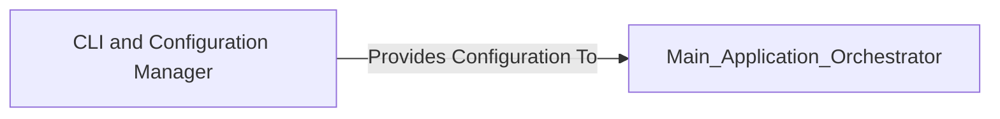

## Details

The `CLI and Configuration Manager` component is crucial for the `Bioinformatics Data Processing Tool` as it serves as the primary interface for user interaction, enabling the tool to receive and validate all necessary execution parameters. This component is fundamental because it ensures that the subsequent data processing steps operate with correct and complete inputs, preventing errors and ensuring the integrity of the analysis.

### CLI and Configuration Manager [[Expand]](./CLI_and_Configuration_Manager.md)
This component is responsible for defining, parsing, and validating command-line arguments provided by the user. It sets up the initial execution parameters for the entire workflow, ensuring that all necessary inputs (file paths, filtering thresholds, annotation options) are correctly received and validated before the main processing begins. It acts as the primary interface for users to interact with the tool.

**Related Classes/Methods**: _None_

### [FAQ](https://github.com/CodeBoarding/GeneratedOnBoardings/tree/main?tab=readme-ov-file#faq)