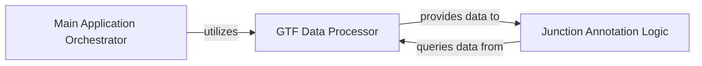

## Details

Overview of the GTF Data Processor component within the annofilter-junctions tool, detailing its purpose, internal structure, and interactions with other components.

### GTF Data Processor [[Expand]](./GTF_Data_Processor.md)
Defines data structures for genomic features (genes, transcripts, exons) and contains the logic to parse GTF files into these structured models. It builds and provides the necessary transcriptome context for junction annotation.

**Related Classes/Methods**:

- `GtfFeature` (1:1)
- `Gene` (1:1)
- `Transcript` (1:1)
- `Exon` (1:1)
- `parse_gtf_attributes` (1:1)
- `parse_gtf_row` (1:1)
- <a href="https://github.com/pfizer-opensource/annofilter-junctions/blob/main/transcriptome.py#L475-L596" target="_blank" rel="noopener noreferrer">`Transcriptome` (475:596)</a>

### Main Application Orchestrator
The main script or orchestrator component that initiates the GTF parsing process.

**Related Classes/Methods**: _None_

### Junction Annotation Logic
Queries the structured transcriptome data from GTF Data Processor to determine the annotation status of input junctions.

**Related Classes/Methods**: _None_

### [FAQ](https://github.com/CodeBoarding/GeneratedOnBoardings/tree/main?tab=readme-ov-file#faq)