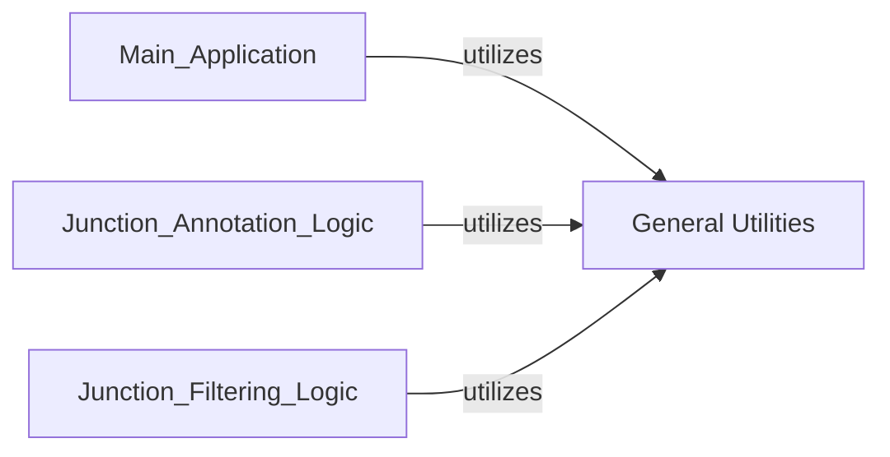

## Details

The `General Utilities` component is fundamental because it provides essential, reusable helper functions that support various core operations across the bioinformatics data processing tool. These functions are designed to be generic and do not contain domain-specific annotation or filtering logic, making them highly modular and maintainable. By centralizing these common tasks, the component reduces code duplication and improves the overall efficiency and readability of the codebase.

### General Utilities [[Expand]](./General_Utilities.md)
Provides common helper functions for tasks such as coordinate calculations, string manipulation, and data formatting, which are reusable across different core components. These utilities are crucial for standardizing data representation and facilitating efficient data processing throughout the pipeline.

**Related Classes/Methods**:

- <a href="https://github.com/pfizer-opensource/annofilter-junctions/blob/main/annofilter_junctions.py#L18-L22" target="_blank" rel="noopener noreferrer">`annofilter_junctions.py:parse_bed12_row` (18:22)</a>
- <a href="https://github.com/pfizer-opensource/annofilter-junctions/blob/main/annofilter_junctions.py#L24-L37" target="_blank" rel="noopener noreferrer">`annofilter_junctions.py:group_bed_by_name` (24:37)</a>
- <a href="https://github.com/pfizer-opensource/annofilter-junctions/blob/main/annofilter_junctions.py#L39-L50" target="_blank" rel="noopener noreferrer">`annofilter_junctions.py:get_junction_id` (39:50)</a>
- <a href="https://github.com/pfizer-opensource/annofilter-junctions/blob/main/annofilter_junctions.py#L52-L67" target="_blank" rel="noopener noreferrer">`annofilter_junctions.py:get_donor_id` (52:67)</a>
- <a href="https://github.com/pfizer-opensource/annofilter-junctions/blob/main/annofilter_junctions.py#L69-L84" target="_blank" rel="noopener noreferrer">`annofilter_junctions.py:get_acceptor_id` (69:84)</a>

### [FAQ](https://github.com/CodeBoarding/GeneratedOnBoardings/tree/main?tab=readme-ov-file#faq)