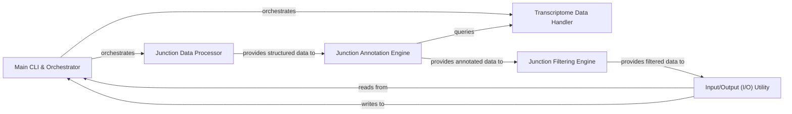

## Details

This Bioinformatics Data Processing Tool is designed for handling RNA-seq junction data, transforming raw BED-formatted input into a structured and usable format for subsequent annotation and filtering. It processes raw data, annotates junctions against genomic features, and filters them based on various criteria, providing a refined dataset for downstream analysis.

### Main CLI & Orchestrator
This is the primary entry point of the application, responsible for parsing command-line arguments, orchestrating the overall workflow, and coordinating interactions between other components. It sets up the input and output streams and initiates the data processing pipeline.

**Related Classes/Methods**:

- <a href="https://github.com/pfizer-opensource/annofilter-junctions/blob/main/annofilter_junctions.py#L1897-L1959" target="_blank" rel="noopener noreferrer">`annofilter_junctions.py:main` (1897:1959)</a>

### Junction Data Processor [[Expand]](./Junction_Data_Processor.md)
This component handles the parsing, modeling, and initial organization of RNA-seq junction data from BED files. It transforms raw text data into structured Python objects.

**Related Classes/Methods**:

- <a href="https://github.com/pfizer-opensource/annofilter-junctions/blob/main/annofilter_junctions.py#L18-L22" target="_blank" rel="noopener noreferrer">`annofilter_junctions.py:parse_bed12_row` (18:22)</a>
- <a href="https://github.com/pfizer-opensource/annofilter-junctions/blob/main/annofilter_junctions.py#L24-L37" target="_blank" rel="noopener noreferrer">`annofilter_junctions.py:group_bed_by_name` (24:37)</a>

### Transcriptome Data Handler
This component is responsible for loading, parsing, and providing access to transcriptome-related data, such as gene models from GTF/GFF files. It likely offers functionalities to query gene, transcript, and exon information, which is critical for annotating junctions.

**Related Classes/Methods**:

- <a href="https://github.com/pfizer-opensource/annofilter-junctions/blob/main/transcriptome.py#L1-L2" target="_blank" rel="noopener noreferrer">`transcriptome.py` (1:2)</a>

### Junction Annotation Engine
This component applies various annotation rules to the processed junction data. It uses information provided by the `Transcriptome Data Handler` to determine if a junction is novel, known, exonic, intronic, or falls within specific genomic contexts.

**Related Classes/Methods**:

- <a href="https://github.com/pfizer-opensource/annofilter-junctions/blob/main/annofilter_junctions.py#L1-L2" target="_blank" rel="noopener noreferrer">`annofilter_junctions.py` (1:2)</a>

### Junction Filtering Engine
This component applies user-defined or pre-configured filtering criteria to the annotated junction data. It removes junctions that do not meet certain quality, abundance, or annotation-based thresholds, reducing noise and focusing on relevant events.

**Related Classes/Methods**:

- <a href="https://github.com/pfizer-opensource/annofilter-junctions/blob/main/annofilter_junctions.py#L1-L2" target="_blank" rel="noopener noreferrer">`annofilter_junctions.py` (1:2)</a>

### Input/Output (I/O) Utility
This component encapsulates the functionalities for reading input files (e.g., BED, GTF) and writing processed data to output files (e.g., annotated BED, filtered BED). It handles file operations and data serialization/deserialization.

**Related Classes/Methods**:

- <a href="https://github.com/pfizer-opensource/annofilter-junctions/blob/main/annofilter_junctions.py#L1-L2" target="_blank" rel="noopener noreferrer">`annofilter_junctions.py` (1:2)</a>

### [FAQ](https://github.com/CodeBoarding/GeneratedOnBoardings/tree/main?tab=readme-ov-file#faq)