```mermaid
graph LR
    CLI_and_Configuration_Manager["CLI and Configuration Manager"]
    Input_Output_Manager["Input/Output Manager"]
    GTF_Data_Processor["GTF Data Processor"]
    Junction_Data_Processor["Junction Data Processor"]
    Junction_Analysis_Core["Junction Analysis Core"]
    Main_Workflow_Orchestrator["Main Workflow Orchestrator"]
    General_Utilities["General Utilities"]
    CLI_and_Configuration_Manager -- "provides configuration to" --> Main_Workflow_Orchestrator
    Main_Workflow_Orchestrator -- "orchestrates calls to" --> Input_Output_Manager
    Main_Workflow_Orchestrator -- "orchestrates calls to" --> Junction_Analysis_Core
    Input_Output_Manager -- "reads GTF data for" --> GTF_Data_Processor
    Input_Output_Manager -- "reads junction data for" --> Junction_Data_Processor
    Junction_Data_Processor -- "writes processed data from" --> Input_Output_Manager
    GTF_Data_Processor -- "provides structured GTF data to" --> Junction_Analysis_Core
    Junction_Data_Processor -- "provides junction data to" --> Junction_Analysis_Core
    Junction_Analysis_Core -- "updates junction data in" --> Junction_Data_Processor
    General_Utilities -- "used by" --> GTF_Data_Processor
    General_Utilities -- "used by" --> Junction_Data_Processor
    General_Utilities -- "used by" --> Junction_Analysis_Core
    click CLI_and_Configuration_Manager href "https://github.com/CodeBoarding/GeneratedOnBoardings/blob/main/annofilter-junctions/CLI_and_Configuration_Manager.md" "Details"
    click GTF_Data_Processor href "https://github.com/CodeBoarding/GeneratedOnBoardings/blob/main/annofilter-junctions/GTF_Data_Processor.md" "Details"
    click Junction_Data_Processor href "https://github.com/CodeBoarding/GeneratedOnBoardings/blob/main/annofilter-junctions/Junction_Data_Processor.md" "Details"
    click General_Utilities href "https://github.com/CodeBoarding/GeneratedOnBoardings/blob/main/annofilter-junctions/General_Utilities.md" "Details"
```

## Details

The `annofilter-junctions` project is structured as a modular bioinformatics data processing pipeline, primarily focused on annotating and filtering RNA-seq junctions. The architecture emphasizes clear separation of concerns, with distinct components handling command-line interaction, data input/output, data modeling and parsing, core annotation and filtering logic, and overall workflow orchestration.

### CLI and Configuration Manager [[Expand]](./CLI_and_Configuration_Manager.md)
Defines, parses, and validates command-line arguments, setting up initial execution parameters and providing validated input to the Main Workflow Orchestrator.

**Related Classes/Methods**:

- `argparse_logic` (1:1)

### Input/Output Manager
Manages all file operations, including reading raw junction data (BED) and GTF annotation files, and writing filtered/annotated output. It acts as the primary interface for data ingress and egress.

**Related Classes/Methods**:

- `file_reading_writing` (1:1)
- `gtf_file_reading` (1:1)

### GTF Data Processor [[Expand]](./GTF_Data_Processor.md)
Defines data structures for genomic features (genes, transcripts, exons) and contains the logic to parse GTF files into these structured models. It provides the necessary transcriptome context for junction annotation.

**Related Classes/Methods**:

- `GtfFeature` (1:1)
- `parse_gtf_attributes` (1:1)
- `parse_gtf_row` (1:1)

### Junction Data Processor [[Expand]](./Junction_Data_Processor.md)
Manages the representation of RNA-seq junction data, including genomic coordinates and attributes, and parses BED-formatted junction files. It holds the junction data throughout the annotation and filtering process.

**Related Classes/Methods**:

- `parse_bed12_row` (1:1)
- `group_bed_by_name` (1:1)

### Junction Analysis Core
Implements the core logic for both annotating RNA-seq junctions against transcriptome data (determining known/novel status) and applying various filtering criteria based on user-defined parameters.

**Related Classes/Methods**:

- `get_junction_info` (1:1)
- `get_ss_info` (1:1)
- `is_known_junction` (1:1)
- `is_known_donor` (1:1)
- `SSOverlap` (1:1)
- `filtering_functions` (1:1)

### Main Workflow Orchestrator
Coordinates the overall data processing workflow. It receives configuration, instructs the Input/Output Manager, and orchestrates the sequence of operations involving the Junction Analysis Core.

**Related Classes/Methods**:

- `main_execution_block` (1:1)

### General Utilities [[Expand]](./General_Utilities.md)
Provides common helper functions for tasks such as coordinate calculations, string manipulation, and data formatting, which are reusable across different core components.

**Related Classes/Methods**:

- `get_junction_id` (1:1)
- `get_donor_id` (1:1)
- `get_acceptor_id` (1:1)
- <a href="https://github.com/pfizer-opensource/annofilter-junctions/blob/main/transcriptome.py#L1-L1" target="_blank" rel="noopener noreferrer">`transcriptome.py` (1:1)</a>

### [FAQ](https://github.com/CodeBoarding/GeneratedOnBoardings/tree/main?tab=readme-ov-file#faq)