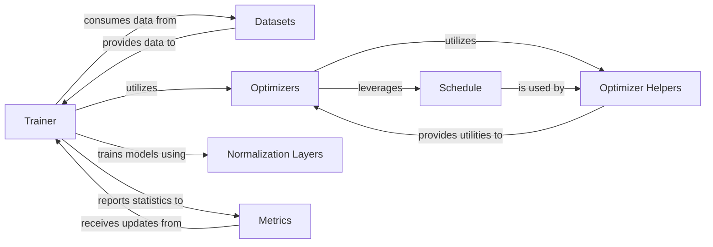

## Details

The Core ML Utilities subsystem provides the foundational infrastructure for building, training, and evaluating deep learning models within the labml_nn project. It encapsulates core functionalities related to data management, model optimization, training orchestration, and essential neural network building blocks.

### Trainer
Orchestrates the entire machine learning training process. It manages epochs, iterations, data loading, model updates, and integrates with other helper modules for metrics and optimization. It is the central orchestrator for the training loop.

**Related Classes/Methods**:

- <a href="https://github.com/labmlai/annotated_deep_learning_paper_implementations/blob/master/labml_nn/helpers/trainer.py" target="_blank" rel="noopener noreferrer">`labml_nn.helpers.trainer`</a>

### Datasets
Provides functionalities for loading, transforming, and managing various datasets, making them ready for consumption by training loops. It abstracts data access and preprocessing.

**Related Classes/Methods**:

- <a href="https://github.com/labmlai/annotated_deep_learning_paper_implementations/blob/master/labml_nn/helpers/datasets.py" target="_blank" rel="noopener noreferrer">`labml_nn.helpers.datasets`</a>

### Optimizers
Implements various optimization algorithms (e.g., Adam) responsible for updating model parameters based on gradients computed during training. This component also includes general optimizer helpers and learning rate scheduling.

**Related Classes/Methods**:

- <a href="https://github.com/labmlai/annotated_deep_learning_paper_implementations/blob/master/labml_nn/optimizers/adam.py" target="_blank" rel="noopener noreferrer">`labml_nn.optimizers.adam`</a>

### Normalization Layers
Provides common neural network building blocks, such as the Batch Normalization layer, used to stabilize and accelerate training by normalizing layer inputs. This represents a category of reusable network layers.

**Related Classes/Methods**:

- <a href="https://github.com/labmlai/annotated_deep_learning_paper_implementations/blob/master/labml_nn/normalization/batch_norm" target="_blank" rel="noopener noreferrer">`labml_nn.normalization.batch_norm`</a>

### Metrics
Offers utilities for tracking and reporting various training and evaluation metrics (e.g., accuracy, loss), crucial for monitoring training progress and model performance.

**Related Classes/Methods**:

- <a href="https://github.com/labmlai/annotated_deep_learning_paper_implementations/blob/master/labml_nn/helpers/metrics.py" target="_blank" rel="noopener noreferrer">`labml_nn.helpers.metrics`</a>

### Optimizer Helpers
Provides supporting utilities and mechanisms to the Optimizers, abstracting common functionalities required by various optimization algorithms.

**Related Classes/Methods**:

- <a href="https://github.com/labmlai/annotated_deep_learning_paper_implementations/blob/master/labml_nn/helpers/optimizer.py" target="_blank" rel="noopener noreferrer">`labml_nn.helpers.optimizer`</a>

### Schedule
Provides supporting utilities and mechanisms for learning rate management, allowing for dynamic adjustment of learning rates during training.

**Related Classes/Methods**:

- <a href="https://github.com/labmlai/annotated_deep_learning_paper_implementations/blob/master/labml_nn/helpers/schedule.py" target="_blank" rel="noopener noreferrer">`labml_nn.helpers.schedule`</a>

### [FAQ](https://github.com/CodeBoarding/GeneratedOnBoardings/tree/main?tab=readme-ov-file#faq)