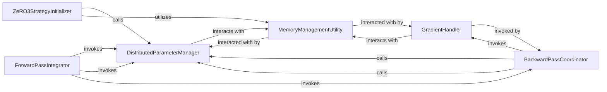

## Details

The Distributed Training & Scaling subsystem is primarily encapsulated within the `labml_nn.scaling.zero3` package.

### ZeRO3StrategyInitializer
The primary entry point for configuring and initializing the ZeRO-3 distributed training strategy. It orchestrates the initial setup, including parameter preparation and integration of memory management utilities. This component is crucial as it sets up the entire distributed environment.

**Related Classes/Methods**:

- <a href="https://github.com/labmlai/annotated_deep_learning_paper_implementations/blob/master/labml_nn/scaling/zero3/__init__.py" target="_blank" rel="noopener noreferrer">`ZeRO3StrategyInitializer`</a>

### DistributedParameterManager
Manages the lifecycle of model parameters across distributed devices. This includes preparing parameters for efficient distributed storage, dynamically fetching required parameters to the active device during computation, and releasing them from memory when no longer needed. This component is fundamental to ZeRO-3's memory optimization by handling parameter sharding and retrieval.

**Related Classes/Methods**:

- <a href="https://github.com/labmlai/annotated_deep_learning_paper_implementations/blob/master/labml_nn/scaling/zero3/__init__.py" target="_blank" rel="noopener noreferrer">`DistributedParameterManager:_merge_and_pad_params`</a>
- <a href="https://github.com/labmlai/annotated_deep_learning_paper_implementations/blob/master/labml_nn/scaling/zero3/__init__.py" target="_blank" rel="noopener noreferrer">`DistributedParameterManager:fetch_params`</a>
- <a href="https://github.com/labmlai/annotated_deep_learning_paper_implementations/blob/master/labml_nn/scaling/zero3/__init__.py" target="_blank" rel="noopener noreferrer">`DistributedParameterManager:_cleanup_params`</a>

### ForwardPassIntegrator
Executes the model's forward computation pass, ensuring that necessary parameters are fetched on-demand and setting up the required hooks for the subsequent backward pass. This component is essential for integrating the ZeRO-3 strategy into the standard PyTorch forward pass.

**Related Classes/Methods**:

- <a href="https://github.com/labmlai/annotated_deep_learning_paper_implementations/blob/master/labml_nn/scaling/zero3/__init__.py" target="_blank" rel="noopener noreferrer">`ForwardPassIntegrator:forward`</a>

### BackwardPassCoordinator
Manages the distributed aspects of the backward pass. This involves registering PyTorch autograd hooks, triggering the central backward event, and coordinating parameter fetching, gradient handling, and memory cleanup during the backward computation. This component is critical for correctly propagating gradients in a distributed setting.

**Related Classes/Methods**:

- <a href="https://github.com/labmlai/annotated_deep_learning_paper_implementations/blob/master/labml_nn/scaling/zero3/__init__.py" target="_blank" rel="noopener noreferrer">`BackwardPassCoordinator:_add_backward_hooks`</a>
- <a href="https://github.com/labmlai/annotated_deep_learning_paper_implementations/blob/master/labml_nn/scaling/zero3/__init__.py" target="_blank" rel="noopener noreferrer">`BackwardPassCoordinator:_post_backward_hook`</a>
- <a href="https://github.com/labmlai/annotated_deep_learning_paper_implementations/blob/master/labml_nn/scaling/zero3/__init__.py" target="_blank" rel="noopener noreferrer">`BackwardPassCoordinator:_backward_event`</a>

### GradientHandler
Specifically handles the temporary storage and management of gradients during the backward pass, ensuring they are correctly backed up for distributed updates. This component ensures gradient integrity and availability for optimization.

**Related Classes/Methods**:

- <a href="https://github.com/labmlai/annotated_deep_learning_paper_implementations/blob/master/labml_nn/scaling/zero3/__init__.py" target="_blank" rel="noopener noreferrer">`GradientHandler:_backup_grads`</a>

### MemoryManagementUtility
A low-level utility providing explicit memory freeing operations. This is crucial for ZeRO-3's aggressive memory optimization strategy, allowing for the release of memory as soon as parameters or gradients are no longer needed. This utility underpins the memory efficiency of the entire subsystem.

**Related Classes/Methods**:

- <a href="https://github.com/labmlai/annotated_deep_learning_paper_implementations/blob/master/labml_nn/scaling/zero3/__init__.py" target="_blank" rel="noopener noreferrer">`MemoryManagementUtility:_empty`</a>

### [FAQ](https://github.com/CodeBoarding/GeneratedOnBoardings/tree/main?tab=readme-ov-file#faq)