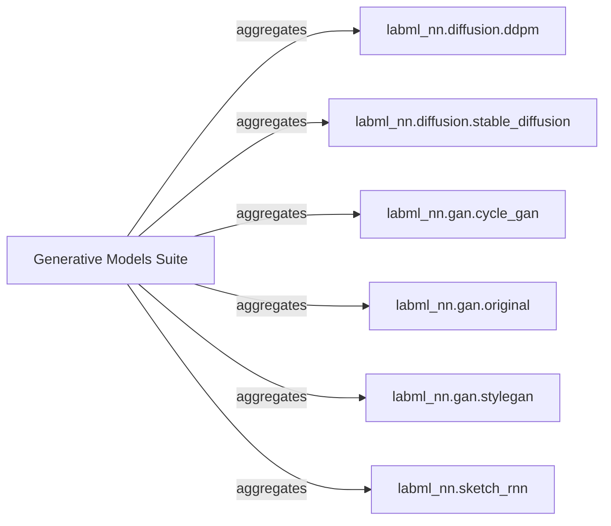

## Details

The labml_nn project's generative models subsystem is structured around a Generative Models Suite acting as a conceptual umbrella for various advanced generative architectures. This suite encompasses distinct implementations such as labml_nn.diffusion.ddpm for Denoising Diffusion Probabilistic Models, labml_nn.diffusion.stable_diffusion for latent diffusion, labml_nn.gan.cycle_gan for unpaired image-to-image translation, labml_nn.gan.original for foundational GAN concepts, labml_nn.gan.stylegan for high-resolution image generation, and labml_nn.sketch_rnn for vector-based sketch generation. Each component within this suite is self-contained, providing specific model architectures, training loops, and utility functions tailored to its generative task. The primary interaction pathway involves data flow from datasets into the respective model components for training and inference, with models generating outputs that are then evaluated or sampled.

### Generative Models Suite [[Expand]](./Generative_Models_Suite.md)
Acts as a high-level logical container and entry point for various generative model implementations. It provides a unified conceptual view of the project's generative capabilities. This is an abstract component and does not have a direct source code reference.

**Related Classes/Methods**: _None_

### labml_nn.diffusion.ddpm
Implements Denoising Diffusion Probabilistic Models, managing forward/reverse diffusion, noise prediction, training loss, dataset loading, and evaluation.

**Related Classes/Methods**:

- <a href="https://github.com/labmlai/annotated_deep_learning_paper_implementations/blob/master/labml_nn/diffusion/ddpm/experiment.py" target="_blank" rel="noopener noreferrer">`labml_nn.diffusion.ddpm.experiment`</a>
- <a href="https://github.com/labmlai/annotated_deep_learning_paper_implementations/blob/master/labml_nn/diffusion/ddpm/unet.py" target="_blank" rel="noopener noreferrer">`labml_nn.diffusion.ddpm.unet`</a>
- <a href="https://github.com/labmlai/annotated_deep_learning_paper_implementations/blob/master/labml_nn/diffusion/ddpm/evaluate.py" target="_blank" rel="noopener noreferrer">`labml_nn.diffusion.ddpm.evaluate`</a>

### labml_nn.diffusion.stable_diffusion
Implements the latent diffusion model for various image generation tasks (text-to-image, image-to-image, in-painting), integrating a UNet, Autoencoder, and attention mechanisms.

**Related Classes/Methods**:

- <a href="https://github.com/labmlai/annotated_deep_learning_paper_implementations/blob/master/labml_nn/diffusion/stable_diffusion/scripts" target="_blank" rel="noopener noreferrer">`labml_nn.diffusion.stable_diffusion.scripts`</a>
- <a href="https://github.com/labmlai/annotated_deep_learning_paper_implementations/blob/master/labml_nn/diffusion/stable_diffusion/model/unet.py" target="_blank" rel="noopener noreferrer">`labml_nn.diffusion.stable_diffusion.model.unet`</a>
- <a href="https://github.com/labmlai/annotated_deep_learning_paper_implementations/blob/master/labml_nn/diffusion/stable_diffusion/model/autoencoder.py" target="_blank" rel="noopener noreferrer">`labml_nn.diffusion.stable_diffusion.model.autoencoder`</a>
- <a href="https://github.com/labmlai/annotated_deep_learning_paper_implementations/blob/master/labml_nn/diffusion/stable_diffusion/model/unet_attention.py" target="_blank" rel="noopener noreferrer">`labml_nn.diffusion.stable_diffusion.model.unet_attention`</a>
- <a href="https://github.com/labmlai/annotated_deep_learning_paper_implementations/blob/master/labml_nn/diffusion/stable_diffusion/sampler/ddpm.py" target="_blank" rel="noopener noreferrer">`labml_nn.diffusion.stable_diffusion.sampler.ddpm`</a>
- <a href="https://github.com/labmlai/annotated_deep_learning_paper_implementations/blob/master/labml_nn/diffusion/stable_diffusion/sampler/ddim.py" target="_blank" rel="noopener noreferrer">`labml_nn.diffusion.stable_diffusion.sampler.ddim`</a>

### labml_nn.gan.cycle_gan
Implements unpaired image-to-image translation using adversarial training with cycle consistency, managing generators, discriminators, and a replay buffer.

**Related Classes/Methods**:

- <a href="https://github.com/labmlai/annotated_deep_learning_paper_implementations/blob/master/labml_nn/gan/cycle_gan" target="_blank" rel="noopener noreferrer">`labml_nn.gan.cycle_gan`</a>
- <a href="https://github.com/labmlai/annotated_deep_learning_paper_implementations/blob/master/labml_nn/gan/cycle_gan/__init__.py" target="_blank" rel="noopener noreferrer">`labml_nn.gan.cycle_gan.generator_resnet`</a>
- <a href="https://github.com/labmlai/annotated_deep_learning_paper_implementations/blob/master/labml_nn/gan/cycle_gan/__init__.py" target="_blank" rel="noopener noreferrer">`labml_nn.gan.cycle_gan.discriminator`</a>
- <a href="https://github.com/labmlai/annotated_deep_learning_paper_implementations/blob/master/labml_nn/gan/cycle_gan/__init__.py" target="_blank" rel="noopener noreferrer">`labml_nn.gan.cycle_gan.image_dataset`</a>
- <a href="https://github.com/labmlai/annotated_deep_learning_paper_implementations/blob/master/labml_nn/gan/cycle_gan/__init__.py" target="_blank" rel="noopener noreferrer">`labml_nn.gan.cycle_gan.replay_buffer`</a>
- <a href="https://github.com/labmlai/annotated_deep_learning_paper_implementations/blob/master/labml_nn/gan/cycle_gan/__init__.py" target="_blank" rel="noopener noreferrer">`labml_nn.gan.cycle_gan.sample_images`</a>

### labml_nn.gan.original
Provides a fundamental GAN implementation, focusing on the adversarial training loop between a generator and a discriminator.

**Related Classes/Methods**:

- <a href="https://github.com/labmlai/annotated_deep_learning_paper_implementations/blob/master/labml_nn/gan/original/experiment.py" target="_blank" rel="noopener noreferrer">`labml_nn.gan.original.experiment`</a>
- <a href="https://github.com/labmlai/annotated_deep_learning_paper_implementations/blob/master/labml_nn/gan/original/experiment.py" target="_blank" rel="noopener noreferrer">`labml_nn.gan.original.calc_generator_loss`</a>
- <a href="https://github.com/labmlai/annotated_deep_learning_paper_implementations/blob/master/labml_nn/gan/original/experiment.py" target="_blank" rel="noopener noreferrer">`labml_nn.gan.original.calc_discriminator_loss`</a>

### labml_nn.gan.stylegan
Implements the StyleGAN architecture for high-resolution image generation, incorporating style modulation and progressive growth.

**Related Classes/Methods**:

- <a href="https://github.com/labmlai/annotated_deep_learning_paper_implementations/blob/master/labml_nn/gan/stylegan/experiment.py" target="_blank" rel="noopener noreferrer">`labml_nn.gan.stylegan.experiment`</a>
- <a href="https://github.com/labmlai/annotated_deep_learning_paper_implementations/blob/master/labml_nn/gan/stylegan/experiment.py" target="_blank" rel="noopener noreferrer">`labml_nn.gan.stylegan.generate_images`</a>
- <a href="https://github.com/labmlai/annotated_deep_learning_paper_implementations/blob/master/labml_nn/gan/stylegan/__init__.py" target="_blank" rel="noopener noreferrer">`labml_nn.gan.stylegan.equalized_linear`</a>
- <a href="https://github.com/labmlai/annotated_deep_learning_paper_implementations/blob/master/labml_nn/gan/stylegan/__init__.py" target="_blank" rel="noopener noreferrer">`labml_nn.gan.stylegan.style_block`</a>
- <a href="https://github.com/labmlai/annotated_deep_learning_paper_implementations/blob/master/labml_nn/gan/stylegan/__init__.py" target="_blank" rel="noopener noreferrer">`labml_nn.gan.stylegan.conv2d_weight_modulate`</a>

### labml_nn.sketch_rnn
Implements a recurrent neural network for generating vector-based sketches, handling encoding of input sketches and decoding of new ones.

**Related Classes/Methods**:

- <a href="https://github.com/labmlai/annotated_deep_learning_paper_implementations/blob/master/labml_nn/sketch_rnn" target="_blank" rel="noopener noreferrer">`labml_nn.sketch_rnn`</a>
- <a href="https://github.com/labmlai/annotated_deep_learning_paper_implementations/blob/master/labml_nn/sketch_rnn/__init__.py" target="_blank" rel="noopener noreferrer">`labml_nn.sketch_rnn.encoder_rnn`</a>
- <a href="https://github.com/labmlai/annotated_deep_learning_paper_implementations/blob/master/labml_nn/sketch_rnn/__init__.py" target="_blank" rel="noopener noreferrer">`labml_nn.sketch_rnn.decoder_rnn`</a>
- <a href="https://github.com/labmlai/annotated_deep_learning_paper_implementations/blob/master/labml_nn/sketch_rnn/__init__.py" target="_blank" rel="noopener noreferrer">`labml_nn.sketch_rnn.strokes_dataset`</a>
- <a href="https://github.com/labmlai/annotated_deep_learning_paper_implementations/blob/master/labml_nn/sketch_rnn/__init__.py" target="_blank" rel="noopener noreferrer">`labml_nn.sketch_rnn._sample_step`</a>

### [FAQ](https://github.com/CodeBoarding/GeneratedOnBoardings/tree/main?tab=readme-ov-file#faq)