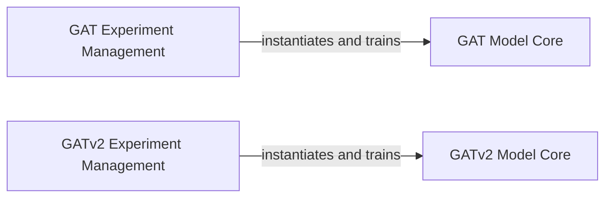

## Details

The `Graph Neural Networks` subsystem focuses on implementing and experimenting with Graph Attention Networks (GAT) and its improved version, GATv2.

### GAT Model Core
Implements the core Graph Attention Network (GAT) architecture, defining the neural network layers and attention mechanisms for processing graph-structured data.

**Related Classes/Methods**:

- <a href="https://github.com/labmlai/annotated_deep_learning_paper_implementations/blob/master/labml_nn/graphs/gat/experiment.py#L108-L149" target="_blank" rel="noopener noreferrer">`labml_nn.graphs.gat.experiment.GAT`:108-149</a>

### GATv2 Model Core
Implements the core GATv2 architecture, an enhanced version of GAT, providing improved attention mechanisms for graph data.

**Related Classes/Methods**:

- <a href="https://github.com/labmlai/annotated_deep_learning_paper_implementations/blob/master/labml_nn/graphs/gatv2/experiment.py#L20-L65" target="_blank" rel="noopener noreferrer">`labml_nn.graphs.gatv2.experiment.GATv2`:20-65</a>

### GAT Experiment Management
Orchestrates the entire lifecycle of a GAT experiment. This includes loading configurations, handling the Cora dataset, instantiating the GAT model, managing the training and evaluation loops, and logging experiment results.

**Related Classes/Methods**:

- <a href="https://github.com/labmlai/annotated_deep_learning_paper_implementations/blob/master/labml_nn/graphs/gat/experiment.py#L288-L304" target="_blank" rel="noopener noreferrer">`labml_nn.graphs.gat.experiment.main`:288-304</a>
- <a href="https://github.com/labmlai/annotated_deep_learning_paper_implementations/blob/master/labml_nn/graphs/gat/experiment.py#L194-L253" target="_blank" rel="noopener noreferrer">`labml_nn.graphs.gat.experiment.run`:194-253</a>
- <a href="https://github.com/labmlai/annotated_deep_learning_paper_implementations/blob/master/labml_nn/graphs/gat/experiment.py#L159-L253" target="_blank" rel="noopener noreferrer">`labml_nn.graphs.gat.experiment.Configs`:159-253</a>
- <a href="https://github.com/labmlai/annotated_deep_learning_paper_implementations/blob/master/labml_nn/graphs/gat/experiment.py#L25-L105" target="_blank" rel="noopener noreferrer">`labml_nn.graphs.gat.experiment.CoraDataset`:25-105</a>
- <a href="https://github.com/labmlai/annotated_deep_learning_paper_implementations/blob/master/labml_nn/graphs/gat/experiment.py#L270-L275" target="_blank" rel="noopener noreferrer">`labml_nn.graphs.gat.experiment.gat_model`:270-275</a>

### GATv2 Experiment Management
Manages the complete lifecycle of a GATv2 experiment. This component is responsible for loading configurations, instantiating the GATv2 model, and executing the training and evaluation phases.

**Related Classes/Methods**:

- <a href="https://github.com/labmlai/annotated_deep_learning_paper_implementations/blob/master/labml_nn/graphs/gatv2/experiment.py#L90-L108" target="_blank" rel="noopener noreferrer">`labml_nn.graphs.gatv2.experiment.main`:90-108</a>
- <a href="https://github.com/labmlai/annotated_deep_learning_paper_implementations/blob/master/labml_nn/graphs/gatv2/experiment.py" target="_blank" rel="noopener noreferrer">`labml_nn.graphs.gatv2.experiment.run`</a>
- <a href="https://github.com/labmlai/annotated_deep_learning_paper_implementations/blob/master/labml_nn/graphs/gatv2/experiment.py#L68-L79" target="_blank" rel="noopener noreferrer">`labml_nn.graphs.gatv2.experiment.Configs`:68-79</a>
- <a href="https://github.com/labmlai/annotated_deep_learning_paper_implementations/blob/master/labml_nn/graphs/gatv2/experiment.py#L82-L87" target="_blank" rel="noopener noreferrer">`labml_nn.graphs.gatv2.experiment.gat_v2_model`:82-87</a>

### [FAQ](https://github.com/CodeBoarding/GeneratedOnBoardings/tree/main?tab=readme-ov-file#faq)