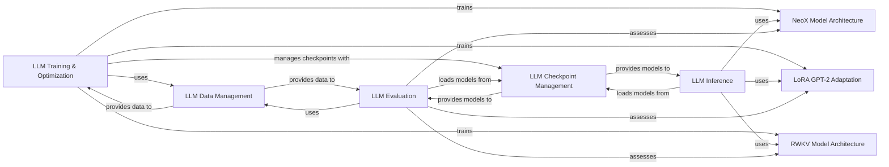

## Details

The Large Language Model (LLM) Specifics subsystem is dedicated to the implementation, training, and inference of large-scale language models. It encapsulates distinct model architectures like NeoX and RWKV, along with specialized fine-tuning techniques such as LoRA for GPT-2. This subsystem focuses on the core computational and algorithmic aspects unique to LLMs, including their forward passes, training loops, and generation capabilities.

### NeoX Model Architecture
Defines the complete transformer architecture for the NeoX model, including its specific layers and overall structural design. This component represents the foundational model definition.

**Related Classes/Methods**:

- <a href="https://github.com/labmlai/annotated_deep_learning_paper_implementations/blob/master/labml_nn/neox/model.py" target="_blank" rel="noopener noreferrer">`labml_nn.neox.model`</a>

### LoRA GPT-2 Adaptation
Implements the Low-Rank Adaptation (LoRA) technique specifically for GPT-2-like models, enabling efficient fine-tuning by modifying a small subset of parameters.

**Related Classes/Methods**:

- <a href="https://github.com/labmlai/annotated_deep_learning_paper_implementations/blob/master/labml_nn/lora/gpt2.py" target="_blank" rel="noopener noreferrer">`labml_nn.lora.gpt2`</a>

### RWKV Model Architecture
Defines the unique recurrent neural network architecture of the RWKV model, characterized by its TimeMixing and ChannelMixing components, offering an alternative to traditional transformers.

**Related Classes/Methods**:

- <a href="https://github.com/labmlai/annotated_deep_learning_paper_implementations/blob/master/labml_nn/rwkv/__init__.py" target="_blank" rel="noopener noreferrer">`labml_nn.rwkv.__init__`</a>

### LLM Training & Optimization
Orchestrates the training loop for various LLMs, managing epochs, optimization, and integrating fine-tuning utilities, including distributed strategies like Zero3.

**Related Classes/Methods**:

- <a href="https://github.com/labmlai/annotated_deep_learning_paper_implementations/blob/master/labml_nn/neox/utils/trainer.py" target="_blank" rel="noopener noreferrer">`labml_nn.neox.utils.trainer`</a>
- <a href="https://github.com/labmlai/annotated_deep_learning_paper_implementations/blob/master/labml_nn/neox/utils/finetune.py" target="_blank" rel="noopener noreferrer">`labml_nn.neox.utils.finetune`</a>
- <a href="https://github.com/labmlai/annotated_deep_learning_paper_implementations/blob/master/labml_nn/scaling/zero3/finetune_neox.py" target="_blank" rel="noopener noreferrer">`labml_nn.scaling.zero3.finetune_neox`</a>

### LLM Inference
Handles the process of generating text or performing other inference tasks using a trained LLM.

**Related Classes/Methods**:

- <a href="https://github.com/labmlai/annotated_deep_learning_paper_implementations/blob/master/labml_nn/neox/samples/generate.py" target="_blank" rel="noopener noreferrer">`labml_nn.neox.samples.generate`</a>

### LLM Evaluation
Responsible for assessing the performance of trained LLMs using various metrics, such as log-likelihood.

**Related Classes/Methods**:

- <a href="https://github.com/labmlai/annotated_deep_learning_paper_implementations/blob/master/labml_nn/neox/evaluation" target="_blank" rel="noopener noreferrer">`labml_nn.neox.evaluation`</a>

### LLM Data Management
Manages the loading, preprocessing, and batching of text datasets required for LLM training and evaluation.

**Related Classes/Methods**:

- <a href="https://github.com/labmlai/annotated_deep_learning_paper_implementations/blob/master/labml_nn/neox/utils/text_dataset.py" target="_blank" rel="noopener noreferrer">`labml_nn.neox.utils.text_dataset`</a>

### LLM Checkpoint Management
Manages the downloading, loading, and saving of LLM model checkpoints and associated training states.

**Related Classes/Methods**:

- <a href="https://github.com/labmlai/annotated_deep_learning_paper_implementations/blob/master/labml_nn/neox/checkpoint.py" target="_blank" rel="noopener noreferrer">`labml_nn.neox.checkpoint`</a>

### [FAQ](https://github.com/CodeBoarding/GeneratedOnBoardings/tree/main?tab=readme-ov-file#faq)