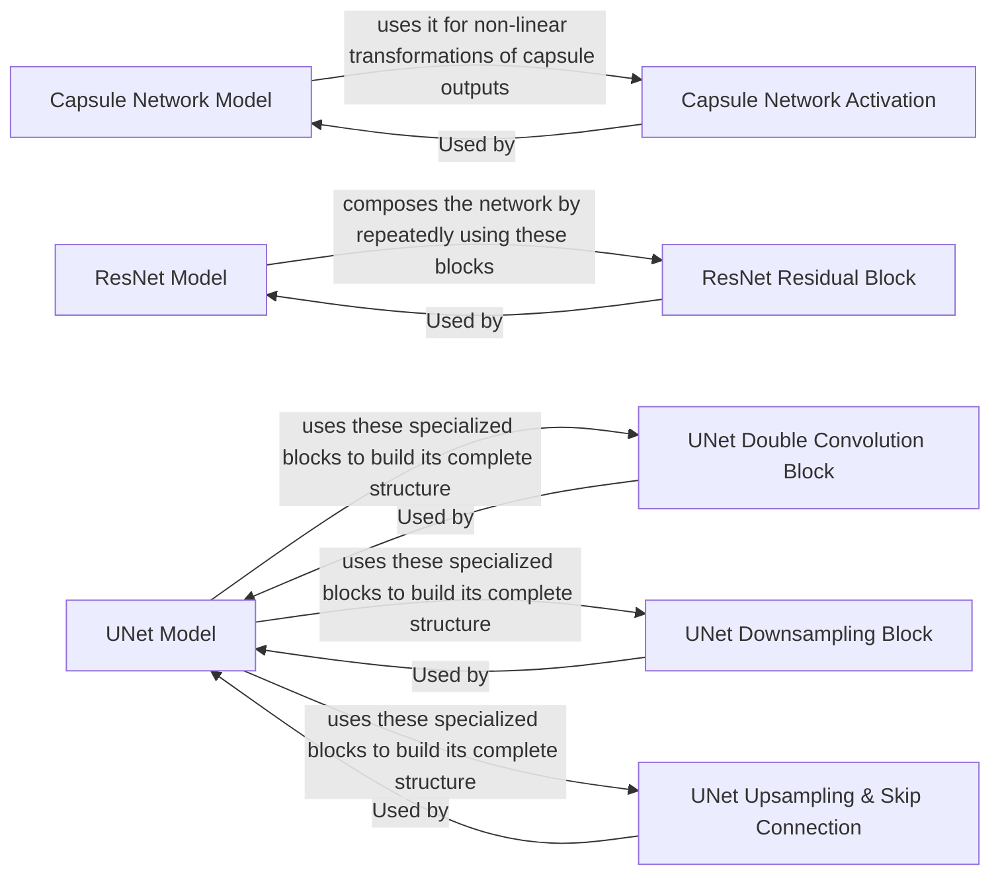

## Details

The `labml_nn` project implements several deep learning architectures, including Capsule Networks, ResNet, and U-Net. The Capsule Network Model, specifically designed for MNIST, utilizes a unique Capsule Network Activation (squashing function) for its non-linear transformations. The ResNet Model is built upon the ResNet Residual Block, which incorporates skip connections to enable the training of very deep networks. The U-Net Model, primarily used for image segmentation, is composed of specialized building blocks: the UNet Double Convolution Block for feature extraction, the UNet Downsampling Block for reducing spatial dimensions, and the UNet Upsampling & Skip Connection for restoring spatial dimensions and integrating high-resolution features. Each of these models represents a distinct subsystem, with clear internal relationships between their core components.

### Capsule Network Model
Implements the core Capsule Network architecture, specifically tailored for MNIST, including its unique routing-by-agreement mechanism. This component is responsible for the overall forward pass computation of the Capsule Network.

**Related Classes/Methods**:

- <a href="https://github.com/labmlai/annotated_deep_learning_paper_implementations/blob/master/labml_nn/capsule_networks/mnist.py#L27-L95" target="_blank" rel="noopener noreferrer">`labml_nn.capsule_networks.mnist.MNISTCapsuleNetworkModel`:27-95</a>

### Capsule Network Activation
Provides the non-linear "squashing" activation function, which is crucial and unique to Capsule Networks. This function scales vectors to a length between 0 and 1, preserving their orientation.

**Related Classes/Methods**:

- <a href="https://github.com/labmlai/annotated_deep_learning_paper_implementations/blob/master/labml_nn/capsule_networks/__init__.py" target="_blank" rel="noopener noreferrer">`labml_nn.capsule_networks.__init__.Squash`</a>

### ResNet Model
Defines the overall ResNet architecture, assembling various layers and residual blocks to form the deep convolutional network. This component is responsible for constructing the ResNet model and its forward pass.

**Related Classes/Methods**:

- <a href="https://github.com/labmlai/annotated_deep_learning_paper_implementations/blob/master/labml_nn/resnet/__init__.py#L239-L300" target="_blank" rel="noopener noreferrer">`labml_nn.resnet.ResNetBase`:239-300</a>

### ResNet Residual Block
Implements the fundamental building block of ResNet, incorporating skip connections to facilitate the training of very deep networks by mitigating the vanishing gradient problem.

**Related Classes/Methods**:

- <a href="https://github.com/labmlai/annotated_deep_learning_paper_implementations/blob/master/labml_nn/resnet/__init__.py#L88-L152" target="_blank" rel="noopener noreferrer">`labml_nn.resnet.__init__.ResidualBlock`:88-152</a>

### UNet Model
Defines the UNet architecture, characterized by its symmetric encoder-decoder structure with crucial skip connections, primarily used for image segmentation tasks. This component handles the overall construction and forward pass of the UNet.

**Related Classes/Methods**:

- <a href="https://github.com/labmlai/annotated_deep_learning_paper_implementations/blob/master/labml_nn/unet/__init__.py#L120-L187" target="_blank" rel="noopener noreferrer">`labml_nn.unet.UNet`:120-187</a>

### UNet Double Convolution Block
A common building block in the UNet encoder and decoder paths, performing a sequence of two convolutional layers, typically followed by batch normalization and activation.

**Related Classes/Methods**:

- <a href="https://github.com/labmlai/annotated_deep_learning_paper_implementations/blob/master/labml_nn/unet/__init__.py#L32-L62" target="_blank" rel="noopener noreferrer">`labml_nn.unet.__init__.DoubleConvolution`:32-62</a>

### UNet Downsampling Block
Handles the downsampling operations in the encoder path of the UNet, typically using max pooling, to progressively reduce spatial dimensions while increasing feature channels.

**Related Classes/Methods**:

- <a href="https://github.com/labmlai/annotated_deep_learning_paper_implementations/blob/master/labml_nn/unet/__init__.py#L65-L79" target="_blank" rel="noopener noreferrer">`labml_nn.unet.__init__.DownSample`:65-79</a>

### UNet Upsampling & Skip Connection
Manages the upsampling operations in the decoder path to restore spatial dimensions, and the crucial skip connections (CropAndConcat) that concatenate high-resolution features from the encoder, enabling precise localization in the output.

**Related Classes/Methods**:

- <a href="https://github.com/labmlai/annotated_deep_learning_paper_implementations/blob/master/labml_nn/unet/__init__.py#L82-L96" target="_blank" rel="noopener noreferrer">`labml_nn.unet.__init__.UpSample`:82-96</a>
- <a href="https://github.com/labmlai/annotated_deep_learning_paper_implementations/blob/master/labml_nn/unet/__init__.py#L99-L117" target="_blank" rel="noopener noreferrer">`labml_nn.unet.__init__.CropAndConcat`:99-117</a>

### [FAQ](https://github.com/CodeBoarding/GeneratedOnBoardings/tree/main?tab=readme-ov-file#faq)