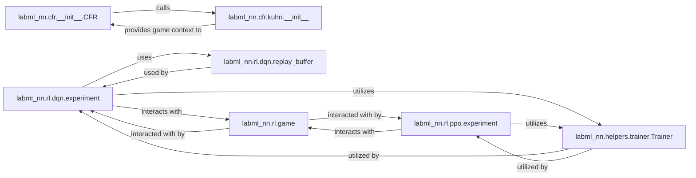

## Details

The "Reinforcement Learning Algorithms" subsystem primarily encompasses the implementations and orchestration logic for various reinforcement learning algorithms, including Deep Q-Networks (DQN), Proximal Policy Optimization (PPO), and Counterfactual Regret Minimization (CFR). Its boundaries are defined by the core experiment/main entry points for these algorithms and their direct dependencies within the `labml_nn.rl` and `labml_nn.cfr` packages.

### labml_nn.rl.dqn.experiment
Orchestrates the training and evaluation of the Deep Q-Network (DQN) algorithm. It initializes the DQN agent, manages interactions with the environment, and coordinates the training loop by sampling from the replay buffer.

**Related Classes/Methods**:

- <a href="https://github.com/labmlai/annotated_deep_learning_paper_implementations/blob/master/labml_nn/rl/dqn/experiment.py" target="_blank" rel="noopener noreferrer">`labml_nn.rl.dqn.experiment`</a>

### labml_nn.rl.ppo.experiment
Serves as the main entry point and orchestrator for Proximal Policy Optimization (PPO) algorithm training. It handles the policy and value function updates and manages interaction with the reinforcement learning environment.

**Related Classes/Methods**:

- <a href="https://github.com/labmlai/annotated_deep_learning_paper_implementations/blob/master/labml_nn/rl/ppo/experiment.py" target="_blank" rel="noopener noreferrer">`labml_nn.rl.ppo.experiment`</a>

### labml_nn.cfr.__init__.CFR
Implements the foundational Counterfactual Regret Minimization (CFR) algorithm. It is responsible for traversing the game tree, calculating regrets, and deriving optimal strategies in imperfect information games.

**Related Classes/Methods**:

- <a href="https://github.com/labmlai/annotated_deep_learning_paper_implementations/blob/master/labml_nn/cfr/__init__.py" target="_blank" rel="noopener noreferrer">`labml_nn.cfr.__init__.CFR`</a>

### labml_nn.cfr.kuhn.__init__
Provides the specific game logic and information set management for Kuhn Poker. It defines the rules, states, actions, and payoff structure necessary for applying the general CFR algorithm to this particular game.

**Related Classes/Methods**:

- <a href="https://github.com/labmlai/annotated_deep_learning_paper_implementations/blob/master/labml_nn/cfr/kuhn/__init__.py" target="_blank" rel="noopener noreferrer">`labml_nn.cfr.kuhn.__init__`</a>

### labml_nn.rl.dqn.replay_buffer
Manages a prioritized experience replay buffer, crucial for stabilizing off-policy learning in DQN. It stores and allows efficient sampling of past (state, action, reward, next_state, done) transitions.

**Related Classes/Methods**:

- <a href="https://github.com/labmlai/annotated_deep_learning_paper_implementations/blob/master/labml_nn/rl/dqn/replay_buffer.py" target="_blank" rel="noopener noreferrer">`labml_nn.rl.dqn.replay_buffer`</a>

### labml_nn.rl.game
Defines an abstract interface for reinforcement learning environments. It standardizes methods for stepping through a game, resetting its state, and providing observations and rewards, allowing different algorithms to interact with various environments uniformly.

**Related Classes/Methods**:

- <a href="https://github.com/labmlai/annotated_deep_learning_paper_implementations/blob/master/labml_nn/rl/game.py" target="_blank" rel="noopener noreferrer">`labml_nn.rl.game`</a>

### labml_nn.helpers.trainer.Trainer
A generic utility class designed to manage and standardize training loops across different machine learning models. It provides a structured way to iterate through training steps, handle data, and potentially integrate logging or checkpointing.

**Related Classes/Methods**:

- <a href="https://github.com/labmlai/annotated_deep_learning_paper_implementations/blob/master/labml_nn/helpers/trainer.py" target="_blank" rel="noopener noreferrer">`labml_nn.helpers.trainer.Trainer`</a>

### [FAQ](https://github.com/CodeBoarding/GeneratedOnBoardings/tree/main?tab=readme-ov-file#faq)