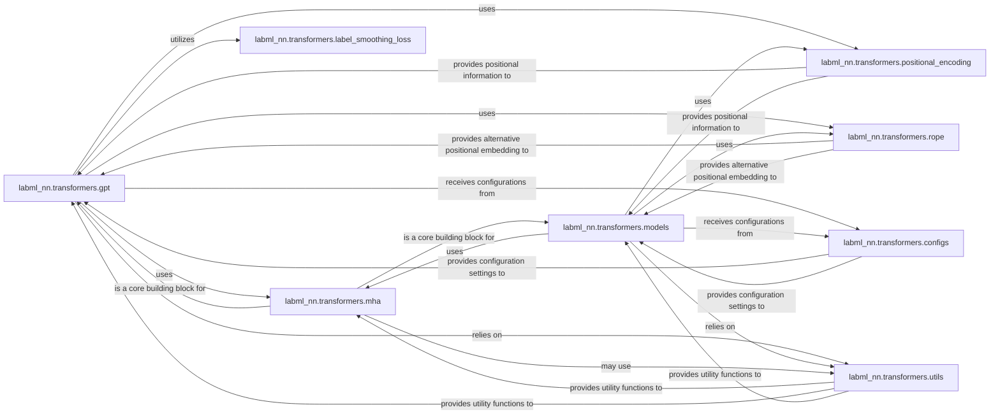

## Details

The Transformer Model Implementations subsystem is primarily encapsulated within the labml_nn.transformers package. This subsystem focuses on providing core building blocks and complete implementations of various transformer architectures.

### labml_nn.transformers.gpt
Implements the Generative Pre-trained Transformer (GPT) architecture, an autoregressive model designed for sequence generation tasks. It manages the overall GPT model structure, including layers, attention mechanisms, and forward pass logic.

**Related Classes/Methods**:

- <a href="https://github.com/labmlai/annotated_deep_learning_paper_implementations/blob/master/labml_nn/transformers/gpt" target="_blank" rel="noopener noreferrer">`labml_nn.transformers.gpt`</a>

### labml_nn.transformers.models
Provides a generic and reusable framework for constructing various transformer models, capable of encompassing both encoder and decoder functionalities. It offers a flexible base for building different transformer architectures by composing core components.

**Related Classes/Methods**:

- <a href="https://github.com/labmlai/annotated_deep_learning_paper_implementations/blob/master/labml_nn/transformers/models.py" target="_blank" rel="noopener noreferrer">`labml_nn.transformers.models`</a>

### labml_nn.transformers.mha
Implements the multi-head attention mechanism, a fundamental component for capturing dependencies across different representation subspaces within sequences. It computes attention scores and combines information from multiple "heads" to form a richer representation.

**Related Classes/Methods**:

- <a href="https://github.com/labmlai/annotated_deep_learning_paper_implementations/blob/master/labml_nn/transformers/mha.py" target="_blank" rel="noopener noreferrer">`labml_nn.transformers.mha`</a>

### labml_nn.transformers.positional_encoding
Generates and applies sinusoidal positional encodings to input sequences, providing crucial positional information to attention mechanisms, as transformers are permutation-invariant. It injects absolute positional information into token embeddings.

**Related Classes/Methods**:

- <a href="https://github.com/labmlai/annotated_deep_learning_paper_implementations/blob/master/labml_nn/transformers/positional_encoding.py" target="_blank" rel="noopener noreferrer">`labml_nn.transformers.positional_encoding`</a>

### labml_nn.transformers.rope
Implements Rotary Positional Embeddings (RoPE), an alternative and often more effective method for integrating relative positional information directly into attention computations. It modifies attention computations to incorporate relative positional data.

**Related Classes/Methods**:

- <a href="https://github.com/labmlai/annotated_deep_learning_paper_implementations/blob/master/labml_nn/transformers/rope" target="_blank" rel="noopener noreferrer">`labml_nn.transformers.rope`</a>

### labml_nn.transformers.configs
Defines and manages configuration settings for various transformer sub-components and models. It enables flexible and standardized parameterization of models and their building blocks.

**Related Classes/Methods**:

- <a href="https://github.com/labmlai/annotated_deep_learning_paper_implementations/blob/master/labml_nn/transformers/configs.py" target="_blank" rel="noopener noreferrer">`labml_nn.transformers.configs`</a>

### labml_nn.transformers.label_smoothing_loss
Provides a label smoothing regularization technique, commonly used to improve the generalization and calibration of deep learning models, particularly in sequence-to-sequence tasks. It computes a modified cross-entropy loss with label smoothing.

**Related Classes/Methods**:

- <a href="https://github.com/labmlai/annotated_deep_learning_paper_implementations/blob/master/labml_nn/transformers/label_smoothing_loss.py" target="_blank" rel="noopener noreferrer">`labml_nn.transformers.label_smoothing_loss`</a>

### labml_nn.transformers.utils
Offers general utility functions that support various transformer implementations. It provides common helper operations such as mask generation, tensor manipulations, etc.

**Related Classes/Methods**:

- <a href="https://github.com/labmlai/annotated_deep_learning_paper_implementations/blob/master/labml_nn/transformers/utils.py" target="_blank" rel="noopener noreferrer">`labml_nn.transformers.utils`</a>

### [FAQ](https://github.com/CodeBoarding/GeneratedOnBoardings/tree/main?tab=readme-ov-file#faq)