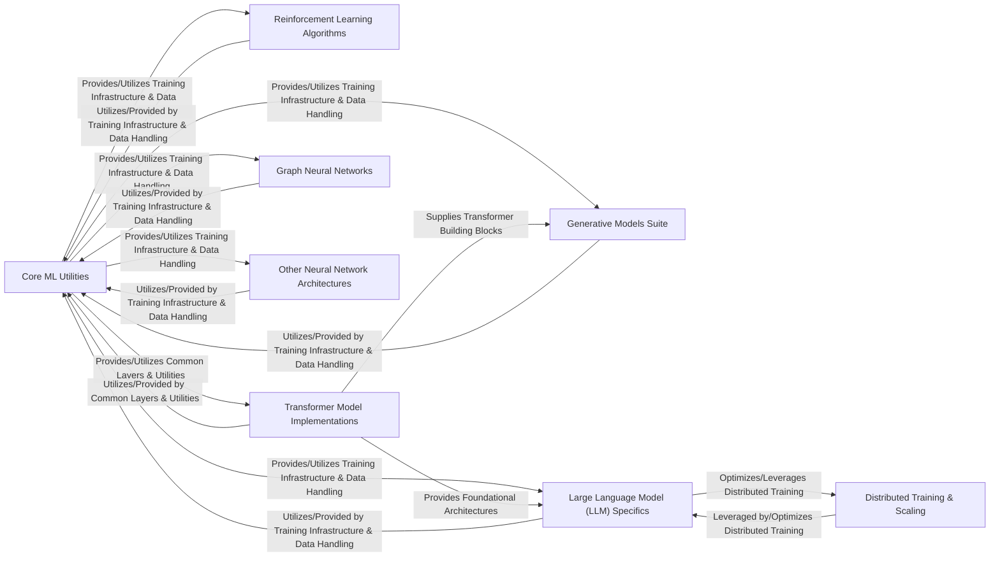

## Details

The `annotated_deep_learning_paper_implementations` project is architected as a modular ML toolkit, primarily designed to showcase diverse deep learning model implementations. At its core, the `Core ML Utilities` component provides foundational services such as data handling, training loop management, and common neural network layers, acting as a central backbone for the entire library. Specialized model suites, including `Generative Models Suite`, `Reinforcement Learning Algorithms`, `Transformer Model Implementations`, `Large Language Model (LLM) Specifics`, `Graph Neural Networks`, and `Other Neural Network Architectures`, each represent distinct functional blocks. These model implementations extensively leverage the `Core ML Utilities` for shared functionalities. Furthermore, there are specific inter-component dependencies, such as `Large Language Model (LLM) Specifics` building upon `Transformer Model Implementations` and utilizing `Distributed Training & Scaling` for performance optimization. This component-based architecture facilitates clear data and control flow, making it highly suitable for a flow graph representation where each model type is a primary architectural unit interacting with shared utilities and specialized modules.

### Core ML Utilities [[Expand]](./Core_ML_Utilities.md)
Provides foundational utilities, data handling, training infrastructure, and common neural network building blocks.

**Related Classes/Methods**:

- <a href="https://github.com/labmlai/annotated_deep_learning_paper_implementations/blob/master/labml_nn/helpers/trainer.py#L409-L415" target="_blank" rel="noopener noreferrer">`labml_nn.helpers.trainer.run`:409-415</a>
- <a href="https://github.com/labmlai/annotated_deep_learning_paper_implementations/blob/master/labml_nn/helpers/datasets.py" target="_blank" rel="noopener noreferrer">`labml_nn.helpers.datasets`</a>
- <a href="https://github.com/labmlai/annotated_deep_learning_paper_implementations/blob/master/labml_nn/optimizers/adam.py" target="_blank" rel="noopener noreferrer">`labml_nn.optimizers.adam`</a>
- <a href="https://github.com/labmlai/annotated_deep_learning_paper_implementations/blob/master/labml_nn/normalization/batch_norm" target="_blank" rel="noopener noreferrer">`labml_nn.normalization.batch_norm`</a>

### Generative Models Suite [[Expand]](./Generative_Models_Suite.md)
Implementations of various generative models (e.g., Diffusion Models, GANs, SketchRNN).

**Related Classes/Methods**:

- <a href="https://github.com/labmlai/annotated_deep_learning_paper_implementations/blob/master/labml_nn/diffusion/ddpm/experiment.py#L225-L247" target="_blank" rel="noopener noreferrer">`labml_nn.diffusion.ddpm.experiment.main`:225-247</a>
- <a href="https://github.com/labmlai/annotated_deep_learning_paper_implementations/blob/master/labml_nn/diffusion/stable_diffusion/scripts/text_to_image.py#L104-L153" target="_blank" rel="noopener noreferrer">`labml_nn.diffusion.stable_diffusion.scripts.text_to_image.main`:104-153</a>
- <a href="https://github.com/labmlai/annotated_deep_learning_paper_implementations/blob/master/labml_nn/gan/cycle_gan/__init__.py#L663-L683" target="_blank" rel="noopener noreferrer">`labml_nn.gan.cycle_gan.__init__.train`:663-683</a>

### Reinforcement Learning Algorithms [[Expand]](./Reinforcement_Learning_Algorithms.md)
Implementations of reinforcement learning algorithms (e.g., DQN, PPO, CFR).

**Related Classes/Methods**:

- <a href="https://github.com/labmlai/annotated_deep_learning_paper_implementations/blob/master/labml_nn/rl/dqn/experiment.py#L254-L285" target="_blank" rel="noopener noreferrer">`labml_nn.rl.dqn.experiment.main`:254-285</a>
- <a href="https://github.com/labmlai/annotated_deep_learning_paper_implementations/blob/master/labml_nn/rl/ppo/experiment.py#L353-L391" target="_blank" rel="noopener noreferrer">`labml_nn.rl.ppo.experiment.main`:353-391</a>
- <a href="https://github.com/labmlai/annotated_deep_learning_paper_implementations/blob/master/labml_nn/cfr/kuhn/__init__.py#L226-L243" target="_blank" rel="noopener noreferrer">`labml_nn.cfr.kuhn.__init__.main`:226-243</a>

### Transformer Model Implementations [[Expand]](./Transformer_Model_Implementations.md)
Core transformer architectures, attention mechanisms, and positional encoding schemes.

**Related Classes/Methods**:

- <a href="https://github.com/labmlai/annotated_deep_learning_paper_implementations/blob/master/labml_nn/transformers/mha.py" target="_blank" rel="noopener noreferrer">`labml_nn.transformers.mha`</a>
- <a href="https://github.com/labmlai/annotated_deep_learning_paper_implementations/blob/master/labml_nn/transformers/positional_encoding.py" target="_blank" rel="noopener noreferrer">`labml_nn.transformers.positional_encoding`</a>
- <a href="https://github.com/labmlai/annotated_deep_learning_paper_implementations/blob/master/labml_nn/transformers/gpt/__init__.py#L220-L259" target="_blank" rel="noopener noreferrer">`labml_nn.transformers.gpt.__init__.main`:220-259</a>

### Large Language Model (LLM) Specifics [[Expand]](./Large_Language_Model_LLM_Specifics.md)
Dedicated modules for large-scale language models, including specific architectures (NeoX, RWKV) and fine-tuning techniques (LoRA).

**Related Classes/Methods**:

- <a href="https://github.com/labmlai/annotated_deep_learning_paper_implementations/blob/master/labml_nn/neox/model.py" target="_blank" rel="noopener noreferrer">`labml_nn.neox.model`</a>
- <a href="https://github.com/labmlai/annotated_deep_learning_paper_implementations/blob/master/labml_nn/neox/utils/trainer.py#L76-L79" target="_blank" rel="noopener noreferrer">`labml_nn.neox.utils.trainer.train`:76-79</a>
- <a href="https://github.com/labmlai/annotated_deep_learning_paper_implementations/blob/master/labml_nn/lora/gpt2.py#L140-L167" target="_blank" rel="noopener noreferrer">`labml_nn.lora.gpt2.__init__`:140-167</a>

### Graph Neural Networks [[Expand]](./Graph_Neural_Networks.md)
Implementations of neural networks for graph-structured data (e.g., GAT, GATv2).

**Related Classes/Methods**:

- <a href="https://github.com/labmlai/annotated_deep_learning_paper_implementations/blob/master/labml_nn/graphs/gat/experiment.py#L288-L304" target="_blank" rel="noopener noreferrer">`labml_nn.graphs.gat.experiment.main`:288-304</a>
- <a href="https://github.com/labmlai/annotated_deep_learning_paper_implementations/blob/master/labml_nn/graphs/gatv2" target="_blank" rel="noopener noreferrer">`labml_nn.graphs.gatv2`</a>

### Other Neural Network Architectures [[Expand]](./Other_Neural_Network_Architectures.md)
Diverse neural network models not categorized elsewhere (e.g., ResNet, UNet, Capsule Networks).

**Related Classes/Methods**:

- <a href="https://github.com/labmlai/annotated_deep_learning_paper_implementations/blob/master/labml_nn/capsule_networks/mnist.py#L152-L155" target="_blank" rel="noopener noreferrer">`labml_nn.capsule_networks.mnist.capsule_network_model`:152-155</a>
- <a href="https://github.com/labmlai/annotated_deep_learning_paper_implementations/blob/master/labml_nn/resnet/experiment.py#L54-L77" target="_blank" rel="noopener noreferrer">`labml_nn.resnet.experiment.main`:54-77</a>
- <a href="https://github.com/labmlai/annotated_deep_learning_paper_implementations/blob/master/labml_nn/unet/experiment.py" target="_blank" rel="noopener noreferrer">`labml_nn.unet/experiment`</a>

### Distributed Training & Scaling [[Expand]](./Distributed_Training_Scaling.md)
Modules for optimizing training of large models, focusing on memory and computational efficiency (e.g., ZeRO-3).

**Related Classes/Methods**:

- <a href="https://github.com/labmlai/annotated_deep_learning_paper_implementations/blob/master/labml_nn/scaling/zero3/__init__.py" target="_blank" rel="noopener noreferrer">`labml_nn.scaling.zero3.__init__`</a>

### [FAQ](https://github.com/CodeBoarding/GeneratedOnBoardings/tree/main?tab=readme-ov-file#faq)