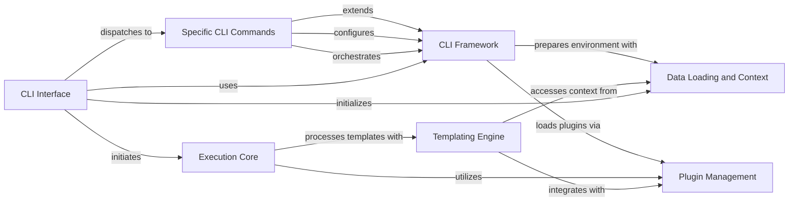

## Component Details

This graph illustrates the core components of the Ansible CLI and their interactions. The `CLI Interface` serves as the primary entry point, utilizing the `CLI Framework` for common functionalities like argument parsing and version display. Specific CLI commands, represented by `Specific CLI Commands`, extend this framework to provide specialized functionalities. The `CLI Framework` also interacts with `Data Loading and Context` to prepare the environment and `Plugin Management` to load necessary plugins. The `Execution Core` is responsible for orchestrating the actual execution of tasks and playbooks, leveraging `Plugin Management` and `Templating Engine` for dynamic content. The `Templating Engine` further relies on `Data Loading and Context` and `Plugin Management` for its operations. The overall flow starts with the `CLI Interface` initiating the process, which then dispatches to specific commands, leading to the setup of the environment and the eventual execution of tasks by the `Execution Core`.

### CLI Interface
Provides the command-line interface for Ansible, handling argument parsing, user input, version information display, and dispatching commands to the core execution logic. It serves as the primary entry point for users interacting with Ansible.

**Related Classes/Methods**:

- <a href="https://github.com/ansible/ansible/blob/master/test/lib/ansible_test/_internal/provider/layout/ansible.py#L16-L49" target="_blank" rel="noopener noreferrer">`ansible.cli.CLI` (16:49)</a>
- <a href="https://github.com/ansible/ansible/blob/master/lib/ansible/cli/arguments/option_helpers.py#L64-L151" target="_blank" rel="noopener noreferrer">`ansible.cli.arguments.option_helpers.ArgumentParser` (64:151)</a>

### CLI Framework
This component provides the foundational structure for all Ansible command-line interfaces, handling common argument parsing, vault secret management, and the overall command execution flow. It includes the base CLI class and helper functions for argument definition.

**Related Classes/Methods**:

- `ansible.cli.CLI` (full file reference)
- `ansible.cli.arguments.option_helpers` (full file reference)
- <a href="https://github.com/ansible/ansible/blob/master/lib/ansible/cli/arguments/option_helpers.py#L64-L151" target="_blank" rel="noopener noreferrer">`ansible.cli.arguments.option_helpers.ArgumentParser` (64:151)</a>
- <a href="https://github.com/ansible/ansible/blob/master/lib/ansible/cli/arguments/option_helpers.py#L40-L61" target="_blank" rel="noopener noreferrer">`ansible.cli.arguments.option_helpers.DeprecatedArgument` (40:61)</a>
- <a href="https://github.com/ansible/ansible/blob/master/lib/ansible/cli/arguments/option_helpers.py#L154-L158" target="_blank" rel="noopener noreferrer">`ansible.cli.arguments.option_helpers.AnsibleVersion` (154:158)</a>
- `ansible.cli.scripts.ansible_connection_cli_stub` (full file reference)

### Specific CLI Commands
This component encompasses the various specialized command-line tools provided by Ansible, each extending the base CLI framework to offer distinct functionalities like managing playbooks, inventory, or vault operations. These classes define the specific arguments and execution logic for each Ansible command.

**Related Classes/Methods**:

- <a href="https://github.com/ansible/ansible/blob/master/lib/ansible/cli/pull.py#L63-L403" target="_blank" rel="noopener noreferrer">`ansible.lib.ansible.cli.pull.PullCLI` (63:403)</a>
- <a href="https://github.com/ansible/ansible/blob/master/lib/ansible/cli/inventory.py#L32-L400" target="_blank" rel="noopener noreferrer">`ansible.lib.ansible.cli.inventory.InventoryCLI` (32:400)</a>
- <a href="https://github.com/ansible/ansible/blob/master/lib/ansible/cli/adhoc.py#L29-L205" target="_blank" rel="noopener noreferrer">`ansible.lib.ansible.cli.adhoc.AdHocCLI` (29:205)</a>
- <a href="https://github.com/ansible/ansible/blob/master/lib/ansible/cli/doc.py#L441-L1583" target="_blank" rel="noopener noreferrer">`ansible.lib.ansible.cli.doc.DocCLI` (441:1583)</a>
- <a href="https://github.com/ansible/ansible/blob/master/lib/ansible/cli/playbook.py#L31-L227" target="_blank" rel="noopener noreferrer">`ansible.lib.ansible.cli.playbook.PlaybookCLI` (31:227)</a>
- <a href="https://github.com/ansible/ansible/blob/master/lib/ansible/cli/vault.py#L27-L483" target="_blank" rel="noopener noreferrer">`ansible.lib.ansible.cli.vault.VaultCLI` (27:483)</a>
- <a href="https://github.com/ansible/ansible/blob/master/lib/ansible/cli/config.py#L86-L691" target="_blank" rel="noopener noreferrer">`ansible.lib.ansible.cli.config.ConfigCLI` (86:691)</a>
- <a href="https://github.com/ansible/ansible/blob/master/lib/ansible/cli/galaxy.py#L181-L1877" target="_blank" rel="noopener noreferrer">`ansible.lib.ansible.cli.galaxy.GalaxyCLI` (181:1877)</a>
- <a href="https://github.com/ansible/ansible/blob/master/lib/ansible/cli/console.py#L38-L601" target="_blank" rel="noopener noreferrer">`ansible.lib.ansible.cli.console.ConsoleCLI` (38:601)</a>

### Templating Engine
This component is responsible for processing and rendering Jinja2 templates, enabling dynamic variable substitution and conditional logic within Ansible configurations and tasks. It includes the main Templar class and its underlying Jinja2 integration components.

**Related Classes/Methods**:

- `ansible.template.Templar` (full file reference)
- <a href="https://github.com/ansible/ansible/blob/master/lib/ansible/_internal/_templating/_engine.py#L90-L592" target="_blank" rel="noopener noreferrer">`ansible._internal._templating._engine.TemplateEngine` (90:592)</a>
- `ansible._internal._templating._jinja_bits` (full file reference)
- `ansible._internal._templating._jinja_plugins` (full file reference)
- `ansible._internal._templating._lazy_containers` (full file reference)
- `ansible._internal._templating._errors` (full file reference)
- `ansible._internal._templating._datatag` (full file reference)
- `ansible._internal._templating._utils` (full file reference)
- `ansible._internal._templating._marker_behaviors` (full file reference)
- <a href="https://github.com/ansible/ansible/blob/master/lib/ansible/_internal/_task.py#L48-L78" target="_blank" rel="noopener noreferrer">`ansible._internal._task.TaskArgsFinalizer` (48:78)</a>

### Plugin Management
This component manages the discovery, loading, and access of various Ansible plugins, such as action plugins, callback plugins, and lookup plugins, which extend Ansible's core capabilities and provide modular functionality.

**Related Classes/Methods**:

- <a href="https://github.com/ansible/ansible/blob/master/lib/ansible/plugins/loader.py#L290-L1227" target="_blank" rel="noopener noreferrer">`ansible.plugins.loader.PluginLoader` (290:1227)</a>

### Execution Core
This component orchestrates the execution of Ansible playbooks and tasks. It manages the task queue, handles connections to remote hosts, and interacts with various plugins to perform the actual operations defined in playbooks.

**Related Classes/Methods**:

- <a href="https://github.com/ansible/ansible/blob/master/lib/ansible/executor/playbook_executor.py#L41-L330" target="_blank" rel="noopener noreferrer">`ansible.executor.playbook_executor.PlaybookExecutor` (41:330)</a>
- <a href="https://github.com/ansible/ansible/blob/master/lib/ansible/executor/task_queue_manager.py#L115-L501" target="_blank" rel="noopener noreferrer">`ansible.executor.task_queue_manager.TaskQueueManager` (115:501)</a>
- <a href="https://github.com/ansible/ansible/blob/master/lib/ansible/executor/task_executor.py#L55-L1175" target="_blank" rel="noopener noreferrer">`ansible.executor.task_executor.TaskExecutor` (55:1175)</a>
- <a href="https://github.com/ansible/ansible/blob/master/lib/ansible/executor/powershell/module_manifest.py#L53-L299" target="_blank" rel="noopener noreferrer">`ansible.executor.powershell.module_manifest.PSModuleDepFinder` (53:299)</a>

### Data Loading and Context
This component is responsible for loading and parsing various data sources, including inventory and configuration files. It also manages the global context and ambient environment for Ansible operations, providing necessary data and settings to other components.

**Related Classes/Methods**:

- <a href="https://github.com/ansible/ansible/blob/master/lib/ansible/parsing/dataloader.py#L38-L523" target="_blank" rel="noopener noreferrer">`ansible.parsing.dataloader.DataLoader` (38:523)</a>
- <a href="https://github.com/ansible/ansible/blob/master/lib/ansible/context.py#L30-L33" target="_blank" rel="noopener noreferrer">`ansible.context._init_global_context` (30:33)</a>
- <a href="https://github.com/ansible/ansible/blob/master/lib/ansible/module_utils/_internal/_ambient_context.py#L13-L58" target="_blank" rel="noopener noreferrer">`ansible.module_utils._internal._ambient_context.AmbientContextBase` (13:58)</a>

### [FAQ](https://github.com/CodeBoarding/GeneratedOnBoardings/tree/main?tab=readme-ov-file#faq)