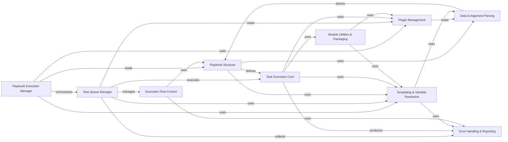

## Component Details

The Execution Engine subsystem in Ansible is responsible for orchestrating the entire process of running playbooks and tasks on target hosts. It manages the lifecycle of playbook execution, from loading playbook definitions and templating variables to dispatching individual tasks, handling their results, and managing execution strategies. The core flow involves the Playbook Execution Manager initiating the run, which then leverages the Task Queue Manager to handle parallel execution across hosts. The Task Queue Manager, in turn, uses the Play Iterator to traverse the playbook structure and the Task Execution Core to run individual tasks. Module Utilities & Packaging ensures modules are correctly prepared and executed, while Plugin Management provides a flexible system for loading various Ansible plugins. Templating & Variable Resolution is crucial for dynamic configuration, and Data & Argument Parsing handles the input data. Error Handling & Reporting provides mechanisms for dealing with failures and collecting statistics.

### Playbook Execution Manager
The top-level orchestrator responsible for initiating and managing the execution of Ansible playbooks. It handles playbook loading, variable prompting, host batching for serialized runs, and the generation of retry inventories.

**Related Classes/Methods**:

- <a href="https://github.com/ansible/ansible/blob/master/lib/ansible/executor/playbook_executor.py#L41-L330" target="_blank" rel="noopener noreferrer">`ansible.executor.playbook_executor.PlaybookExecutor` (41:330)</a>

### Task Queue Manager
Manages the execution of tasks across multiple hosts, handling multiprocessing, dispatching tasks based on the chosen strategy, and processing callbacks. It tracks the state of hosts, including failures and unreachable hosts.

**Related Classes/Methods**:

- <a href="https://github.com/ansible/ansible/blob/master/lib/ansible/executor/task_queue_manager.py#L115-L501" target="_blank" rel="noopener noreferrer">`ansible.executor.task_queue_manager.TaskQueueManager` (115:501)</a>

### Playbook Structure
Defines the hierarchical structure of an Ansible playbook, including plays, roles, blocks of tasks, and individual tasks. It handles loading these definitions from YAML files and managing their attributes and relationships.

**Related Classes/Methods**:

- `ansible.playbook.Playbook` (full file reference)
- <a href="https://github.com/ansible/ansible/blob/master/lib/ansible/playbook/play.py#L43-L440" target="_blank" rel="noopener noreferrer">`ansible.playbook.play.Play` (43:440)</a>
- <a href="https://github.com/ansible/ansible/blob/master/lib/ansible/playbook/block.py#L34-L442" target="_blank" rel="noopener noreferrer">`ansible.playbook.block.Block` (34:442)</a>
- <a href="https://github.com/ansible/ansible/blob/master/lib/ansible/playbook/task.py#L56-L612" target="_blank" rel="noopener noreferrer">`ansible.playbook.task.Task` (56:612)</a>
- <a href="https://github.com/ansible/ansible/blob/master/lib/ansible/playbook/playbook_include.py#L40-L168" target="_blank" rel="noopener noreferrer">`ansible.playbook.playbook_include.PlaybookInclude` (40:168)</a>

### Task Execution Core
Executes individual tasks on target hosts. It is responsible for preparing module arguments, handling loops, interacting with connection and privilege escalation plugins, and processing the raw results from module execution.

**Related Classes/Methods**:

- <a href="https://github.com/ansible/ansible/blob/master/lib/ansible/executor/task_executor.py#L55-L1175" target="_blank" rel="noopener noreferrer">`ansible.executor.task_executor.TaskExecutor` (55:1175)</a>

### Module Utilities & Packaging
Provides essential functionalities for Ansible modules, including discovering Python interpreters on remote hosts, handling module metadata, and packaging modules and their dependencies into a single executable payload (AnsiballZ) for efficient remote transfer and execution. It also supports PowerShell module manifests.

**Related Classes/Methods**:

- `ansible.executor.module_common` (full file reference)
- `ansible.executor.interpreter_discovery` (full file reference)
- `ansible.executor.powershell.module_manifest` (full file reference)

### Plugin Management
A comprehensive system for discovering, loading, and managing various types of Ansible plugins (e.g., connection, shell, become, callback, strategy, lookup, filter, test, vars, inventory, action, terminal, cliconf, netconf, httpapi). It handles plugin paths, aliases, and deprecations, ensuring that the correct plugin is loaded and used.

**Related Classes/Methods**:

- <a href="https://github.com/ansible/ansible/blob/master/lib/ansible/plugins/loader.py#L290-L1227" target="_blank" rel="noopener noreferrer">`ansible.plugins.loader.PluginLoader` (290:1227)</a>
- <a href="https://github.com/ansible/ansible/blob/master/lib/ansible/plugins/loader.py#L800-L805" target="_blank" rel="noopener noreferrer">`ansible.plugins.loader.action_loader` (800:805)</a>
- <a href="https://github.com/ansible/ansible/blob/master/lib/ansible/plugins/loader.py#L830-L834" target="_blank" rel="noopener noreferrer">`ansible.plugins.loader.module_loader` (830:834)</a>
- <a href="https://github.com/ansible/ansible/blob/master/lib/ansible/plugins/loader.py#L815-L822" target="_blank" rel="noopener noreferrer">`ansible.plugins.loader.connection_loader` (815:822)</a>
- <a href="https://github.com/ansible/ansible/blob/master/lib/ansible/plugins/loader.py#L865-L870" target="_blank" rel="noopener noreferrer">`ansible.plugins.loader.strategy_loader` (865:870)</a>
- <a href="https://github.com/ansible/ansible/blob/master/lib/ansible/plugins/loader.py#L810-L814" target="_blank" rel="noopener noreferrer">`ansible.plugins.loader.callback_loader` (810:814)</a>
- <a href="https://github.com/ansible/ansible/blob/master/lib/ansible/plugins/loader.py#L900-L904" target="_blank" rel="noopener noreferrer">`ansible.plugins.loader.become_loader` (900:904)</a>
- <a href="https://github.com/ansible/ansible/blob/master/lib/ansible/plugins/loader.py#L825-L829" target="_blank" rel="noopener noreferrer">`ansible.plugins.loader.shell_loader` (825:829)</a>

### Templating & Variable Resolution
Provides Jinja2-based templating capabilities for dynamic variable substitution and expression evaluation. It handles various templating options, including trust checks and error handling, and manages host-specific variables for templating within their respective contexts.

**Related Classes/Methods**:

- <a href="https://github.com/ansible/ansible/blob/master/lib/ansible/_internal/_templating/_engine.py#L90-L592" target="_blank" rel="noopener noreferrer">`ansible._internal._templating._engine.TemplateEngine` (90:592)</a>
- <a href="https://github.com/ansible/ansible/blob/master/lib/ansible/vars/hostvars.py#L35-L82" target="_blank" rel="noopener noreferrer">`ansible.vars.hostvars.HostVars` (35:82)</a>

### Data & Argument Parsing
Handles the loading and parsing of various data formats, primarily YAML and JSON, from files or strings. It includes functionalities for vault decryption and caching. Additionally, it is responsible for parsing module arguments from different input syntaxes into a canonical form.

**Related Classes/Methods**:

- <a href="https://github.com/ansible/ansible/blob/master/lib/ansible/parsing/dataloader.py#L38-L523" target="_blank" rel="noopener noreferrer">`ansible.parsing.dataloader.DataLoader` (38:523)</a>
- <a href="https://github.com/ansible/ansible/blob/master/lib/ansible/parsing/mod_args.py#L70-L350" target="_blank" rel="noopener noreferrer">`ansible.parsing.mod_args.ModuleArgsParser` (70:350)</a>

### Execution Flow Control
Manages the iteration through plays and tasks within a playbook, maintaining the execution state for each host. It determines the next task to be executed for a given host, handles task skipping, and manages the flow through `block`, `rescue`, and `always` sections.

**Related Classes/Methods**:

- <a href="https://github.com/ansible/ansible/blob/master/lib/ansible/executor/play_iterator.py#L145-L666" target="_blank" rel="noopener noreferrer">`ansible.executor.play_iterator.PlayIterator` (145:666)</a>
- <a href="https://github.com/ansible/ansible/blob/master/lib/ansible/executor/play_iterator.py#L56-L142" target="_blank" rel="noopener noreferrer">`ansible.executor.play_iterator.HostState` (56:142)</a>

### Error Handling & Reporting
Provides a centralized mechanism for handling various types of errors and exceptions that occur during playbook and task execution. It defines custom exception classes for specific error conditions and is responsible for collecting and aggregating execution statistics across all hosts.

**Related Classes/Methods**:

- `ansible.errors.AnsibleError` (full file reference)
- <a href="https://github.com/ansible/ansible/blob/master/lib/ansible/executor/task_result.py#L174-L226" target="_blank" rel="noopener noreferrer">`ansible.executor.task_result._RawTaskResult` (174:226)</a>
- <a href="https://github.com/ansible/ansible/blob/master/lib/ansible/executor/stats.py#L25-L98" target="_blank" rel="noopener noreferrer">`ansible.executor.stats.AggregateStats` (25:98)</a>

### [FAQ](https://github.com/CodeBoarding/GeneratedOnBoardings/tree/main?tab=readme-ov-file#faq)