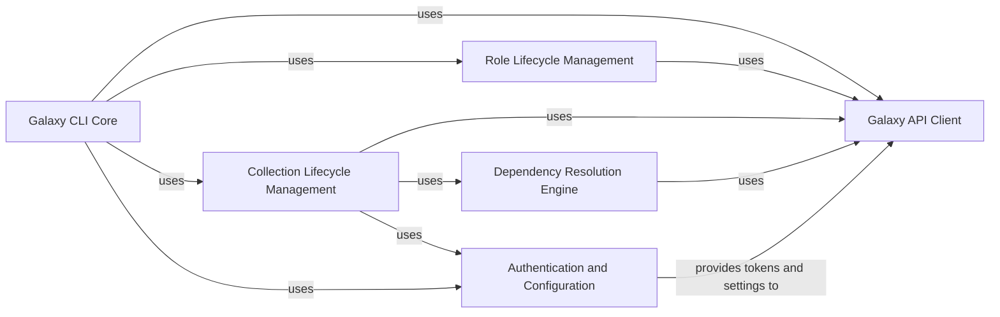

## Component Details

The Galaxy Integration subsystem facilitates comprehensive interaction with Ansible Galaxy, serving as a central hub for managing Ansible content. It encompasses the command-line interface for user interaction, robust API client capabilities for server communication, and dedicated components for the lifecycle management of both Ansible roles and collections. A critical aspect of this subsystem is its sophisticated dependency resolution engine, which ensures that all required content and their versions are correctly identified and handled. Furthermore, it includes a dedicated component for managing authentication tokens and configuration settings, ensuring secure and customizable operations with Galaxy servers. The overall purpose is to provide a complete and reliable solution for sharing, finding, building, downloading, installing, publishing, and verifying Ansible content, including advanced features like GPG signature verification.

### Galaxy CLI Core
This component serves as the primary command-line interface for interacting with Ansible Galaxy. It is responsible for parsing user arguments, initializing the Galaxy environment, managing API server connections, and dispatching commands to the appropriate role or collection management functionalities. It also includes utility functions for displaying formatted output to the user.

**Related Classes/Methods**:

- <a href="https://github.com/ansible/ansible/blob/master/lib/ansible/cli/galaxy.py#L181-L1877" target="_blank" rel="noopener noreferrer">`ansible.cli.galaxy.GalaxyCLI` (181:1877)</a>
- <a href="https://github.com/ansible/ansible/blob/master/lib/ansible/cli/galaxy.py#L1880-L1881" target="_blank" rel="noopener noreferrer">`ansible.cli.galaxy.main` (1880:1881)</a>
- <a href="https://github.com/ansible/ansible/blob/master/lib/ansible/cli/galaxy.py#L158-L178" target="_blank" rel="noopener noreferrer">`ansible.cli.galaxy.RoleDistributionServer` (158:178)</a>
- <a href="https://github.com/ansible/ansible/blob/master/lib/ansible/cli/galaxy.py#L104-L113" target="_blank" rel="noopener noreferrer">`ansible.cli.galaxy._display_header` (104:113)</a>
- <a href="https://github.com/ansible/ansible/blob/master/lib/ansible/cli/galaxy.py#L116-L123" target="_blank" rel="noopener noreferrer">`ansible.cli.galaxy._display_role` (116:123)</a>
- <a href="https://github.com/ansible/ansible/blob/master/lib/ansible/cli/galaxy.py#L126-L132" target="_blank" rel="noopener noreferrer">`ansible.cli.galaxy._display_collection` (126:132)</a>
- <a href="https://github.com/ansible/ansible/blob/master/lib/ansible/cli/galaxy.py#L135-L145" target="_blank" rel="noopener noreferrer">`ansible.cli.galaxy._get_collection_widths` (135:145)</a>
- <a href="https://github.com/ansible/ansible/blob/master/lib/ansible/cli/galaxy.py#L148-L154" target="_blank" rel="noopener noreferrer">`ansible.cli.galaxy.validate_signature_count` (148:154)</a>
- <a href="https://github.com/ansible/ansible/blob/master/lib/ansible/cli/galaxy.py#L71-L101" target="_blank" rel="noopener noreferrer">`ansible.cli.galaxy.with_collection_artifacts_manager` (71:101)</a>
- <a href="https://github.com/ansible/ansible/blob/master/lib/ansible/cli/galaxy.py#L915-L916" target="_blank" rel="noopener noreferrer">`ansible.cli.galaxy.GalaxyCLI._resolve_path` (915:916)</a>
- <a href="https://github.com/ansible/ansible/blob/master/lib/ansible/cli/galaxy.py#L738-L739" target="_blank" rel="noopener noreferrer">`ansible.cli.galaxy.GalaxyCLI._get_default_collection_path` (738:739)</a>
- <a href="https://github.com/ansible/ansible/blob/master/lib/ansible/cli/galaxy.py#L741-L843" target="_blank" rel="noopener noreferrer">`ansible.cli.galaxy.GalaxyCLI._parse_requirements_file` (741:843)</a>
- <a href="https://github.com/ansible/ansible/blob/master/lib/ansible/cli/galaxy.py#L845-L875" target="_blank" rel="noopener noreferrer">`ansible.cli.galaxy.GalaxyCLI._init_coll_req_dict` (845:875)</a>
- <a href="https://github.com/ansible/ansible/blob/master/lib/ansible/cli/galaxy.py#L878-L884" target="_blank" rel="noopener noreferrer">`ansible.cli.galaxy.GalaxyCLI.exit_without_ignore` (878:884)</a>
- <a href="https://github.com/ansible/ansible/blob/master/lib/ansible/cli/galaxy.py#L887-L912" target="_blank" rel="noopener noreferrer">`ansible.cli.galaxy.GalaxyCLI._display_role_info` (887:912)</a>
- <a href="https://github.com/ansible/ansible/blob/master/lib/ansible/cli/galaxy.py#L919-L962" target="_blank" rel="noopener noreferrer">`ansible.cli.galaxy.GalaxyCLI._get_skeleton_galaxy_yml` (919:962)</a>
- <a href="https://github.com/ansible/ansible/blob/master/lib/ansible/cli/galaxy.py#L964-L994" target="_blank" rel="noopener noreferrer">`ansible.cli.galaxy.GalaxyCLI._require_one_of_collections_requirements` (964:994)</a>

### Galaxy API Client
This component provides the interface for programmatic interaction with Ansible Galaxy servers. It handles connection management, API version negotiation, authentication, and making various requests to fetch or submit data related to roles and collections. It also includes caching mechanisms for API responses.

**Related Classes/Methods**:

- <a href="https://github.com/ansible/ansible/blob/master/lib/ansible/galaxy/api.py#L274-L935" target="_blank" rel="noopener noreferrer">`ansible.galaxy.api.GalaxyAPI` (274:935)</a>
- <a href="https://github.com/ansible/ansible/blob/master/lib/ansible/galaxy/api.py#L72-L146" target="_blank" rel="noopener noreferrer">`ansible.galaxy.api.g_connect` (72:146)</a>
- <a href="https://github.com/ansible/ansible/blob/master/lib/ansible/galaxy/api.py#L164-L195" target="_blank" rel="noopener noreferrer">`ansible.galaxy.api._load_cache` (164:195)</a>
- <a href="https://github.com/ansible/ansible/blob/master/lib/ansible/galaxy/api.py#L198-L199" target="_blank" rel="noopener noreferrer">`ansible.galaxy.api._urljoin` (198:199)</a>
- <a href="https://github.com/ansible/ansible/blob/master/lib/ansible/galaxy/api.py#L202-L239" target="_blank" rel="noopener noreferrer">`ansible.galaxy.api.GalaxyError` (202:239)</a>

### Role Lifecycle Management
This component encapsulates the logic for managing Ansible roles, including their installation from various sources (Galaxy, URLs, local files), removal from the local system, displaying detailed information, searching on Galaxy, importing to Galaxy, and setting up integrations.

**Related Classes/Methods**:

- <a href="https://github.com/ansible/ansible/blob/master/lib/ansible/galaxy/role.py#L75-L481" target="_blank" rel="noopener noreferrer">`ansible.galaxy.role.GalaxyRole` (75:481)</a>
- <a href="https://github.com/ansible/ansible/blob/master/lib/ansible/galaxy/role.py#L161-L176" target="_blank" rel="noopener noreferrer">`ansible.galaxy.role.GalaxyRole.metadata_dependencies` (161:176)</a>
- <a href="https://github.com/ansible/ansible/blob/master/lib/ansible/galaxy/role.py#L240-L268" target="_blank" rel="noopener noreferrer">`ansible.galaxy.role.GalaxyRole.fetch` (240:268)</a>
- <a href="https://github.com/ansible/ansible/blob/master/lib/ansible/galaxy/role.py#L270-L445" target="_blank" rel="noopener noreferrer">`ansible.galaxy.role.GalaxyRole.install` (270:445)</a>
- <a href="https://github.com/ansible/ansible/blob/master/lib/ansible/galaxy/role.py#L461-L481" target="_blank" rel="noopener noreferrer">`ansible.galaxy.role.GalaxyRole.requirements` (461:481)</a>
- <a href="https://github.com/ansible/ansible/blob/master/lib/ansible/cli/galaxy.py#L1000-L1006" target="_blank" rel="noopener noreferrer">`ansible.cli.galaxy.GalaxyCLI.execute_role` (1000:1006)</a>
- <a href="https://github.com/ansible/ansible/blob/master/lib/ansible/cli/galaxy.py#L1540-L1558" target="_blank" rel="noopener noreferrer">`ansible.cli.galaxy.GalaxyCLI.execute_remove` (1540:1558)</a>
- <a href="https://github.com/ansible/ansible/blob/master/lib/ansible/cli/galaxy.py#L1570-L1626" target="_blank" rel="noopener noreferrer">`ansible.cli.galaxy.GalaxyCLI.execute_list_role` (1570:1626)</a>
- <a href="https://github.com/ansible/ansible/blob/master/lib/ansible/cli/galaxy.py#L1728-L1767" target="_blank" rel="noopener noreferrer">`ansible.cli.galaxy.GalaxyCLI.execute_search` (1728:1767)</a>
- <a href="https://github.com/ansible/ansible/blob/master/lib/ansible/cli/galaxy.py#L1771-L1826" target="_blank" rel="noopener noreferrer">`ansible.cli.galaxy.GalaxyCLI.execute_import` (1771:1826)</a>
- <a href="https://github.com/ansible/ansible/blob/master/lib/ansible/cli/galaxy.py#L1828-L1859" target="_blank" rel="noopener noreferrer">`ansible.cli.galaxy.GalaxyCLI.execute_setup` (1828:1859)</a>
- <a href="https://github.com/ansible/ansible/blob/master/lib/ansible/cli/galaxy.py#L1861-L1877" target="_blank" rel="noopener noreferrer">`ansible.cli.galaxy.GalaxyCLI.execute_delete` (1861:1877)</a>
- <a href="https://github.com/ansible/ansible/blob/master/lib/ansible/cli/galaxy.py#L1458-L1538" target="_blank" rel="noopener noreferrer">`ansible.cli.galaxy.GalaxyCLI._execute_install_role` (1458:1538)</a>

### Collection Lifecycle Management
This component handles all operations related to Ansible collections, such as building collection artifacts, downloading collections and their dependencies, installing them locally, publishing to Galaxy, verifying their integrity (including GPG signatures), and listing installed collections. It interacts with artifact management and dependency resolution.

**Related Classes/Methods**:

- `ansible.galaxy.collection.build_collection` (1:10000)
- `ansible.galaxy.collection.download_collections` (1:10000)
- `ansible.galaxy.collection.find_existing_collections` (1:10000)
- `ansible.galaxy.collection.install_collections` (1:10000)
- `ansible.galaxy.collection.publish_collection` (1:10000)
- `ansible.galaxy.collection.validate_collection_name` (1:10000)
- `ansible.galaxy.collection.validate_collection_path` (1:10000)
- `ansible.galaxy.collection.verify_collections` (1:10000)
- <a href="https://github.com/ansible/ansible/blob/master/lib/ansible/galaxy/collection/gpg.py#L24-L40" target="_blank" rel="noopener noreferrer">`ansible.galaxy.collection.gpg.get_signature_from_source` (24:40)</a>
- <a href="https://github.com/ansible/ansible/blob/master/lib/ansible/galaxy/collection/gpg.py#L43-L95" target="_blank" rel="noopener noreferrer">`ansible.galaxy.collection.gpg.run_gpg_verify` (43:95)</a>
- <a href="https://github.com/ansible/ansible/blob/master/lib/ansible/galaxy/collection/concrete_artifact_manager.py#L51-L383" target="_blank" rel="noopener noreferrer">`ansible.galaxy.collection.concrete_artifact_manager.ConcreteArtifactsManager` (51:383)</a>
- <a href="https://github.com/ansible/ansible/blob/master/lib/ansible/galaxy/collection/concrete_artifact_manager.py#L413-L462" target="_blank" rel="noopener noreferrer">`ansible.galaxy.collection.concrete_artifact_manager._extract_collection_from_git` (413:462)</a>
- <a href="https://github.com/ansible/ansible/blob/master/lib/ansible/galaxy/collection/concrete_artifact_manager.py#L470-L508" target="_blank" rel="noopener noreferrer">`ansible.galaxy.collection.concrete_artifact_manager._download_file` (470:508)</a>
- <a href="https://github.com/ansible/ansible/blob/master/lib/ansible/galaxy/collection/concrete_artifact_manager.py#L526-L602" target="_blank" rel="noopener noreferrer">`ansible.galaxy.collection.concrete_artifact_manager._normalize_galaxy_yml_manifest` (526:602)</a>
- <a href="https://github.com/ansible/ansible/blob/master/lib/ansible/galaxy/collection/concrete_artifact_manager.py#L605-L612" target="_blank" rel="noopener noreferrer">`ansible.galaxy.collection.concrete_artifact_manager._get_meta_from_dir` (605:612)</a>
- <a href="https://github.com/ansible/ansible/blob/master/lib/ansible/galaxy/collection/concrete_artifact_manager.py#L615-L646" target="_blank" rel="noopener noreferrer">`ansible.galaxy.collection.concrete_artifact_manager._get_meta_from_src_dir` (615:646)</a>
- <a href="https://github.com/ansible/ansible/blob/master/lib/ansible/galaxy/collection/concrete_artifact_manager.py#L649-L679" target="_blank" rel="noopener noreferrer">`ansible.galaxy.collection.concrete_artifact_manager._get_json_from_installed_dir` (649:679)</a>
- <a href="https://github.com/ansible/ansible/blob/master/lib/ansible/galaxy/collection/concrete_artifact_manager.py#L682-L700" target="_blank" rel="noopener noreferrer">`ansible.galaxy.collection.concrete_artifact_manager._get_meta_from_installed_dir` (682:700)</a>
- <a href="https://github.com/ansible/ansible/blob/master/lib/ansible/galaxy/collection/concrete_artifact_manager.py#L703-L750" target="_blank" rel="noopener noreferrer">`ansible.galaxy.collection.concrete_artifact_manager._get_meta_from_tar` (703:750)</a>
- <a href="https://github.com/ansible/ansible/blob/master/lib/ansible/galaxy/collection/galaxy_api_proxy.py#L27-L209" target="_blank" rel="noopener noreferrer">`ansible.galaxy.collection.galaxy_api_proxy.MultiGalaxyAPIProxy` (27:209)</a>
- `ansible.galaxy.collection.CollectionSignatureError` (1:10000)
- `ansible.galaxy.collection.verify_local_collection` (1:10000)
- `ansible.galaxy.collection.verify_file_signatures` (1:10000)
- `ansible.galaxy.collection.verify_file_signature` (1:10000)
- `ansible.galaxy.collection._tempdir` (1:10000)
- `ansible.galaxy.collection._display_progress` (1:10000)
- `ansible.galaxy.collection._verify_file_hash` (1:10000)
- `ansible.galaxy.collection._build_files_manifest` (1:10000)
- `ansible.galaxy.collection._build_files_manifest_distlib` (1:10000)
- `ansible.galaxy.collection._build_files_manifest_walk` (1:10000)
- `ansible.galaxy.collection._build_collection_tar` (1:10000)
- `ansible.galaxy.collection._build_collection_dir` (1:10000)
- `ansible.galaxy.collection.install` (1:10000)
- `ansible.galaxy.collection.write_source_metadata` (1:10000)
- `ansible.galaxy.collection.remove_source_metadata` (1:10000)
- `ansible.galaxy.collection.verify_artifact_manifest` (1:10000)
- `ansible.galaxy.collection.install_artifact` (1:10000)
- `ansible.galaxy.collection.install_src` (1:10000)
- `ansible.galaxy.collection._extract_tar_dir` (1:10000)
- `ansible.galaxy.collection._extract_tar_file` (1:10000)
- `ansible.galaxy.collection._get_tar_file_member` (1:10000)
- `ansible.galaxy.collection._get_json_from_tar_file` (1:10000)
- `ansible.galaxy.collection._get_tar_file_hash` (1:10000)
- `ansible.galaxy.collection._get_file_hash` (1:10000)
- `ansible.galaxy.collection._is_child_path` (1:10000)
- <a href="https://github.com/ansible/ansible/blob/master/lib/ansible/cli/galaxy.py#L1008-L1014" target="_blank" rel="noopener noreferrer">`ansible.cli.galaxy.GalaxyCLI.execute_collection` (1008:1014)</a>
- <a href="https://github.com/ansible/ansible/blob/master/lib/ansible/cli/galaxy.py#L1016-L1037" target="_blank" rel="noopener noreferrer">`ansible.cli.galaxy.GalaxyCLI.execute_build` (1016:1037)</a>
- <a href="https://github.com/ansible/ansible/blob/master/lib/ansible/cli/galaxy.py#L1040-L1066" target="_blank" rel="noopener noreferrer">`ansible.cli.galaxy.GalaxyCLI.execute_download` (1040:1066)</a>
- <a href="https://github.com/ansible/ansible/blob/master/lib/ansible/cli/galaxy.py#L1068-L1223" target="_blank" rel="noopener noreferrer">`ansible.cli.galaxy.GalaxyCLI.execute_init` (1068:1223)</a>
- <a href="https://github.com/ansible/ansible/blob/master/lib/ansible/cli/galaxy.py#L1280-L1310" target="_blank" rel="noopener noreferrer">`ansible.cli.galaxy.GalaxyCLI.execute_verify` (1280:1310)</a>
- <a href="https://github.com/ansible/ansible/blob/master/lib/ansible/cli/galaxy.py#L1313-L1400" target="_blank" rel="noopener noreferrer">`ansible.cli.galaxy.GalaxyCLI.execute_install` (1313:1400)</a>
- <a href="https://github.com/ansible/ansible/blob/master/lib/ansible/cli/galaxy.py#L1402-L1456" target="_blank" rel="noopener noreferrer">`ansible.cli.galaxy.GalaxyCLI._execute_install_collection` (1402:1456)</a>
- <a href="https://github.com/ansible/ansible/blob/master/lib/ansible/cli/galaxy.py#L1629-L1716" target="_blank" rel="noopener noreferrer">`ansible.cli.galaxy.GalaxyCLI.execute_list_collection` (1629:1716)</a>
- <a href="https://github.com/ansible/ansible/blob/master/lib/ansible/cli/galaxy.py#L1718-L1726" target="_blank" rel="noopener noreferrer">`ansible.cli.galaxy.GalaxyCLI.execute_publish` (1718:1726)</a>

### Dependency Resolution Engine
This component is responsible for resolving dependencies for Ansible collections, ensuring that all required collections and their versions are identified and handled correctly during installation or download. It includes logic for version comparison and dependency provider selection.

**Related Classes/Methods**:

- <a href="https://github.com/ansible/ansible/blob/master/lib/ansible/galaxy/dependency_resolution/versioning.py#L14-L20" target="_blank" rel="noopener noreferrer">`ansible.galaxy.dependency_resolution.versioning.is_pre_release` (14:20)</a>
- <a href="https://github.com/ansible/ansible/blob/master/lib/ansible/galaxy/dependency_resolution/versioning.py#L23-L69" target="_blank" rel="noopener noreferrer">`ansible.galaxy.dependency_resolution.versioning.meets_requirements` (23:69)</a>
- <a href="https://github.com/ansible/ansible/blob/master/lib/ansible/galaxy/dependency_resolution/providers.py#L46-L459" target="_blank" rel="noopener noreferrer">`ansible.galaxy.dependency_resolution.providers.CollectionDependencyProviderBase` (46:459)</a>
- <a href="https://github.com/ansible/ansible/blob/master/lib/ansible/galaxy/dependency_resolution/providers.py#L231-L399" target="_blank" rel="noopener noreferrer">`ansible.galaxy.dependency_resolution.providers.CollectionDependencyProviderBase._find_matches` (231:399)</a>
- <a href="https://github.com/ansible/ansible/blob/master/lib/ansible/galaxy/dependency_resolution/providers.py#L401-L426" target="_blank" rel="noopener noreferrer">`ansible.galaxy.dependency_resolution.providers.CollectionDependencyProviderBase.is_satisfied_by` (401:426)</a>
- <a href="https://github.com/ansible/ansible/blob/master/lib/ansible/galaxy/dependency_resolution/providers.py#L463-L470" target="_blank" rel="noopener noreferrer">`ansible.galaxy.dependency_resolution.providers.CollectionDependencyProvider050` (463:470)</a>
- <a href="https://github.com/ansible/ansible/blob/master/lib/ansible/galaxy/dependency_resolution/providers.py#L464-L466" target="_blank" rel="noopener noreferrer">`ansible.galaxy.dependency_resolution.providers.CollectionDependencyProvider050.find_matches` (464:466)</a>
- <a href="https://github.com/ansible/ansible/blob/master/lib/ansible/galaxy/dependency_resolution/providers.py#L468-L470" target="_blank" rel="noopener noreferrer">`ansible.galaxy.dependency_resolution.providers.CollectionDependencyProvider050.get_preference` (468:470)</a>
- <a href="https://github.com/ansible/ansible/blob/master/lib/ansible/galaxy/dependency_resolution/providers.py#L473-L483" target="_blank" rel="noopener noreferrer">`ansible.galaxy.dependency_resolution.providers.CollectionDependencyProvider060` (473:483)</a>
- <a href="https://github.com/ansible/ansible/blob/master/lib/ansible/galaxy/dependency_resolution/providers.py#L474-L479" target="_blank" rel="noopener noreferrer">`ansible.galaxy.dependency_resolution.providers.CollectionDependencyProvider060.find_matches` (474:479)</a>
- <a href="https://github.com/ansible/ansible/blob/master/lib/ansible/galaxy/dependency_resolution/providers.py#L481-L483" target="_blank" rel="noopener noreferrer">`ansible.galaxy.dependency_resolution.providers.CollectionDependencyProvider060.get_preference` (481:483)</a>
- <a href="https://github.com/ansible/ansible/blob/master/lib/ansible/galaxy/dependency_resolution/providers.py#L487-L489" target="_blank" rel="noopener noreferrer">`ansible.galaxy.dependency_resolution.providers.CollectionDependencyProvider070.get_preference` (487:489)</a>
- <a href="https://github.com/ansible/ansible/blob/master/lib/ansible/galaxy/dependency_resolution/providers.py#L493-L495" target="_blank" rel="noopener noreferrer">`ansible.galaxy.dependency_resolution.providers.CollectionDependencyProvider080.get_preference` (493:495)</a>
- <a href="https://github.com/ansible/ansible/blob/master/lib/ansible/galaxy/dependency_resolution/providers.py#L498-L505" target="_blank" rel="noopener noreferrer">`ansible.galaxy.dependency_resolution.providers._get_provider` (498:505)</a>
- <a href="https://github.com/ansible/ansible/blob/master/lib/ansible/galaxy/dependency_resolution/dataclasses.py#L50-L76" target="_blank" rel="noopener noreferrer">`ansible.galaxy.dependency_resolution.dataclasses.get_validated_source_info` (50:76)</a>
- <a href="https://github.com/ansible/ansible/blob/master/lib/ansible/galaxy/dependency_resolution/dataclasses.py#L79-L106" target="_blank" rel="noopener noreferrer">`ansible.galaxy.dependency_resolution.dataclasses._validate_v1_source_info_schema` (79:106)</a>
- <a href="https://github.com/ansible/ansible/blob/master/lib/ansible/galaxy/dependency_resolution/dataclasses.py#L109-L111" target="_blank" rel="noopener noreferrer">`ansible.galaxy.dependency_resolution.dataclasses._is_collection_src_dir` (109:111)</a>
- <a href="https://github.com/ansible/ansible/blob/master/lib/ansible/galaxy/dependency_resolution/dataclasses.py#L114-L116" target="_blank" rel="noopener noreferrer">`ansible.galaxy.dependency_resolution.dataclasses._is_installed_collection_dir` (114:116)</a>
- <a href="https://github.com/ansible/ansible/blob/master/lib/ansible/galaxy/dependency_resolution/dataclasses.py#L119-L123" target="_blank" rel="noopener noreferrer">`ansible.galaxy.dependency_resolution.dataclasses._is_collection_dir` (119:123)</a>
- <a href="https://github.com/ansible/ansible/blob/master/lib/ansible/galaxy/dependency_resolution/dataclasses.py#L126-L139" target="_blank" rel="noopener noreferrer">`ansible.galaxy.dependency_resolution.dataclasses._find_collections_in_subdirs` (126:139)</a>
- <a href="https://github.com/ansible/ansible/blob/master/lib/ansible/galaxy/dependency_resolution/dataclasses.py#L142-L143" target="_blank" rel="noopener noreferrer">`ansible.galaxy.dependency_resolution.dataclasses._is_collection_namespace_dir` (142:143)</a>
- <a href="https://github.com/ansible/ansible/blob/master/lib/ansible/galaxy/dependency_resolution/dataclasses.py#L146-L147" target="_blank" rel="noopener noreferrer">`ansible.galaxy.dependency_resolution.dataclasses._is_file_path` (146:147)</a>
- <a href="https://github.com/ansible/ansible/blob/master/lib/ansible/galaxy/dependency_resolution/dataclasses.py#L158-L169" target="_blank" rel="noopener noreferrer">`ansible.galaxy.dependency_resolution.dataclasses._is_concrete_artifact_pointer` (158:169)</a>
- <a href="https://github.com/ansible/ansible/blob/master/lib/ansible/galaxy/dependency_resolution/dataclasses.py#L172-L599" target="_blank" rel="noopener noreferrer">`ansible.galaxy.dependency_resolution.dataclasses._ComputedReqKindsMixin` (172:599)</a>
- <a href="https://github.com/ansible/ansible/blob/master/lib/ansible/galaxy/dependency_resolution/dataclasses.py#L175-L186" target="_blank" rel="noopener noreferrer">`ansible.galaxy.dependency_resolution.dataclasses._ComputedReqKindsMixin.__init__` (175:186)</a>
- <a href="https://github.com/ansible/ansible/blob/master/lib/ansible/galaxy/dependency_resolution/dataclasses.py#L195-L219" target="_blank" rel="noopener noreferrer">`ansible.galaxy.dependency_resolution.dataclasses._ComputedReqKindsMixin.from_dir_path_as_unknown` (195:219)</a>
- <a href="https://github.com/ansible/ansible/blob/master/lib/ansible/galaxy/dependency_resolution/dataclasses.py#L222-L272" target="_blank" rel="noopener noreferrer">`ansible.galaxy.dependency_resolution.dataclasses._ComputedReqKindsMixin.from_dir_path` (222:272)</a>
- <a href="https://github.com/ansible/ansible/blob/master/lib/ansible/galaxy/dependency_resolution/dataclasses.py#L275-L291" target="_blank" rel="noopener noreferrer">`ansible.galaxy.dependency_resolution.dataclasses._ComputedReqKindsMixin.from_dir_path_implicit` (275:291)</a>
- <a href="https://github.com/ansible/ansible/blob/master/lib/ansible/galaxy/dependency_resolution/dataclasses.py#L294-L317" target="_blank" rel="noopener noreferrer">`ansible.galaxy.dependency_resolution.dataclasses._ComputedReqKindsMixin.from_string` (294:317)</a>
- <a href="https://github.com/ansible/ansible/blob/master/lib/ansible/galaxy/dependency_resolution/dataclasses.py#L320-L462" target="_blank" rel="noopener noreferrer">`ansible.galaxy.dependency_resolution.dataclasses._ComputedReqKindsMixin.from_requirement_dict` (320:462)</a>
- <a href="https://github.com/ansible/ansible/blob/master/lib/ansible/galaxy/dependency_resolution/dataclasses.py#L470-L471" target="_blank" rel="noopener noreferrer">`ansible.galaxy.dependency_resolution.dataclasses._ComputedReqKindsMixin.__str__` (470:471)</a>
- <a href="https://github.com/ansible/ansible/blob/master/lib/ansible/galaxy/dependency_resolution/dataclasses.py#L473-L483" target="_blank" rel="noopener noreferrer">`ansible.galaxy.dependency_resolution.dataclasses._ComputedReqKindsMixin.__unicode__` (473:483)</a>
- <a href="https://github.com/ansible/ansible/blob/master/lib/ansible/galaxy/dependency_resolution/dataclasses.py#L486-L493" target="_blank" rel="noopener noreferrer">`ansible.galaxy.dependency_resolution.dataclasses._ComputedReqKindsMixin.may_have_offline_galaxy_info` (486:493)</a>
- <a href="https://github.com/ansible/ansible/blob/master/lib/ansible/galaxy/dependency_resolution/dataclasses.py#L495-L509" target="_blank" rel="noopener noreferrer">`ansible.galaxy.dependency_resolution.dataclasses._ComputedReqKindsMixin.construct_galaxy_info_path` (495:509)</a>
- <a href="https://github.com/ansible/ansible/blob/master/lib/ansible/galaxy/dependency_resolution/dataclasses.py#L515-L519" target="_blank" rel="noopener noreferrer">`ansible.galaxy.dependency_resolution.dataclasses._ComputedReqKindsMixin.namespace` (515:519)</a>
- <a href="https://github.com/ansible/ansible/blob/master/lib/ansible/galaxy/dependency_resolution/dataclasses.py#L522-L526" target="_blank" rel="noopener noreferrer">`ansible.galaxy.dependency_resolution.dataclasses._ComputedReqKindsMixin.name` (522:526)</a>
- <a href="https://github.com/ansible/ansible/blob/master/lib/ansible/galaxy/dependency_resolution/dataclasses.py#L529-L536" target="_blank" rel="noopener noreferrer">`ansible.galaxy.dependency_resolution.dataclasses._ComputedReqKindsMixin.canonical_package_id` (529:536)</a>
- <a href="https://github.com/ansible/ansible/blob/master/lib/ansible/galaxy/dependency_resolution/dataclasses.py#L551-L555" target="_blank" rel="noopener noreferrer">`ansible.galaxy.dependency_resolution.dataclasses._ComputedReqKindsMixin.namespace_collection_paths` (551:555)</a>
- <a href="https://github.com/ansible/ansible/blob/master/lib/ansible/galaxy/dependency_resolution/dataclasses.py#L608-L619" target="_blank" rel="noopener noreferrer">`ansible.galaxy.dependency_resolution.dataclasses.Requirement` (608:619)</a>
- <a href="https://github.com/ansible/ansible/blob/master/lib/ansible/galaxy/dependency_resolution/dataclasses.py#L618-L619" target="_blank" rel="noopener noreferrer">`ansible.galaxy.dependency_resolution.dataclasses.Requirement.__init__` (618:619)</a>
- <a href="https://github.com/ansible/ansible/blob/master/lib/ansible/galaxy/dependency_resolution/dataclasses.py#L622-L643" target="_blank" rel="noopener noreferrer">`ansible.galaxy.dependency_resolution.dataclasses.Candidate` (622:643)</a>
- <a href="https://github.com/ansible/ansible/blob/master/lib/ansible/galaxy/dependency_resolution/dataclasses.py#L632-L633" target="_blank" rel="noopener noreferrer">`ansible.galaxy.dependency_resolution.dataclasses.Candidate.__init__` (632:633)</a>
- <a href="https://github.com/ansible/ansible/blob/master/lib/ansible/galaxy/dependency_resolution/dataclasses.py#L635-L643" target="_blank" rel="noopener noreferrer">`ansible.galaxy.dependency_resolution.dataclasses.Candidate.with_signatures_repopulated` (635:643)</a>
- <a href="https://github.com/ansible/ansible/blob/master/lib/ansible/galaxy/dependency_resolution/reporters.py#L49-L101" target="_blank" rel="noopener noreferrer">`ansible.galaxy.dependency_resolution.reporters.CollectionDependencyReporter` (49:101)</a>
- <a href="https://github.com/ansible/ansible/blob/master/lib/ansible/galaxy/dependency_resolution/reporters.py#L79-L97" target="_blank" rel="noopener noreferrer">`ansible.galaxy.dependency_resolution.reporters.CollectionDependencyReporter.rejecting_candidate` (79:97)</a>
- <a href="https://github.com/ansible/ansible/blob/master/lib/ansible/galaxy/dependency_resolution/reporters.py#L99-L101" target="_blank" rel="noopener noreferrer">`ansible.galaxy.dependency_resolution.reporters.CollectionDependencyReporter.backtracking` (99:101)</a>
- <a href="https://github.com/ansible/ansible/blob/master/lib/ansible/galaxy/dependency_resolution/reporters.py#L62-L77" target="_blank" rel="noopener noreferrer">`ansible.galaxy.dependency_resolution.reporters.CollectionDependencyReporter._maybe_log_rejection_message` (62:77)</a>
- `ansible.galaxy.dependency_resolution.build_collection_dependency_resolver` (1:10000)
- `ansible.galaxy.collection._resolve_depenency_map` (1:10000)

### Authentication and Configuration
This component manages the various authentication tokens used to interact with Galaxy servers and handles the loading and retrieval of configuration settings relevant to Galaxy operations.

**Related Classes/Methods**:

- <a href="https://github.com/ansible/ansible/blob/master/lib/ansible/galaxy/token.py#L179-L205" target="_blank" rel="noopener noreferrer">`ansible.galaxy.token.BasicAuthToken` (179:205)</a>
- <a href="https://github.com/ansible/ansible/blob/master/lib/ansible/galaxy/token.py#L43-L116" target="_blank" rel="noopener noreferrer">`ansible.galaxy.token.KeycloakToken` (43:116)</a>
- <a href="https://github.com/ansible/ansible/blob/master/lib/ansible/galaxy/token.py#L119-L176" target="_blank" rel="noopener noreferrer">`ansible.galaxy.token.GalaxyToken` (119:176)</a>
- <a href="https://github.com/ansible/ansible/blob/master/lib/ansible/config/manager.py#L373-L407" target="_blank" rel="noopener noreferrer">`ansible.config.manager.ConfigManager.load_galaxy_server_defs` (373:407)</a>
- <a href="https://github.com/ansible/ansible/blob/master/lib/ansible/config/manager.py#L462-L469" target="_blank" rel="noopener noreferrer">`ansible.config.manager.ConfigManager.get_plugin_options` (462:469)</a>

### [FAQ](https://github.com/CodeBoarding/GeneratedOnBoardings/tree/main?tab=readme-ov-file#faq)