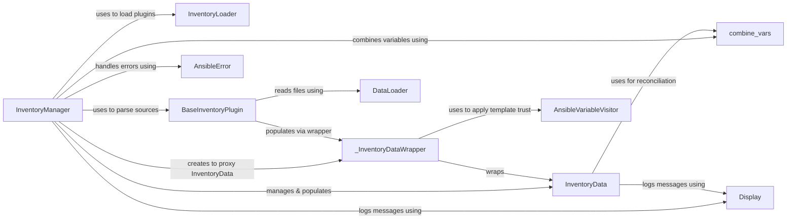

## Component Details

The Inventory Management subsystem is responsible for managing the inventory of hosts and groups that Ansible targets. The core component, `InventoryManager`, orchestrates the parsing of various inventory sources (INI, YAML, scripts) using `BaseInventoryPlugin` instances loaded by `InventoryLoader`. It populates and manages the in-memory representation of the infrastructure within `InventoryData`, which serves as the central data model for hosts and groups. `_InventoryDataWrapper` acts as a proxy for `InventoryData` to ensure proper variable handling and template trust. `DataLoader` assists in loading and parsing data from inventory files. The subsystem also leverages utility functions like `combine_vars` and `get_vars_from_inventory_sources` for variable management, and `Display` for logging and `AnsibleError` for error handling.

### InventoryManager
The central orchestrator for inventory management. It parses inventory sources, manages hosts and groups, associates variables, handles pattern matching, and integrates with inventory plugins.

**Related Classes/Methods**:

- <a href="https://github.com/ansible/ansible/blob/master/lib/ansible/inventory/manager.py#L145-L763" target="_blank" rel="noopener noreferrer">`ansible.inventory.manager.InventoryManager` (145:763)</a>
- <a href="https://github.com/ansible/ansible/blob/master/lib/ansible/inventory/manager.py#L148-L175" target="_blank" rel="noopener noreferrer">`ansible.inventory.manager.InventoryManager.__init__` (148:175)</a>
- <a href="https://github.com/ansible/ansible/blob/master/lib/ansible/inventory/manager.py#L223-L249" target="_blank" rel="noopener noreferrer">`ansible.inventory.manager.InventoryManager.parse_sources` (223:249)</a>
- <a href="https://github.com/ansible/ansible/blob/master/lib/ansible/inventory/manager.py#L251-L347" target="_blank" rel="noopener noreferrer">`ansible.inventory.manager.InventoryManager.parse_source` (251:347)</a>
- <a href="https://github.com/ansible/ansible/blob/master/lib/ansible/inventory/manager.py#L383-L438" target="_blank" rel="noopener noreferrer">`ansible.inventory.manager.InventoryManager.get_hosts` (383:438)</a>
- <a href="https://github.com/ansible/ansible/blob/master/lib/ansible/inventory/manager.py#L671-L709" target="_blank" rel="noopener noreferrer">`ansible.inventory.manager.InventoryManager.add_dynamic_host` (671:709)</a>
- <a href="https://github.com/ansible/ansible/blob/master/lib/ansible/inventory/manager.py#L711-L763" target="_blank" rel="noopener noreferrer">`ansible.inventory.manager.InventoryManager.add_dynamic_group` (711:763)</a>
- <a href="https://github.com/ansible/ansible/blob/master/lib/ansible/inventory/manager.py#L205-L221" target="_blank" rel="noopener noreferrer">`ansible.inventory.manager.InventoryManager._fetch_inventory_plugins` (205:221)</a>
- <a href="https://github.com/ansible/ansible/blob/master/lib/ansible/inventory/manager.py#L440-L464" target="_blank" rel="noopener noreferrer">`ansible.inventory.manager.InventoryManager._evaluate_patterns` (440:464)</a>
- <a href="https://github.com/ansible/ansible/blob/master/lib/ansible/inventory/manager.py#L466-L516" target="_blank" rel="noopener noreferrer">`ansible.inventory.manager.InventoryManager._match_one_pattern` (466:516)</a>
- <a href="https://github.com/ansible/ansible/blob/master/lib/ansible/inventory/manager.py#L198-L200" target="_blank" rel="noopener noreferrer">`ansible.inventory.manager.InventoryManager.reconcile_inventory` (198:200)</a>

### InventoryData
The underlying data model that holds the in-memory representation of hosts and groups. It manages the hierarchical relationships between groups and the assignment of hosts to groups.

**Related Classes/Methods**:

- <a href="https://github.com/ansible/ansible/blob/master/lib/ansible/inventory/data.py#L38-L272" target="_blank" rel="noopener noreferrer">`ansible.inventory.data.InventoryData` (38:272)</a>
- <a href="https://github.com/ansible/ansible/blob/master/lib/ansible/inventory/data.py#L44-L62" target="_blank" rel="noopener noreferrer">`ansible.inventory.data.InventoryData.__init__` (44:62)</a>
- <a href="https://github.com/ansible/ansible/blob/master/lib/ansible/inventory/data.py#L177-L222" target="_blank" rel="noopener noreferrer">`ansible.inventory.data.InventoryData.add_host` (177:222)</a>
- <a href="https://github.com/ansible/ansible/blob/master/lib/ansible/inventory/data.py#L146-L164" target="_blank" rel="noopener noreferrer">`ansible.inventory.data.InventoryData.add_group` (146:164)</a>
- <a href="https://github.com/ansible/ansible/blob/master/lib/ansible/inventory/data.py#L132-L144" target="_blank" rel="noopener noreferrer">`ansible.inventory.data.InventoryData.get_host` (132:144)</a>
- <a href="https://github.com/ansible/ansible/blob/master/lib/ansible/inventory/data.py#L88-L130" target="_blank" rel="noopener noreferrer">`ansible.inventory.data.InventoryData.reconcile_inventory` (88:130)</a>
- <a href="https://github.com/ansible/ansible/blob/master/lib/ansible/inventory/data.py#L233-L246" target="_blank" rel="noopener noreferrer">`ansible.inventory.data.InventoryData.set_variable` (233:246)</a>
- <a href="https://github.com/ansible/ansible/blob/master/lib/ansible/inventory/data.py#L248-L262" target="_blank" rel="noopener noreferrer">`ansible.inventory.data.InventoryData.add_child` (248:262)</a>
- <a href="https://github.com/ansible/ansible/blob/master/lib/ansible/inventory/data.py#L264-L272" target="_blank" rel="noopener noreferrer">`ansible.inventory.data.InventoryData.get_groups_dict` (264:272)</a>
- <a href="https://github.com/ansible/ansible/blob/master/lib/ansible/inventory/data.py#L64-L86" target="_blank" rel="noopener noreferrer">`ansible.inventory.data.InventoryData._create_implicit_localhost` (64:86)</a>

### InventoryLoader
A plugin loader specifically for inventory plugins. It's responsible for finding and loading BaseInventoryPlugin instances based on configured paths and names.

**Related Classes/Methods**:

- `ansible.plugins.loader.inventory_loader` (full file reference)
- <a href="https://github.com/ansible/ansible/blob/master/lib/ansible/plugins/loader.py#L977-L987" target="_blank" rel="noopener noreferrer">`ansible.plugins.loader.PluginLoader.get` (977:987)</a>
- <a href="https://github.com/ansible/ansible/blob/master/lib/ansible/plugins/loader.py#L699-L730" target="_blank" rel="noopener noreferrer">`ansible.plugins.loader.PluginLoader.find_plugin_with_context` (699:730)</a>
- <a href="https://github.com/ansible/ansible/blob/master/lib/ansible/plugins/loader.py#L732-L813" target="_blank" rel="noopener noreferrer">`ansible.plugins.loader.PluginLoader._resolve_plugin_step` (732:813)</a>
- <a href="https://github.com/ansible/ansible/blob/master/lib/ansible/plugins/loader.py#L571-L689" target="_blank" rel="noopener noreferrer">`ansible.plugins.loader.PluginLoader._find_fq_plugin` (571:689)</a>
- <a href="https://github.com/ansible/ansible/blob/master/lib/ansible/plugins/loader.py#L815-L908" target="_blank" rel="noopener noreferrer">`ansible.plugins.loader.PluginLoader._find_plugin_legacy` (815:908)</a>

### BaseInventoryPlugin
An abstract base class for all inventory plugins. Concrete inventory plugins (e.g., INI, YAML, script) inherit from this and implement methods like parse() and verify_file() to process specific inventory sources.

**Related Classes/Methods**:

- `ansible.plugins.inventory.BaseInventoryPlugin` (full file reference)
- `ansible.plugins.inventory.BaseInventoryPlugin.parse` (full file reference)
- `ansible.plugins.inventory.BaseInventoryPlugin.verify_file` (full file reference)
- `ansible.plugins.inventory.BaseInventoryPlugin.update_cache_if_changed` (full file reference)
- `ansible.plugins.inventory.BaseInventoryPlugin.trusted_by_default` (full file reference)

### _InventoryDataWrapper
A proxy wrapper around InventoryData used by inventory plugins. It automatically applies template trust to variables when set_variable is called, ensuring proper handling of sensitive data loaded from inventory.

**Related Classes/Methods**:

- <a href="https://github.com/ansible/ansible/blob/master/lib/ansible/inventory/manager.py#L766-L796" target="_blank" rel="noopener noreferrer">`ansible.inventory.manager._InventoryDataWrapper` (766:796)</a>
- <a href="https://github.com/ansible/ansible/blob/master/lib/ansible/inventory/manager.py#L776-L780" target="_blank" rel="noopener noreferrer">`ansible.inventory.manager._InventoryDataWrapper.__init__` (776:780)</a>
- <a href="https://github.com/ansible/ansible/blob/master/lib/ansible/inventory/manager.py#L783-L793" target="_blank" rel="noopener noreferrer">`ansible.inventory.manager._InventoryDataWrapper._inspector` (783:793)</a>
- <a href="https://github.com/ansible/ansible/blob/master/lib/ansible/inventory/manager.py#L795-L796" target="_blank" rel="noopener noreferrer">`ansible.inventory.manager._InventoryDataWrapper.set_variable` (795:796)</a>

### DataLoader
A utility class for loading and parsing data from files or strings, supporting YAML and JSON formats. It handles file caching and vault decryption.

**Related Classes/Methods**:

- <a href="https://github.com/ansible/ansible/blob/master/lib/ansible/parsing/dataloader.py#L38-L523" target="_blank" rel="noopener noreferrer">`ansible.parsing.dataloader.DataLoader` (38:523)</a>
- <a href="https://github.com/ansible/ansible/blob/master/lib/ansible/parsing/dataloader.py#L57-L75" target="_blank" rel="noopener noreferrer">`ansible.parsing.dataloader.DataLoader.__init__` (57:75)</a>
- <a href="https://github.com/ansible/ansible/blob/master/lib/ansible/parsing/dataloader.py#L81-L90" target="_blank" rel="noopener noreferrer">`ansible.parsing.dataloader.DataLoader.load` (81:90)</a>
- <a href="https://github.com/ansible/ansible/blob/master/lib/ansible/parsing/dataloader.py#L92-L135" target="_blank" rel="noopener noreferrer">`ansible.parsing.dataloader.DataLoader.load_from_file` (92:135)</a>
- <a href="https://github.com/ansible/ansible/blob/master/lib/ansible/parsing/dataloader.py#L166-L195" target="_blank" rel="noopener noreferrer">`ansible.parsing.dataloader.DataLoader.get_text_file_contents` (166:195)</a>
- <a href="https://github.com/ansible/ansible/blob/master/lib/ansible/parsing/dataloader.py#L158-L164" target="_blank" rel="noopener noreferrer">`ansible.parsing.dataloader.DataLoader._decrypt_if_vault_data` (158:164)</a>

### AnsibleVariableVisitor
A component used by _InventoryDataWrapper to apply template trust to variables. It ensures that variables loaded from inventory sources are correctly marked for templating.

**Related Classes/Methods**:

- `ansible.template.AnsibleVariableVisitor` (full file reference)
- `ansible.template.AnsibleVariableVisitor.visit` (full file reference)

### AnsibleError
Base class for all Ansible-specific exceptions. Used for error handling throughout the inventory management process.

**Related Classes/Methods**:

- `ansible.errors.AnsibleError` (full file reference)

### Display
A utility for logging messages and warnings to the console. Used for debugging and informing the user about inventory parsing status and issues.

**Related Classes/Methods**:

- <a href="https://github.com/ansible/ansible/blob/master/lib/ansible/utils/display.py#L292-L1169" target="_blank" rel="noopener noreferrer">`ansible.utils.display.Display` (292:1169)</a>
- <a href="https://github.com/ansible/ansible/blob/master/lib/ansible/utils/display.py#L553-L557" target="_blank" rel="noopener noreferrer">`ansible.utils.display.Display.debug` (553:557)</a>
- <a href="https://github.com/ansible/ansible/blob/master/lib/ansible/utils/display.py#L780-L813" target="_blank" rel="noopener noreferrer">`ansible.utils.display.Display.warning` (780:813)</a>
- <a href="https://github.com/ansible/ansible/blob/master/lib/ansible/utils/display.py#L517-L518" target="_blank" rel="noopener noreferrer">`ansible.utils.display.Display.vvv` (517:518)</a>
- <a href="https://github.com/ansible/ansible/blob/master/lib/ansible/utils/display.py#L520-L521" target="_blank" rel="noopener noreferrer">`ansible.utils.display.Display.vvvv` (520:521)</a>

### combine_vars
A utility function for merging variable dictionaries, used to combine variables from different sources (e.g., group variables with host variables).

**Related Classes/Methods**:

- <a href="https://github.com/ansible/ansible/blob/master/lib/ansible/utils/vars.py#L79-L90" target="_blank" rel="noopener noreferrer">`ansible.utils.vars.combine_vars` (79:90)</a>

### [FAQ](https://github.com/CodeBoarding/GeneratedOnBoardings/tree/main?tab=readme-ov-file#faq)