```mermaid
graph LR
    CLI_Module["CLI Module"]
    Executor_Module["Executor Module"]
    Playbook_Management["Playbook Management"]
    Plugin_System["Plugin System"]
    Module_Utilities["Module Utilities"]
    Core_Modules["Core Modules"]
    Parsing_Module["Parsing Module"]
    Inventory_Module["Inventory Module"]
    Utility_Module["Utility Module"]
    Variable_Management["Variable Management"]
    Galaxy_Module["Galaxy Module"]
    Internal_Utilities["Internal Utilities"]
    Core_Components["Core Components"]
    CLI_Module -- "orchestrates" --> Executor_Module
    CLI_Module -- "uses" --> Inventory_Module
    CLI_Module -- "uses" --> Parsing_Module
    CLI_Module -- "uses" --> Utility_Module
    CLI_Module -- "uses" --> Galaxy_Module
    Executor_Module -- "executes" --> Playbook_Management
    Executor_Module -- "uses" --> Module_Utilities
    Executor_Module -- "uses" --> Plugin_System
    Executor_Module -- "uses" --> Inventory_Module
    Executor_Module -- "uses" --> Variable_Management
    Playbook_Management -- "defines structure for" --> Executor_Module
    Playbook_Management -- "uses" --> Parsing_Module
    Playbook_Management -- "uses" --> Variable_Management
    Plugin_System -- "provides extensions for" --> Executor_Module
    Plugin_System -- "provides extensions for" --> Inventory_Module
    Plugin_System -- "provides extensions for" --> Variable_Management
    Plugin_System -- "provides extensions for" --> Core_Modules
    Module_Utilities -- "supports" --> Core_Modules
    Module_Utilities -- "supports" --> Plugin_System
    Module_Utilities -- "supports" --> Internal_Utilities
    Core_Modules -- "implements tasks using" --> Module_Utilities
    Parsing_Module -- "parses data for" --> Playbook_Management
    Parsing_Module -- "parses data for" --> Inventory_Module
    Inventory_Module -- "manages data for" --> Executor_Module
    Inventory_Module -- "manages data for" --> Playbook_Management
    Utility_Module -- "provides general services to" --> CLI_Module
    Utility_Module -- "provides general services to" --> Executor_Module
    Utility_Module -- "provides general services to" --> Playbook_Management
    Utility_Module -- "provides general services to" --> Plugin_System
    Variable_Management -- "manages variables for" --> Executor_Module
    Variable_Management -- "manages variables for" --> Playbook_Management
    Variable_Management -- "manages variables for" --> Plugin_System
    Galaxy_Module -- "interacts with" --> CLI_Module
    Internal_Utilities -- "provides internal mechanisms for" --> Module_Utilities
    Internal_Utilities -- "provides internal mechanisms for" --> Parsing_Module
    Internal_Utilities -- "provides internal mechanisms for" --> Playbook_Management
    Internal_Utilities -- "provides internal mechanisms for" --> Executor_Module
    Core_Components -- "provides core functionalities to" --> CLI_Module
    Core_Components -- "provides core functionalities to" --> Executor_Module
    Core_Components -- "provides core functionalities to" --> Playbook_Management
    Core_Components -- "provides core functionalities to" --> Plugin_System
    Core_Components -- "provides core functionalities to" --> Module_Utilities
    Core_Components -- "provides core functionalities to" --> Parsing_Module
    Core_Components -- "provides core functionalities to" --> Inventory_Module
    Core_Components -- "provides core functionalities to" --> Utility_Module
    Core_Components -- "provides core functionalities to" --> Variable_Management
    Core_Components -- "provides core functionalities to" --> Galaxy_Module
    Core_Components -- "provides core functionalities to" --> Internal_Utilities
```

## Component Details

This architecture overview details the core components of Ansible, a powerful automation engine. It illustrates how command-line interactions, playbook definitions, task execution, and various plugin systems work together to manage and automate infrastructure. The system's purpose is to provide a robust, flexible, and extensible platform for IT automation, from simple ad-hoc commands to complex multi-tier application deployments.

### CLI Module
This component handles the command-line interface for Ansible, processing arguments, initializing the context, and orchestrating the execution of various Ansible commands like ad-hoc commands, playbooks, and galaxy operations. It interacts with inventory, parsing, and execution components.

**Related Classes/Methods**:

- `ansible.cli` (full file reference)
- `ansible.cli.adhoc` (full file reference)
- `ansible.cli.arguments.option_helpers` (full file reference)
- `ansible.cli.config` (full file reference)
- `ansible.cli.console` (full file reference)
- `ansible.cli.doc` (full file reference)
- `ansible.cli.galaxy` (full file reference)
- `ansible.cli.inventory` (full file reference)
- `ansible.cli.playbook` (full file reference)
- `ansible.cli.pull` (full file reference)
- `ansible.cli.scripts.ansible_connection_cli_stub` (full file reference)
- `ansible.cli.vault` (full file reference)

### Executor Module
The Executor module is responsible for managing the execution of tasks and playbooks. It includes components for handling task queues, processing task results, managing interpreters, and handling PowerShell execution. It interacts closely with playbook structures, inventory, and various plugins.

**Related Classes/Methods**:

- `ansible.executor.interpreter_discovery` (full file reference)
- `ansible.executor.module_common` (full file reference)
- `ansible.executor.play_iterator` (full file reference)
- `ansible.executor.playbook_executor` (full file reference)
- `ansible.executor.powershell.module_manifest` (full file reference)
- `ansible.executor.process.worker` (full file reference)
- `ansible.executor.stats` (full file reference)
- `ansible.executor.task_executor` (full file reference)
- `ansible.executor.task_queue_manager` (full file reference)
- `ansible.executor.task_result` (full file reference)

### Playbook Management
Responsible for defining, loading, parsing, and compiling Ansible playbooks, including tasks, blocks, roles, and handlers. It manages the structure and flow of automation logic, handling includes, imports, and conditional execution. This component interacts with the templating engine for variable substitution, the parsing module for loading playbook content, and the variable management system for handling playbook-specific variables. It provides the structured automation definitions that the Executor module consumes.

**Related Classes/Methods**:

- `ansible.playbook` (full file reference)
- `ansible.playbook.attribute` (full file reference)
- `ansible.playbook.base` (full file reference)
- `ansible.playbook.block` (full file reference)
- `ansible.playbook.collectionsearch` (full file reference)
- `ansible.playbook.conditional` (full file reference)
- `ansible.playbook.delegatable` (full file reference)
- `ansible.playbook.handler` (full file reference)
- `ansible.playbook.handler_task_include` (full file reference)
- `ansible.playbook.helpers` (full file reference)
- `ansible.playbook.included_file` (full file reference)
- `ansible.playbook.loop_control` (full file reference)
- `ansible.playbook.notifiable` (full file reference)
- `ansible.playbook.play` (full file reference)
- `ansible.playbook.play_context` (full file reference)
- `ansible.playbook.playbook_include` (full file reference)
- `ansible.playbook.role` (full file reference)
- `ansible.playbook.role.definition` (full file reference)
- `ansible.playbook.role.include` (full file reference)
- `ansible.playbook.role.metadata` (full file reference)
- `ansible.playbook.role.requirement` (full file reference)
- `ansible.playbook.role_include` (full file reference)
- `ansible.playbook.taggable` (full file reference)
- `ansible.playbook.task` (full file reference)
- `ansible.playbook.task_include` (full file reference)
- <a href="https://github.com/ansible/ansible/blob/master/test/lib/ansible_test/_internal/provider/layout/ansible.py#L16-L49" target="_blank" rel="noopener noreferrer">`ansible.playbook.Playbook` (16:49)</a>

### Plugin System
The Plugin System provides a flexible and extensible architecture for Ansible, allowing various functionalities to be implemented as plugins. This includes action plugins (for module execution), become plugins (privilege escalation), cache plugins, callback plugins (for reporting), connection plugins (for host communication), filter plugins (for data transformation), httpapi plugins, inventory plugins (for host discovery), lookup plugins (for data retrieval), netconf plugins, shell plugins (for command execution), strategy plugins (for execution flow), terminal plugins, test plugins, and vars plugins (for variable loading).

**Related Classes/Methods**:

- `ansible.plugins` (full file reference)
- `ansible.plugins.action` (full file reference)
- `ansible.plugins.action.add_host` (full file reference)
- `ansible.plugins.action.assemble` (full file reference)
- `ansible.plugins.action.assert` (full file reference)
- `ansible.plugins.action.async_status` (full file reference)
- `ansible.plugins.action.command` (full file reference)
- `ansible.plugins.action.copy` (full file reference)
- `ansible.plugins.action.debug` (full file reference)
- `ansible.plugins.action.dnf` (full file reference)
- `ansible.plugins.action.fail` (full file reference)
- `ansible.plugins.action.fetch` (full file reference)
- `ansible.plugins.action.gather_facts` (full file reference)
- `ansible.plugins.action.group_by` (full file reference)
- `ansible.plugins.action.include_vars` (full file reference)
- `ansible.plugins.action.normal` (full file reference)
- `ansible.plugins.action.package` (full file reference)
- `ansible.plugins.action.pause` (full file reference)
- `ansible.plugins.action.raw` (full file reference)
- `ansible.plugins.action.reboot` (full file reference)
- `ansible.plugins.action.script` (full file reference)
- `ansible.plugins.action.service` (full file reference)
- `ansible.plugins.action.set_fact` (full file reference)
- `ansible.plugins.action.set_stats` (full file reference)
- `ansible.plugins.action.shell` (full file reference)
- `ansible.plugins.action.template` (full file reference)
- `ansible.plugins.action.unarchive` (full file reference)
- `ansible.plugins.action.uri` (full file reference)
- `ansible.plugins.action.validate_argument_spec` (full file reference)
- `ansible.plugins.action.wait_for_connection` (full file reference)
- `ansible.plugins.become` (full file reference)
- `ansible.plugins.become.runas` (full file reference)
- `ansible.plugins.become.su` (full file reference)
- `ansible.plugins.become.sudo` (full file reference)
- `ansible.plugins.cache` (full file reference)
- `ansible.plugins.cache.base` (full file reference)
- `ansible.plugins.cache.jsonfile` (full file reference)
- `ansible.plugins.cache.memory` (full file reference)
- `ansible.plugins.callback` (full file reference)
- `ansible.plugins.callback.default` (full file reference)
- `ansible.plugins.callback.junit` (full file reference)
- `ansible.plugins.callback.minimal` (full file reference)
- `ansible.plugins.callback.oneline` (full file reference)
- `ansible.plugins.callback.tree` (full file reference)
- `ansible.plugins.cliconf` (full file reference)
- `ansible.plugins.connection` (full file reference)
- `ansible.plugins.connection.local` (full file reference)
- `ansible.plugins.connection.paramiko_ssh` (full file reference)
- `ansible.plugins.connection.psrp` (full file reference)
- `ansible.plugins.connection.ssh` (full file reference)
- `ansible.plugins.connection.winrm` (full file reference)
- `ansible.plugins.filter` (full file reference)
- `ansible.plugins.filter.core` (full file reference)
- `ansible.plugins.filter.encryption` (full file reference)
- `ansible.plugins.filter.mathstuff` (full file reference)
- `ansible.plugins.filter.urlsplit` (full file reference)
- `ansible.plugins.httpapi` (full file reference)
- `ansible.plugins.inventory` (full file reference)
- `ansible.plugins.inventory.advanced_host_list` (full file reference)
- `ansible.plugins.inventory.auto` (full file reference)
- `ansible.plugins.inventory.constructed` (full file reference)
- `ansible.plugins.inventory.generator` (full file reference)
- `ansible.plugins.inventory.host_list` (full file reference)
- `ansible.plugins.inventory.ini` (full file reference)
- `ansible.plugins.inventory.script` (full file reference)
- `ansible.plugins.inventory.toml` (full file reference)
- `ansible.plugins.inventory.yaml` (full file reference)
- `ansible.plugins.list` (full file reference)
- `ansible.plugins.loader` (full file reference)
- `ansible.plugins.lookup` (full file reference)
- `ansible.plugins.lookup.config` (full file reference)
- `ansible.plugins.lookup.csvfile` (full file reference)
- `ansible.plugins.lookup.dict` (full file reference)
- `ansible.plugins.lookup.env` (full file reference)
- `ansible.plugins.lookup.file` (full file reference)
- `ansible.plugins.lookup.fileglob` (full file reference)
- `ansible.plugins.lookup.first_found` (full file reference)
- `ansible.plugins.lookup.indexed_items` (full file reference)
- `ansible.plugins.lookup.ini` (full file reference)
- `ansible.plugins.lookup.inventory_hostnames` (full file reference)
- `ansible.plugins.lookup.items` (full file reference)
- `ansible.plugins.lookup.lines` (full file reference)
- `ansible.plugins.lookup.list` (full file reference)
- `ansible.plugins.lookup.nested` (full file reference)
- `ansible.plugins.lookup.password` (full file reference)
- `ansible.plugins.lookup.pipe` (full file reference)
- `ansible.plugins.lookup.random_choice` (full file reference)
- `ansible.plugins.lookup.sequence` (full file reference)
- `ansible.plugins.lookup.subelements` (full file reference)
- `ansible.plugins.lookup.template` (full file reference)
- `ansible.plugins.lookup.together` (full file reference)
- `ansible.plugins.lookup.unvault` (full file reference)
- `ansible.plugins.lookup.url` (full file reference)
- `ansible.plugins.lookup.varnames` (full file reference)
- `ansible.plugins.lookup.vars` (full file reference)
- `ansible.plugins.netconf` (full file reference)
- `ansible.plugins.shell` (full file reference)
- `ansible.plugins.shell.cmd` (full file reference)
- `ansible.plugins.shell.powershell` (full file reference)
- `ansible.plugins.shell.sh` (full file reference)
- `ansible.plugins.strategy` (full file reference)
- `ansible.plugins.strategy.debug` (full file reference)
- `ansible.plugins.strategy.free` (full file reference)
- `ansible.plugins.strategy.host_pinned` (full file reference)
- `ansible.plugins.strategy.linear` (full file reference)
- `ansible.plugins.terminal` (full file reference)
- `ansible.plugins.test` (full file reference)
- `ansible.plugins.test.core` (full file reference)
- `ansible.plugins.vars` (full file reference)
- `ansible.plugins.vars.host_group_vars` (full file reference)

### Module Utilities
This component provides a collection of utility functions and classes used by Ansible modules. It includes basic module functionalities, common utilities for arguments, collections, file operations, JSON handling, locale, parameters, process management, system information, text conversion, validation, and warnings. It also provides compatibility layers and data tagging mechanisms.

**Related Classes/Methods**:

- `ansible.module_utils._internal._datatag` (full file reference)
- `ansible.module_utils._internal._datatag._tags` (full file reference)
- `ansible.module_utils._internal._deprecator` (full file reference)
- `ansible.module_utils._internal._event_utils` (full file reference)
- `ansible.module_utils._internal._json` (full file reference)
- `ansible.module_utils._internal._json._legacy_encoder` (full file reference)
- `ansible.module_utils._internal._json._profiles` (full file reference)
- `ansible.module_utils._internal._json._profiles._module_legacy_m2c` (full file reference)
- `ansible.module_utils._internal._messages` (full file reference)
- `ansible.module_utils._text` (full file reference)
- `ansible.module_utils.basic` (full file reference)
- `ansible.module_utils.common.arg_spec` (full file reference)
- `ansible.module_utils.common.collections` (full file reference)
- `ansible.module_utils.common.json` (full file reference)
- `ansible.module_utils.common.locale` (full file reference)
- `ansible.module_utils.common.network` (full file reference)
- `ansible.module_utils.common.parameters` (full file reference)
- `ansible.module_utils.common.process` (full file reference)
- `ansible.module_utils.common.respawn` (full file reference)
- `ansible.module_utils.common.sys_info` (full file reference)
- `ansible.module_utils.common.text.converters` (full file reference)
- `ansible.module_utils.common.text.formatters` (full file reference)
- `ansible.module_utils.common.validation` (full file reference)
- `ansible.module_utils.common.warnings` (full file reference)
- `ansible.module_utils.common.yaml` (full file reference)
- `ansible.module_utils.compat.datetime` (full file reference)
- `ansible.module_utils.compat.paramiko` (full file reference)
- `ansible.module_utils.compat.selinux` (full file reference)
- `ansible.module_utils.compat.typing` (full file reference)
- `ansible.module_utils.connection` (full file reference)
- `ansible.module_utils.datatag` (full file reference)
- `ansible.module_utils.facts` (full file reference)
- `ansible.module_utils.facts.ansible_collector` (full file reference)
- `ansible.module_utils.facts.collector` (full file reference)
- `ansible.module_utils.facts.compat` (full file reference)
- `ansible.module_utils.facts.default_collectors` (full file reference)
- `ansible.module_utils.facts.hardware.aix` (full file reference)
- `ansible.module_utils.facts.hardware.base` (full file reference)
- `ansible.module_utils.facts.hardware.darwin` (full file reference)
- `ansible.module_utils.facts.hardware.dragonfly` (full file reference)
- `ansible.module_utils.facts.hardware.freebsd` (full file reference)
- `ansible.module_utils.facts.hardware.hpux` (full file reference)
- `ansible.module_utils.facts.hardware.hurd` (full file reference)
- `ansible.module_utils.facts.hardware.linux` (full file reference)
- `ansible.module_utils.facts.hardware.netbsd` (full file reference)
- `ansible.module_utils.facts.hardware.openbsd` (full file reference)
- `ansible.module_utils.facts.hardware.sunos` (full file reference)
- `ansible.module_utils.facts.network.aix` (full file reference)
- `ansible.module_utils.facts.network.base` (full file reference)
- `ansible.module_utils.facts.network.darwin` (full file reference)
- `ansible.module_utils.facts.network.dragonfly` (full file reference)
- `ansible.module_utils.facts.network.fc_wwn` (full file reference)
- `ansible.module_utils.facts.network.freebsd` (full file reference)
- `ansible.module_utils.facts.network.generic_bsd` (full file reference)
- `ansible.module_utils.facts.network.hpux` (full file reference)
- `ansible.module_utils.facts.network.hurd` (full file reference)
- `ansible.module_utils.facts.network.iscsi` (full file reference)
- `ansible.module_utils.facts.network.linux` (full file reference)
- `ansible.module_utils.facts.network.netbsd` (full file reference)
- `ansible.module_utils.facts.network.nvme` (full file reference)
- `ansible.module_utils.facts.network.openbsd` (full file reference)
- `ansible.module_utils.facts.network.sunos` (full file reference)
- `ansible.module_utils.facts.other.facter` (full file reference)
- `ansible.module_utils.facts.other.ohai` (full file reference)
- `ansible.module_utils.facts.packages` (full file reference)
- `ansible.module_utils.facts.sysctl` (full file reference)
- `ansible.module_utils.facts.system.apparmor` (full file reference)
- `ansible.module_utils.facts.system.caps` (full file reference)
- `ansible.module_utils.facts.system.chroot` (full file reference)
- `ansible.module_utils.facts.system.cmdline` (full file reference)
- `ansible.module_utils.facts.system.date_time` (full file reference)
- `ansible.module_utils.facts.system.distribution` (full file reference)
- `ansible.module_utils.facts.system.dns` (full file reference)
- `ansible.module_utils.facts.system.env` (full file reference)
- `ansible.module_utils.facts.system.fips` (full file reference)
- `ansible.module_utils.facts.system.loadavg` (full file reference)
- `ansible.module_utils.facts.system.local` (full file reference)
- `ansible.module_utils.facts.system.lsb` (full file reference)
- `ansible.module_utils.facts.system.pkg_mgr` (full file reference)
- `ansible.module_utils.facts.system.platform` (full file reference)
- `ansible.module_utils.facts.system.python` (full file reference)
- `ansible.module_utils.facts.system.selinux` (full file reference)
- `ansible.module_utils.facts.system.service_mgr` (full file reference)
- `ansible.module_utils.facts.system.ssh_pub_keys` (full file reference)
- `ansible.module_utils.facts.system.systemd` (full file reference)
- `ansible.module_utils.facts.system.user` (full file reference)
- `ansible.module_utils.facts.virtual.base` (full file reference)
- `ansible.module_utils.facts.virtual.dragonfly` (full file reference)
- `ansible.module_utils.facts.virtual.freebsd` (full file reference)
- `ansible.module_utils.facts.virtual.hpux` (full file reference)
- `ansible.module_utils.facts.virtual.linux` (full file reference)
- `ansible.module_utils.facts.virtual.netbsd` (full file reference)
- `ansible.module_utils.facts.virtual.openbsd` (full file reference)
- `ansible.module_utils.facts.virtual.sunos` (full file reference)
- `ansible.module_utils.parsing.convert_bool` (full file reference)
- `ansible.module_utils.service` (full file reference)
- `ansible.module_utils.testing` (full file reference)
- `ansible.module_utils.urls` (full file reference)

### Core Modules
This component represents the fundamental Ansible modules that perform various system administration tasks. These modules are built upon the `module_utils.basic` and other utility modules to interact with target systems.

**Related Classes/Methods**:

- `ansible.modules.apt` (full file reference)
- `ansible.modules.apt_key` (full file reference)
- `ansible.modules.apt_repository` (full file reference)
- `ansible.modules.assemble` (full file reference)
- `ansible.modules.async_status` (full file reference)
- `ansible.modules.async_wrapper` (full file reference)
- `ansible.modules.blockinfile` (full file reference)
- `ansible.modules.command` (full file reference)
- `ansible.modules.copy` (full file reference)
- `ansible.modules.cron` (full file reference)
- `ansible.modules.deb822_repository` (full file reference)
- `ansible.modules.debconf` (full file reference)
- `ansible.modules.dnf` (full file reference)
- `ansible.modules.dnf5` (full file reference)
- `ansible.modules.dpkg_selections` (full file reference)
- `ansible.modules.expect` (full file reference)
- `ansible.modules.file` (full file reference)
- `ansible.modules.find` (full file reference)
- `ansible.modules.get_url` (full file reference)
- `ansible.modules.getent` (full file reference)
- `ansible.modules.git` (full file reference)
- `ansible.modules.group` (full file reference)
- `ansible.modules.hostname` (full file reference)
- `ansible.modules.iptables` (full file reference)
- `ansible.modules.known_hosts` (full file reference)
- `ansible.modules.lineinfile` (full file reference)
- `ansible.modules.mount_facts` (full file reference)
- `ansible.modules.package_facts` (full file reference)
- `ansible.modules.ping` (full file reference)
- `ansible.modules.pip` (full file reference)
- `ansible.modules.replace` (full file reference)
- `ansible.modules.rpm_key` (full file reference)
- `ansible.modules.service` (full file reference)
- `ansible.modules.service_facts` (full file reference)
- `ansible.modules.setup` (full file reference)
- `ansible.modules.slurp` (full file reference)
- `ansible.modules.stat` (full file reference)
- `ansible.modules.subversion` (full file reference)
- `ansible.modules.systemd_service` (full file reference)
- `ansible.modules.sysvinit` (full file reference)
- `ansible.modules.tempfile` (full file reference)
- `ansible.modules.unarchive` (full file reference)
- <a href="https://github.com/ansible/ansible/blob/master/lib/ansible/modules/uri.py#L541-L585" target="_blank" rel="noopener noreferrer">`ansible.modules.uri` (541:585)</a>
- `ansible.modules.user` (full file reference)
- `ansible.modules.wait_for` (full file reference)
- `ansible.modules.yum_repository` (full file reference)

### Parsing Module
This component is responsible for parsing various data formats used in Ansible, including JSON, YAML, and vault-encrypted content. It handles data loading, argument parsing, and splitting of strings.

**Related Classes/Methods**:

- `ansible.parsing.ajson` (full file reference)
- `ansible.parsing.dataloader` (full file reference)
- `ansible.parsing.mod_args` (full file reference)
- `ansible.parsing.plugin_docs` (full file reference)
- `ansible.parsing.splitter` (full file reference)
- `ansible.parsing.utils.addresses` (full file reference)
- <a href="https://github.com/ansible/ansible/blob/master/lib/ansible/parsing/utils/jsonify.py#L27-L40" target="_blank" rel="noopener noreferrer">`ansible.parsing.utils.jsonify` (27:40)</a>
- `ansible.parsing.utils.yaml` (full file reference)
- `ansible.parsing.vault` (full file reference)
- `ansible.parsing.yaml.dumper` (full file reference)
- `ansible.parsing.yaml.loader` (full file reference)
- `ansible.parsing.yaml.objects` (full file reference)

### Inventory Module
The Inventory module manages the inventory of hosts and groups that Ansible operates on. It provides functionalities for data management, group and host representation, and various inventory plugins for different data sources.

**Related Classes/Methods**:

- `ansible.inventory.data` (full file reference)
- `ansible.inventory.group` (full file reference)
- `ansible.inventory.helpers` (full file reference)
- `ansible.inventory.host` (full file reference)
- `ansible.inventory.manager` (full file reference)

### Utility Module
This component provides a wide range of general utility functions for Ansible, including command execution, collection loading, color formatting, context management, display output, encryption, Galaxy interactions, hashing, path manipulation, plugin documentation, and version handling. It also includes internal utilities for data tagging and error handling.

**Related Classes/Methods**:

- `ansible.utils.cmd_functions` (full file reference)
- `ansible.utils.collection_loader` (full file reference)
- `ansible.utils.collection_loader._collection_finder` (full file reference)
- `ansible.utils.color` (full file reference)
- `ansible.utils.context_objects` (full file reference)
- `ansible.utils.display` (full file reference)
- `ansible.utils.encrypt` (full file reference)
- `ansible.utils.galaxy` (full file reference)
- `ansible.utils.hashing` (full file reference)
- `ansible.utils.helpers` (full file reference)
- `ansible.utils.jsonrpc` (full file reference)
- `ansible.utils.listify` (full file reference)
- `ansible.utils.path` (full file reference)
- `ansible.utils.plugin_docs` (full file reference)
- `ansible.utils.py3compat` (full file reference)
- `ansible.utils.sentinel` (full file reference)
- `ansible.utils.ssh_functions` (full file reference)
- `ansible.utils.unicode` (full file reference)
- `ansible.utils.unsafe_proxy` (full file reference)
- `ansible.utils.vars` (full file reference)
- `ansible.utils.version` (full file reference)

### Variable Management
This component is responsible for managing variables within Ansible, including cleaning variables, handling host-specific variables, and loading variables from various sources through plugins. It also defines reserved variable names.

**Related Classes/Methods**:

- `ansible.vars.clean` (full file reference)
- `ansible.vars.hostvars` (full file reference)
- `ansible.vars.manager` (full file reference)
- `ansible.vars.plugins` (full file reference)
- `ansible.vars.reserved` (full file reference)

### Galaxy Module
This component handles interactions with Ansible Galaxy, including API communication, collection management, GPG signature verification, and dependency resolution for collections and roles.

**Related Classes/Methods**:

- `ansible.galaxy` (full file reference)
- `ansible.galaxy.api` (full file reference)
- `ansible.galaxy.collection` (full file reference)
- `ansible.galaxy.collection.concrete_artifact_manager` (full file reference)
- `ansible.galaxy.collection.galaxy_api_proxy` (full file reference)
- `ansible.galaxy.collection.gpg` (full file reference)
- `ansible.galaxy.dependency_resolution` (full file reference)
- `ansible.galaxy.dependency_resolution.dataclasses` (full file reference)
- `ansible.galaxy.dependency_resolution.providers` (full file reference)
- `ansible.galaxy.dependency_resolution.reporters` (full file reference)
- `ansible.galaxy.dependency_resolution.versioning` (full file reference)
- `ansible.galaxy.role` (full file reference)
- `ansible.galaxy.token` (full file reference)

### Internal Utilities
This component contains internal utility modules used across Ansible for various purposes, including templating, JSON handling, error management, and data tagging. These are generally not exposed as public APIs.

**Related Classes/Methods**:

- `ansible._internal` (full file reference)
- `ansible._internal._ansiballz` (full file reference)
- `ansible._internal._datatag._tags` (full file reference)
- `ansible._internal._datatag._utils` (full file reference)
- `ansible._internal._errors._alarm_timeout` (full file reference)
- `ansible._internal._errors._captured` (full file reference)
- `ansible._internal._errors._error_factory` (full file reference)
- `ansible._internal._errors._error_utils` (full file reference)
- `ansible._internal._errors._handler` (full file reference)
- `ansible._internal._errors._task_timeout` (full file reference)
- `ansible._internal._event_formatting` (full file reference)
- `ansible._internal._json` (full file reference)
- `ansible._internal._json._legacy_encoder` (full file reference)
- `ansible._internal._json._profiles._cache_persistence` (full file reference)
- `ansible._internal._json._profiles._legacy` (full file reference)
- `ansible._internal._ssh._agent_launch` (full file reference)
- `ansible._internal._task` (full file reference)
- `ansible._internal._templating._access` (full file reference)
- `ansible._internal._templating._chain_templar` (full file reference)
- `ansible._internal._templating._datatag` (full file reference)
- `ansible._internal._templating._engine` (full file reference)
- `ansible._internal._templating._errors` (full file reference)
- `ansible._internal._templating._jinja_bits` (full file reference)
- `ansible._internal._templating._jinja_common` (full file reference)
- `ansible._internal._templating._jinja_plugins` (full file reference)
- `ansible._internal._templating._lazy_containers` (full file reference)
- `ansible._internal._templating._marker_behaviors` (full file reference)
- `ansible._internal._templating._transform` (full file reference)
- `ansible._internal._templating._utils` (full file reference)
- `ansible._internal._yaml._constructor` (full file reference)
- `ansible._internal._yaml._dumper` (full file reference)
- `ansible._internal._yaml._errors` (full file reference)
- `ansible._internal._yaml._loader` (full file reference)

### Core Components
This component represents the very core of Ansible, including its release information, constants, and fundamental error handling mechanisms.

**Related Classes/Methods**:

- `ansible` (full file reference)
- `ansible.release` (full file reference)
- `ansible.constants` (full file reference)
- `ansible.errors` (full file reference)
- `ansible.context` (full file reference)

### [FAQ](https://github.com/CodeBoarding/GeneratedOnBoardings/tree/main?tab=readme-ov-file#faq)