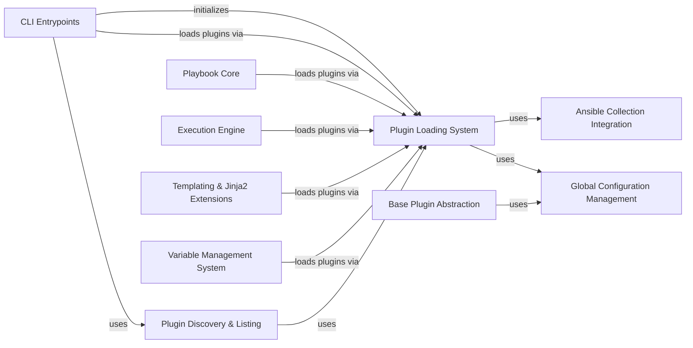

## Component Details

The Plugin Management subsystem in Ansible is crucial for its extensibility, enabling the dynamic discovery, loading, and management of various plugin types such as action, connection, lookup, callback, and shell plugins. Its primary purpose is to ensure that the correct plugin is identified, loaded, and configured for any given task or operation, thereby facilitating Ansible's core automation capabilities and allowing users to extend its functionality through custom plugins. The main flow involves core Ansible components requesting specific plugin types, which are then resolved and loaded by the Plugin Loading System, often leveraging collection integration and global configuration settings.

### Plugin Loading System
This is the core subsystem responsible for discovering, loading, and managing all types of Ansible plugins. It handles plugin path management, caching, aliases, and the complex resolution of plugin names, including fully qualified collection names (FQCNs) and legacy plugin names. It also manages plugin deprecation and removal, and initializes the collection loader and plugin filters.

**Related Classes/Methods**:

- <a href="https://github.com/ansible/ansible/blob/master/lib/ansible/plugins/loader.py#L290-L1227" target="_blank" rel="noopener noreferrer">`ansible.plugins.loader.PluginLoader` (290:1227)</a>
- <a href="https://github.com/ansible/ansible/blob/master/lib/ansible/plugins/loader.py#L1230-L1242" target="_blank" rel="noopener noreferrer">`ansible.plugins.loader._CacheLoader` (1230:1242)</a>
- <a href="https://github.com/ansible/ansible/blob/master/lib/ansible/plugins/loader.py#L1245-L1549" target="_blank" rel="noopener noreferrer">`ansible.plugins.loader.Jinja2Loader` (1245:1549)</a>
- <a href="https://github.com/ansible/ansible/blob/master/lib/ansible/plugins/loader.py#L131-L134" target="_blank" rel="noopener noreferrer">`ansible.plugins.loader.PluginPathContext` (131:134)</a>
- <a href="https://github.com/ansible/ansible/blob/master/lib/ansible/plugins/loader.py#L137-L287" target="_blank" rel="noopener noreferrer">`ansible.plugins.loader.PluginLoadContext` (137:287)</a>
- <a href="https://github.com/ansible/ansible/blob/master/lib/ansible/plugins/loader.py#L66-L67" target="_blank" rel="noopener noreferrer">`ansible.plugins.loader.get_all_plugin_loaders` (66:67)</a>
- <a href="https://github.com/ansible/ansible/blob/master/lib/ansible/plugins/loader.py#L71-L75" target="_blank" rel="noopener noreferrer">`ansible.plugins.loader.get_plugin_loader_namespace` (71:75)</a>
- <a href="https://github.com/ansible/ansible/blob/master/lib/ansible/plugins/loader.py#L78-L88" target="_blank" rel="noopener noreferrer">`ansible.plugins.loader.add_all_plugin_dirs` (78:88)</a>
- <a href="https://github.com/ansible/ansible/blob/master/lib/ansible/plugins/loader.py#L91-L121" target="_blank" rel="noopener noreferrer">`ansible.plugins.loader.get_shell_plugin` (91:121)</a>
- <a href="https://github.com/ansible/ansible/blob/master/lib/ansible/plugins/loader.py#L1680-L1691" target="_blank" rel="noopener noreferrer">`ansible.plugins.loader.init_plugin_loader` (1680:1691)</a>
- <a href="https://github.com/ansible/ansible/blob/master/lib/ansible/plugins/loader.py#L1662-L1677" target="_blank" rel="noopener noreferrer">`ansible.plugins.loader._configure_collection_loader` (1662:1677)</a>
- <a href="https://github.com/ansible/ansible/blob/master/lib/ansible/plugins/loader.py#L1570-L1623" target="_blank" rel="noopener noreferrer">`ansible.plugins.loader._load_plugin_filter` (1570:1623)</a>

### Base Plugin Abstraction
This component provides the foundational abstract functionalities and common interfaces that most Ansible plugins inherit from. It defines how plugins interact with the configuration manager to retrieve and set their options and how they declare their configuration definitions.

**Related Classes/Methods**:

- `ansible.plugins.AnsiblePlugin` (full file reference)
- `ansible.plugins.AnsibleJinja2Plugin` (full file reference)
- `ansible.plugins.netconf.NetconfBase` (full file reference)
- `ansible.plugins.lookup.LookupBase` (full file reference)
- `ansible.plugins.cliconf.CliconfBase` (full file reference)
- `ansible.plugins.vars.BaseVarsPlugin` (full file reference)
- `ansible.plugins.action.ActionBase` (full file reference)
- `ansible.plugins.callback.CallbackBase` (full file reference)
- `ansible.plugins.connection.ConnectionBase` (full file reference)
- `ansible.plugins.connection.NetworkConnectionBase` (full file reference)
- `ansible.plugins.inventory._BaseInventoryPlugin` (full file reference)
- `ansible.plugins.inventory.Cacheable` (full file reference)
- `ansible.plugins.inventory.Constructable` (full file reference)
- `ansible.plugins.become.BecomeBase` (full file reference)
- `ansible.plugins.shell.ShellBase` (full file reference)

### Ansible Collection Integration
This component facilitates the integration and management of Ansible Collections. It is responsible for parsing fully qualified collection names (FQCNs), resolving plugin locations within collections, and handling collection-specific metadata such as deprecations and redirects, ensuring seamless use of collection-provided content.

**Related Classes/Methods**:

- <a href="https://github.com/ansible/ansible/blob/master/lib/ansible/utils/collection_loader/_collection_finder.py#L890-L1076" target="_blank" rel="noopener noreferrer">`ansible.utils.collection_loader._collection_finder.AnsibleCollectionRef` (890:1076)</a>
- <a href="https://github.com/ansible/ansible/blob/master/lib/ansible/utils/collection_loader/_collection_finder.py#L188-L361" target="_blank" rel="noopener noreferrer">`ansible.utils.collection_loader._collection_finder._AnsibleCollectionFinder` (188:361)</a>
- `ansible.galaxy.collection` (full file reference)

### Global Configuration Management
This component manages Ansible's overarching configuration settings, including both global parameters and plugin-specific configurations. It provides the mechanisms for retrieving configuration values and initializing plugin-defined configuration options, ensuring consistent behavior across the system.

**Related Classes/Methods**:

- <a href="https://github.com/ansible/ansible/blob/master/lib/ansible/config/manager.py#L340-L741" target="_blank" rel="noopener noreferrer">`ansible.config.manager.ConfigManager` (340:741)</a>

### CLI Entrypoints
This component represents the various command-line interface entry points for Ansible. These interfaces initiate core Ansible operations and rely on the Plugin Loading System to access and utilize different plugin types required for their functionality.

**Related Classes/Methods**:

- <a href="https://github.com/ansible/ansible/blob/master/lib/ansible/cli/pull.py#L63-L403" target="_blank" rel="noopener noreferrer">`ansible.cli.pull.PullCLI` (63:403)</a>
- <a href="https://github.com/ansible/ansible/blob/master/lib/ansible/cli/console.py#L38-L601" target="_blank" rel="noopener noreferrer">`ansible.cli.console.ConsoleCLI` (38:601)</a>
- <a href="https://github.com/ansible/ansible/blob/master/lib/ansible/cli/scripts/ansible_connection_cli_stub.py#L59-L208" target="_blank" rel="noopener noreferrer">`ansible.cli.scripts.ansible_connection_cli_stub.ConnectionProcess` (59:208)</a>
- `ansible.cli.scripts.ansible_connection_cli_stub` (full file reference)

### Playbook Core
This component is central to processing and managing Ansible playbooks. It handles the loading of playbook data, validation of task arguments, and resolution of actions, ensuring that the correct plugins are identified and prepared for execution within the playbook context.

**Related Classes/Methods**:

- <a href="https://github.com/ansible/ansible/blob/master/lib/ansible/playbook/task.py#L56-L612" target="_blank" rel="noopener noreferrer">`ansible.playbook.task.Task` (56:612)</a>
- <a href="https://github.com/ansible/ansible/blob/master/lib/ansible/playbook/base.py#L84-L727" target="_blank" rel="noopener noreferrer">`ansible.playbook.base.FieldAttributeBase` (84:727)</a>
- `ansible.playbook.Playbook` (full file reference)

### Execution Engine
This component represents the core execution logic of Ansible, orchestrating the running of playbooks and individual tasks. It is responsible for invoking various types of plugins, such as action, connection, and strategy plugins, to perform operations on managed hosts according to the defined automation.

**Related Classes/Methods**:

- <a href="https://github.com/ansible/ansible/blob/master/lib/ansible/executor/playbook_executor.py#L41-L330" target="_blank" rel="noopener noreferrer">`ansible.executor.playbook_executor.PlaybookExecutor` (41:330)</a>
- <a href="https://github.com/ansible/ansible/blob/master/lib/ansible/executor/module_common.py#L712-L827" target="_blank" rel="noopener noreferrer">`ansible.executor.module_common.recursive_finder` (712:827)</a>
- <a href="https://github.com/ansible/ansible/blob/master/lib/ansible/executor/powershell/module_manifest.py#L53-L299" target="_blank" rel="noopener noreferrer">`ansible.executor.powershell.module_manifest.PSModuleDepFinder` (53:299)</a>
- <a href="https://github.com/ansible/ansible/blob/master/lib/ansible/executor/task_executor.py#L55-L1175" target="_blank" rel="noopener noreferrer">`ansible.executor.task_executor.TaskExecutor` (55:1175)</a>
- <a href="https://github.com/ansible/ansible/blob/master/lib/ansible/executor/task_queue_manager.py#L115-L501" target="_blank" rel="noopener noreferrer">`ansible.executor.task_queue_manager.TaskQueueManager` (115:501)</a>

### Templating & Jinja2 Extensions
This component provides dynamic content generation capabilities within Ansible, primarily through the integration of Jinja2 templating. It specifically handles the loading and execution of custom Jinja2 filters and tests, which extend the templating language's functionality.

**Related Classes/Methods**:

- <a href="https://github.com/ansible/ansible/blob/master/lib/ansible/_internal/_templating/_jinja_plugins.py#L36-L160" target="_blank" rel="noopener noreferrer">`ansible._internal._templating._jinja_plugins.JinjaPluginIntercept` (36:160)</a>
- <a href="https://github.com/ansible/ansible/blob/master/lib/ansible/_internal/_templating/_jinja_plugins.py#L199-L287" target="_blank" rel="noopener noreferrer">`ansible._internal._templating._jinja_plugins._invoke_lookup` (199:287)</a>

### Variable Management System
This component is responsible for managing and resolving variables within Ansible. It includes mechanisms for priming variable loaders and retrieving variables from various sources, often leveraging cache plugins for performance.

**Related Classes/Methods**:

- `ansible.vars.plugins` (full file reference)
- <a href="https://github.com/ansible/ansible/blob/master/lib/ansible/vars/manager.py#L99-L608" target="_blank" rel="noopener noreferrer">`ansible.vars.manager.VariableManager` (99:608)</a>

### Plugin Discovery & Listing
This component provides utilities specifically designed for listing and querying available Ansible plugins. It enables the discovery of plugins from various configured paths and collections, offering a comprehensive view of the loaded plugin ecosystem.

**Related Classes/Methods**:

- `ansible.plugins.list` (full file reference)

### [FAQ](https://github.com/CodeBoarding/GeneratedOnBoardings/tree/main?tab=readme-ov-file#faq)