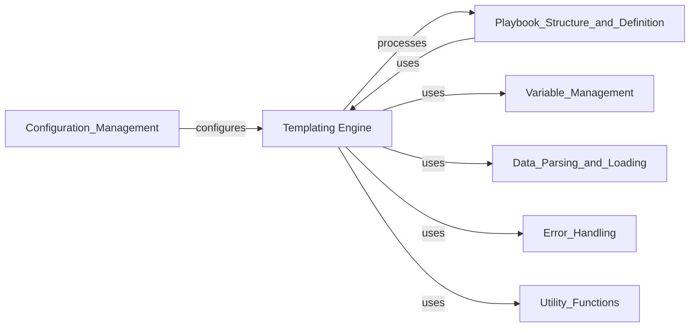

## Component Details

The Templating Engine component in Ansible is responsible for processing and rendering templates, primarily utilizing Jinja2. It evaluates expressions and conditionals within templates, ensuring proper handling of data, including sensitive or untrusted information. This component is crucial for dynamically generating content and configurations based on Ansible's internal data structures and variable management, integrating deeply with the overall execution flow.

### Templating Engine
Provides the core templating capabilities of Ansible, primarily powered by Jinja2. It handles the rendering of templates, evaluation of expressions and conditionals, and ensures proper handling of sensitive or untrusted data during the templating process. It integrates deeply with Ansible's internal data structures and variable management.

**Related Classes/Methods**:

- <a href="https://github.com/ansible/ansible/blob/master/test/lib/ansible_test/_internal/provider/layout/ansible.py#L16-L49" target="_blank" rel="noopener noreferrer">`ansible.template.Templar` (16:49)</a>
- <a href="https://github.com/ansible/ansible/blob/master/lib/ansible/_internal/_templating/_engine.py#L90-L592" target="_blank" rel="noopener noreferrer">`ansible._internal._templating._engine.TemplateEngine` (90:592)</a>
- `ansible._internal._templating._jinja_bits` (full file reference)
- `ansible._internal._templating._jinja_common` (full file reference)
- `ansible._internal._templating._lazy_containers` (full file reference)
- `ansible._internal._templating._marker_behaviors` (full file reference)
- `ansible._internal._templating._transform` (full file reference)
- `ansible._internal._templating._utils` (full file reference)
- <a href="https://github.com/ansible/ansible/blob/master/lib/ansible/parsing/dataloader.py#L38-L523" target="_blank" rel="noopener noreferrer">`ansible.parsing.dataloader.DataLoader` (38:523)</a>
- <a href="https://github.com/ansible/ansible/blob/master/lib/ansible/vars/hostvars.py#L85-L113" target="_blank" rel="noopener noreferrer">`ansible.vars.hostvars.HostVarsVars` (85:113)</a>
- `ansible.errors` (full file reference)
- `ansible.utils.display` (full file reference)

### [FAQ](https://github.com/CodeBoarding/GeneratedOnBoardings/tree/main?tab=readme-ov-file#faq)