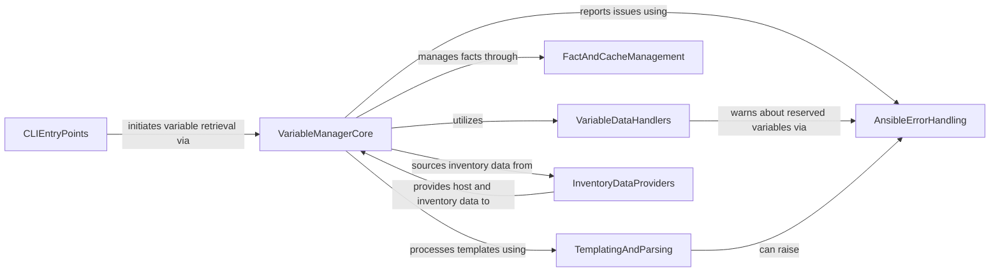

## Component Details

The Variable Management subsystem in Ansible is responsible for the comprehensive handling of variables, including their loading, combination, and cleaning, to ensure accurate variable resolution during playbook execution and templating. It integrates data from various sources like inventory, facts, and command-line inputs, applying a defined precedence to provide the correct variable values to tasks and templates. The core of this system is the VariableManager, which orchestrates these operations, interacting with components for data handling, fact caching, templating, and error management.

### VariableManagerCore
The central component responsible for orchestrating the loading, merging, and retrieval of all types of variables and facts within Ansible, adhering to specific precedence rules. It maintains caches for facts and non-persistent variables.

**Related Classes/Methods**:

- <a href="https://github.com/ansible/ansible/blob/master/lib/ansible/vars/manager.py#L99-L608" target="_blank" rel="noopener noreferrer">`ansible.vars.manager.VariableManager` (99:608)</a>
- <a href="https://github.com/ansible/ansible/blob/master/lib/ansible/vars/manager.py#L111-L135" target="_blank" rel="noopener noreferrer">`ansible.vars.manager.VariableManager:__init__` (111:135)</a>
- <a href="https://github.com/ansible/ansible/blob/master/lib/ansible/vars/manager.py#L144-L426" target="_blank" rel="noopener noreferrer">`ansible.vars.manager.VariableManager:get_vars` (144:426)</a>
- <a href="https://github.com/ansible/ansible/blob/master/lib/ansible/vars/manager.py#L428-L434" target="_blank" rel="noopener noreferrer">`ansible.vars.manager.VariableManager:_facts_gathered_for_host` (428:434)</a>
- <a href="https://github.com/ansible/ansible/blob/master/lib/ansible/vars/manager.py#L436-L502" target="_blank" rel="noopener noreferrer">`ansible.vars.manager.VariableManager:_get_magic_variables` (436:502)</a>
- <a href="https://github.com/ansible/ansible/blob/master/lib/ansible/vars/manager.py#L504-L547" target="_blank" rel="noopener noreferrer">`ansible.vars.manager.VariableManager:get_delegated_vars_and_hostname` (504:547)</a>
- <a href="https://github.com/ansible/ansible/blob/master/lib/ansible/vars/manager.py#L549-L556" target="_blank" rel="noopener noreferrer">`ansible.vars.manager.VariableManager:clear_facts` (549:556)</a>
- <a href="https://github.com/ansible/ansible/blob/master/lib/ansible/vars/manager.py#L558-L580" target="_blank" rel="noopener noreferrer">`ansible.vars.manager.VariableManager:set_host_facts` (558:580)</a>
- <a href="https://github.com/ansible/ansible/blob/master/lib/ansible/vars/manager.py#L582-L594" target="_blank" rel="noopener noreferrer">`ansible.vars.manager.VariableManager:set_nonpersistent_facts` (582:594)</a>
- <a href="https://github.com/ansible/ansible/blob/master/lib/ansible/vars/manager.py#L596-L608" target="_blank" rel="noopener noreferrer">`ansible.vars.manager.VariableManager:set_host_variable` (596:608)</a>
- <a href="https://github.com/ansible/ansible/blob/master/lib/ansible/vars/manager.py#L73-L96" target="_blank" rel="noopener noreferrer">`ansible.vars.manager.preprocess_vars` (73:96)</a>
- <a href="https://github.com/ansible/ansible/blob/master/lib/ansible/vars/manager.py#L62-L70" target="_blank" rel="noopener noreferrer">`ansible.vars.manager._deprecate_top_level_fact` (62:70)</a>

### VariableDataHandlers
A collection of utilities focused on the manipulation and preparation of variable data, including combining dictionaries, loading variables from various sources (options, extra vars), and ensuring data integrity.

**Related Classes/Methods**:

- <a href="https://github.com/ansible/ansible/blob/master/lib/ansible/utils/vars.py#L214-L236" target="_blank" rel="noopener noreferrer">`ansible.utils.vars.load_options_vars` (214:236)</a>
- <a href="https://github.com/ansible/ansible/blob/master/lib/ansible/utils/vars.py#L183-L211" target="_blank" rel="noopener noreferrer">`ansible.utils.vars.load_extra_vars` (183:211)</a>
- <a href="https://github.com/ansible/ansible/blob/master/lib/ansible/utils/vars.py#L79-L90" target="_blank" rel="noopener noreferrer">`ansible.utils.vars.combine_vars` (79:90)</a>
- <a href="https://github.com/ansible/ansible/blob/master/lib/ansible/vars/reserved.py#L68-L80" target="_blank" rel="noopener noreferrer">`ansible.vars.reserved.warn_if_reserved` (68:80)</a>

### FactAndCacheManagement
Manages the storage, retrieval, and cleaning of host facts, interacting with Ansible's caching mechanisms to ensure efficient fact handling and proper namespacing.

**Related Classes/Methods**:

- <a href="https://github.com/ansible/ansible/blob/master/lib/ansible/plugins/loader.py#L1004-L1006" target="_blank" rel="noopener noreferrer">`ansible.plugins.loader.cache_loader.get` (1004:1006)</a>
- <a href="https://github.com/ansible/ansible/blob/master/lib/ansible/_internal/_plugins/_cache.py#L19-L20" target="_blank" rel="noopener noreferrer">`ansible._internal._plugins._cache.PluginInterposer.get` (19:20)</a>
- <a href="https://github.com/ansible/ansible/blob/master/lib/ansible/_internal/_plugins/_cache.py#L22-L23" target="_blank" rel="noopener noreferrer">`ansible._internal._plugins._cache.PluginInterposer.set` (22:23)</a>
- <a href="https://github.com/ansible/ansible/blob/master/lib/ansible/_internal/_plugins/_cache.py#L31-L32" target="_blank" rel="noopener noreferrer">`ansible._internal._plugins._cache.PluginInterposer.delete` (31:32)</a>
- <a href="https://github.com/ansible/ansible/blob/master/lib/ansible/vars/clean.py#L159-L168" target="_blank" rel="noopener noreferrer">`ansible.vars.clean.namespace_facts` (159:168)</a>
- <a href="https://github.com/ansible/ansible/blob/master/lib/ansible/vars/clean.py#L116-L156" target="_blank" rel="noopener noreferrer">`ansible.vars.clean.clean_facts` (116:156)</a>

### TemplatingAndParsing
Provides the functionality for processing templated strings and data structures, identifying templates, and handling parsing-related errors during variable evaluation.

**Related Classes/Methods**:

- <a href="https://github.com/ansible/ansible/blob/master/lib/ansible/_internal/_templating/_engine.py#L90-L592" target="_blank" rel="noopener noreferrer">`ansible._internal._templating._engine.TemplateEngine` (90:592)</a>
- <a href="https://github.com/ansible/ansible/blob/master/lib/ansible/_internal/_templating/_engine.py#L235-L297" target="_blank" rel="noopener noreferrer">`ansible._internal._templating._engine.TemplateEngine.template` (235:297)</a>
- <a href="https://github.com/ansible/ansible/blob/master/lib/ansible/_internal/_templating/_engine.py#L418-L431" target="_blank" rel="noopener noreferrer">`ansible._internal._templating._engine.TemplateEngine.is_template` (418:431)</a>
- <a href="https://github.com/ansible/ansible/blob/master/lib/ansible/module_utils/datatag.py#L47-L49" target="_blank" rel="noopener noreferrer">`ansible.module_utils.datatag.native_type_name` (47:49)</a>
- `ansible.module_utils._internal._datatag.AnsibleDatatagBase.tag` (100:102)

### InventoryDataProviders
Responsible for extracting and organizing variable data from the Ansible inventory, including host and group variables, and integrating data from inventory plugins.

**Related Classes/Methods**:

- <a href="https://github.com/ansible/ansible/blob/master/lib/ansible/inventory/host.py#L34-L146" target="_blank" rel="noopener noreferrer">`ansible.inventory.host.Host` (34:146)</a>
- <a href="https://github.com/ansible/ansible/blob/master/lib/ansible/inventory/helpers.py#L25-L26" target="_blank" rel="noopener noreferrer">`ansible.inventory.helpers.sort_groups` (25:26)</a>
- <a href="https://github.com/ansible/ansible/blob/master/lib/ansible/inventory/helpers.py#L29-L40" target="_blank" rel="noopener noreferrer">`ansible.inventory.helpers.get_group_vars` (29:40)</a>
- <a href="https://github.com/ansible/ansible/blob/master/lib/ansible/vars/plugins.py#L108-L124" target="_blank" rel="noopener noreferrer">`ansible.vars.plugins.get_vars_from_inventory_sources` (108:124)</a>
- <a href="https://github.com/ansible/ansible/blob/master/lib/ansible/vars/plugins.py#L81-L105" target="_blank" rel="noopener noreferrer">`ansible.vars.plugins.get_vars_from_path` (81:105)</a>
- <a href="https://github.com/ansible/ansible/blob/master/lib/ansible/inventory/manager.py#L145-L763" target="_blank" rel="noopener noreferrer">`ansible.inventory.manager.InventoryManager` (145:763)</a>

### CLIEntryPoints
Represents the command-line interface components that serve as the initial entry points for operations requiring variable management, such as inventory inspection or playbook execution.

**Related Classes/Methods**:

- <a href="https://github.com/ansible/ansible/blob/master/lib/ansible/cli/inventory.py#L192-L206" target="_blank" rel="noopener noreferrer">`ansible.cli.inventory.InventoryCLI:_get_host_variables` (192:206)</a>
- <a href="https://github.com/ansible/ansible/blob/master/lib/ansible/cli/playbook.py#L89-L227" target="_blank" rel="noopener noreferrer">`ansible.cli.playbook.PlaybookCLI:run` (89:227)</a>

### AnsibleErrorHandling
Defines the various custom error types used throughout the Ansible system to signal specific issues during variable processing, parsing, or execution.

**Related Classes/Methods**:

- <a href="https://github.com/ansible/ansible/blob/master/test/lib/ansible_test/_internal/provider/layout/ansible.py#L26-L28" target="_blank" rel="noopener noreferrer">`ansible.errors.AnsibleError` (26:28)</a>
- <a href="https://github.com/ansible/ansible/blob/master/test/lib/ansible_test/_internal/provider/layout/ansible.py#L30-L32" target="_blank" rel="noopener noreferrer">`ansible.errors.AnsibleParserError` (30:32)</a>
- <a href="https://github.com/ansible/ansible/blob/master/test/lib/ansible_test/_internal/provider/layout/ansible.py#L34-L36" target="_blank" rel="noopener noreferrer">`ansible.errors.AnsibleUndefinedVariable` (34:36)</a>
- <a href="https://github.com/ansible/ansible/blob/master/test/lib/ansible_test/_internal/provider/layout/ansible.py#L38-L40" target="_blank" rel="noopener noreferrer">`ansible.errors.AnsibleAssertionError` (38:40)</a>
- <a href="https://github.com/ansible/ansible/blob/master/test/lib/ansible_test/_internal/provider/layout/ansible.py#L42-L44" target="_blank" rel="noopener noreferrer">`ansible.errors.AnsibleValueOmittedError` (42:44)</a>
- <a href="https://github.com/ansible/ansible/blob/master/test/lib/ansible_test/_internal/provider/layout/ansible.py#L46-L48" target="_blank" rel="noopener noreferrer">`ansible.errors.AnsibleFileNotFound` (46:48)</a>

### [FAQ](https://github.com/CodeBoarding/GeneratedOnBoardings/tree/main?tab=readme-ov-file#faq)