```mermaid
graph LR
    CLI_Interface["CLI Interface"]
    Playbook_Management["Playbook Management"]
    Execution_Engine["Execution Engine"]
    Plugin_Management["Plugin Management"]
    Data_Handling_Utilities["Data Handling & Utilities"]
    Variable_Management["Variable Management"]
    Galaxy_Integration["Galaxy Integration"]
    Configuration_Management["Configuration Management"]
    Inventory_Management["Inventory Management"]
    Templating_Engine["Templating Engine"]
    CLI_Interface -- "dispatches to" --> Execution_Engine
    CLI_Interface -- "dispatches to" --> Playbook_Management
    CLI_Interface -- "dispatches to" --> Inventory_Management
    CLI_Interface -- "dispatches to" --> Galaxy_Integration
    CLI_Interface -- "dispatches to" --> Configuration_Management
    CLI_Interface -- "uses" --> Data_Handling_Utilities
    Playbook_Management -- "loads and compiles" --> Execution_Engine
    Playbook_Management -- "uses" --> Data_Handling_Utilities
    Playbook_Management -- "uses" --> Variable_Management
    Playbook_Management -- "uses" --> Plugin_Management
    Playbook_Management -- "uses" --> Templating_Engine
    Execution_Engine -- "orchestrates" --> Plugin_Management
    Execution_Engine -- "uses" --> Playbook_Management
    Execution_Engine -- "uses" --> Inventory_Management
    Execution_Engine -- "uses" --> Variable_Management
    Execution_Engine -- "uses" --> Templating_Engine
    Execution_Engine -- "uses" --> Data_Handling_Utilities
    Plugin_Management -- "provides plugins to" --> Execution_Engine
    Plugin_Management -- "provides plugins to" --> Playbook_Management
    Plugin_Management -- "provides plugins to" --> Inventory_Management
    Plugin_Management -- "provides plugins to" --> Templating_Engine
    Plugin_Management -- "uses" --> Configuration_Management
    Plugin_Management -- "uses" --> Data_Handling_Utilities
    Data_Handling_Utilities -- "used by" --> CLI_Interface
    Data_Handling_Utilities -- "used by" --> Playbook_Management
    Data_Handling_Utilities -- "used by" --> Execution_Engine
    Data_Handling_Utilities -- "used by" --> Plugin_Management
    Data_Handling_Utilities -- "used by" --> Variable_Management
    Data_Handling_Utilities -- "used by" --> Galaxy_Integration
    Data_Handling_Utilities -- "used by" --> Configuration_Management
    Data_Handling_Utilities -- "used by" --> Inventory_Management
    Data_Handling_Utilities -- "used by" --> Templating_Engine
    Variable_Management -- "manages data for" --> Execution_Engine
    Variable_Management -- "manages data for" --> Playbook_Management
    Variable_Management -- "manages data for" --> Templating_Engine
    Variable_Management -- "uses" --> Inventory_Management
    Variable_Management -- "uses" --> Data_Handling_Utilities
    Galaxy_Integration -- "uses" --> Configuration_Management
    Galaxy_Integration -- "uses" --> Data_Handling_Utilities
    Configuration_Management -- "configures" --> CLI_Interface
    Configuration_Management -- "configures" --> Playbook_Management
    Configuration_Management -- "configures" --> Execution_Engine
    Configuration_Management -- "configures" --> Plugin_Management
    Configuration_Management -- "configures" --> Data_Handling_Utilities
    Configuration_Management -- "configures" --> Variable_Management
    Configuration_Management -- "configures" --> Galaxy_Integration
    Configuration_Management -- "configures" --> Inventory_Management
    Configuration_Management -- "configures" --> Templating_Engine
    Inventory_Management -- "provides inventory to" --> Execution_Engine
    Inventory_Management -- "provides inventory to" --> Variable_Management
    Inventory_Management -- "uses" --> Data_Handling_Utilities
    Inventory_Management -- "uses" --> Plugin_Management
    Templating_Engine -- "uses" --> Variable_Management
    Templating_Engine -- "uses" --> Data_Handling_Utilities
    Templating_Engine -- "uses" --> Plugin_Management
    Templating_Engine -- "used by" --> Playbook_Management
    Templating_Engine -- "used by" --> Execution_Engine
    click CLI_Interface href "https://github.com/CodeBoarding/GeneratedOnBoardings/blob/main/ansible/CLI Interface.md" "Details"
    click Playbook_Management href "https://github.com/CodeBoarding/GeneratedOnBoardings/blob/main/ansible/Playbook Management.md" "Details"
    click Execution_Engine href "https://github.com/CodeBoarding/GeneratedOnBoardings/blob/main/ansible/Execution Engine.md" "Details"
    click Plugin_Management href "https://github.com/CodeBoarding/GeneratedOnBoardings/blob/main/ansible/Plugin Management.md" "Details"
    click Data_Handling_Utilities href "https://github.com/CodeBoarding/GeneratedOnBoardings/blob/main/ansible/Data Handling & Utilities.md" "Details"
    click Variable_Management href "https://github.com/CodeBoarding/GeneratedOnBoardings/blob/main/ansible/Variable Management.md" "Details"
    click Galaxy_Integration href "https://github.com/CodeBoarding/GeneratedOnBoardings/blob/main/ansible/Galaxy Integration.md" "Details"
    click Configuration_Management href "https://github.com/CodeBoarding/GeneratedOnBoardings/blob/main/ansible/Configuration Management.md" "Details"
    click Inventory_Management href "https://github.com/CodeBoarding/GeneratedOnBoardings/blob/main/ansible/Inventory Management.md" "Details"
    click Templating_Engine href "https://github.com/CodeBoarding/GeneratedOnBoardings/blob/main/ansible/Templating Engine.md" "Details"
```

## Component Details

The Ansible architecture is designed around a modular and extensible core, enabling automation across diverse IT environments. The main flow begins with the CLI Interface, which parses user commands and dispatches them to the appropriate core components. For playbook execution, the Playbook Management component loads and compiles the automation logic. The Execution Engine then orchestrates the actual execution of tasks on target hosts, leveraging the Inventory Management for host information and the Variable Management for dynamic data. Plugin Management is crucial for extending Ansible's capabilities by loading various plugin types, while the Templating Engine handles dynamic content generation. Configuration Management provides system-wide and user-specific settings, and Data Handling & Utilities offers foundational services for parsing, data manipulation, and common operations. Finally, Galaxy Integration supports content discovery and management.

### CLI Interface
Provides the command-line interface for Ansible, handling argument parsing, user input, version information display, and dispatching commands to the core execution logic. It serves as the primary entry point for users interacting with Ansible.

**Related Classes/Methods**:

- <a href="https://github.com/ansible/ansible/blob/master/test/lib/ansible_test/_internal/provider/layout/ansible.py#L16-L49" target="_blank" rel="noopener noreferrer">`ansible.cli.CLI` (16:49)</a>
- <a href="https://github.com/ansible/ansible/blob/master/lib/ansible/cli/arguments/option_helpers.py#L64-L151" target="_blank" rel="noopener noreferrer">`ansible.cli.arguments.option_helpers.ArgumentParser` (64:151)</a>

### Playbook Management
Responsible for defining, loading, parsing, and compiling Ansible playbooks, including tasks, blocks, roles, and handlers. It manages the structure and flow of automation logic, handling includes, imports, and conditional execution.

**Related Classes/Methods**:

- <a href="https://github.com/ansible/ansible/blob/master/test/lib/ansible_test/_internal/provider/layout/ansible.py#L16-L49" target="_blank" rel="noopener noreferrer">`ansible.playbook.Playbook` (16:49)</a>

### Execution Engine
Orchestrates the execution of Ansible tasks on target hosts. It manages the task queue, handles results from modules, processes callbacks, and deals with various execution strategies. It also includes logic for interpreter discovery and module common functionalities.

**Related Classes/Methods**:

- <a href="https://github.com/ansible/ansible/blob/master/lib/ansible/executor/playbook_executor.py#L41-L330" target="_blank" rel="noopener noreferrer">`ansible.executor.playbook_executor.PlaybookExecutor` (41:330)</a>

### Plugin Management
Discovers, loads, and manages various types of Ansible plugins, including action, connection, lookup, callback, and shell plugins. It ensures the correct plugin is loaded and configured for a given task or operation, enabling Ansible's extensibility.

**Related Classes/Methods**:

- <a href="https://github.com/ansible/ansible/blob/master/lib/ansible/plugins/loader.py#L290-L1227" target="_blank" rel="noopener noreferrer">`ansible.plugins.loader.PluginLoader` (290:1227)</a>

### Data Handling & Utilities
Provides a collection of reusable Python modules and functions for common tasks across Ansible. This includes parsing various input formats (YAML, INI, command-line arguments), handling sensitive data (Vault), performing file operations, gathering system information, managing warnings/deprecations, and general utility functions like text conversion and JSON handling.

**Related Classes/Methods**:

- <a href="https://github.com/ansible/ansible/blob/master/lib/ansible/module_utils/basic.py#L366-L2185" target="_blank" rel="noopener noreferrer">`ansible.module_utils.basic.AnsibleModule` (366:2185)</a>
- <a href="https://github.com/ansible/ansible/blob/master/lib/ansible/parsing/dataloader.py#L38-L523" target="_blank" rel="noopener noreferrer">`ansible.parsing.dataloader.DataLoader` (38:523)</a>

### Variable Management
Manages variables within Ansible, including host variables, group variables, facts, and reserved variables. It handles the loading, combining, and cleaning of variable data, ensuring that the correct variable values are available during playbook execution and templating.

**Related Classes/Methods**:

- <a href="https://github.com/ansible/ansible/blob/master/lib/ansible/vars/manager.py#L99-L608" target="_blank" rel="noopener noreferrer">`ansible.vars.manager.VariableManager` (99:608)</a>

### Galaxy Integration
Facilitates interaction with Ansible Galaxy for sharing and finding Ansible content. It supports operations like building, downloading, installing, publishing, and verifying Ansible collections and roles, including dependency resolution and GPG signature verification.

**Related Classes/Methods**:

- <a href="https://github.com/ansible/ansible/blob/master/lib/ansible/galaxy/collection/galaxy_api_proxy.py#L27-L209" target="_blank" rel="noopener noreferrer">`ansible.galaxy.collection.galaxy_api_proxy.MultiGalaxyAPIProxy` (27:209)</a>

### Configuration Management
Manages Ansible's configuration settings, including loading configuration files (INI, YAML), retrieving configuration values, and handling deprecated settings. It ensures that Ansible operates according to the specified user and system-wide configurations.

**Related Classes/Methods**:

- <a href="https://github.com/ansible/ansible/blob/master/lib/ansible/config/manager.py#L340-L741" target="_blank" rel="noopener noreferrer">`ansible.config.manager.ConfigManager` (340:741)</a>

### Inventory Management
Manages the inventory of hosts and groups that Ansible targets. It handles adding hosts and groups, setting variables, and parsing inventory sources (e.g., INI, YAML, scripts) to build the in-memory representation of the infrastructure.

**Related Classes/Methods**:

- <a href="https://github.com/ansible/ansible/blob/master/lib/ansible/inventory/manager.py#L145-L763" target="_blank" rel="noopener noreferrer">`ansible.inventory.manager.InventoryManager` (145:763)</a>

### Templating Engine
Provides the core templating capabilities of Ansible, primarily powered by Jinja2. It handles the rendering of templates, evaluation of expressions and conditionals, and ensures proper handling of sensitive or untrusted data during the templating process.

**Related Classes/Methods**:

- <a href="https://github.com/ansible/ansible/blob/master/test/lib/ansible_test/_internal/provider/layout/ansible.py#L16-L49" target="_blank" rel="noopener noreferrer">`ansible.template.Templar` (16:49)</a>

### [FAQ](https://github.com/CodeBoarding/GeneratedOnBoardings/tree/main?tab=readme-ov-file#faq)