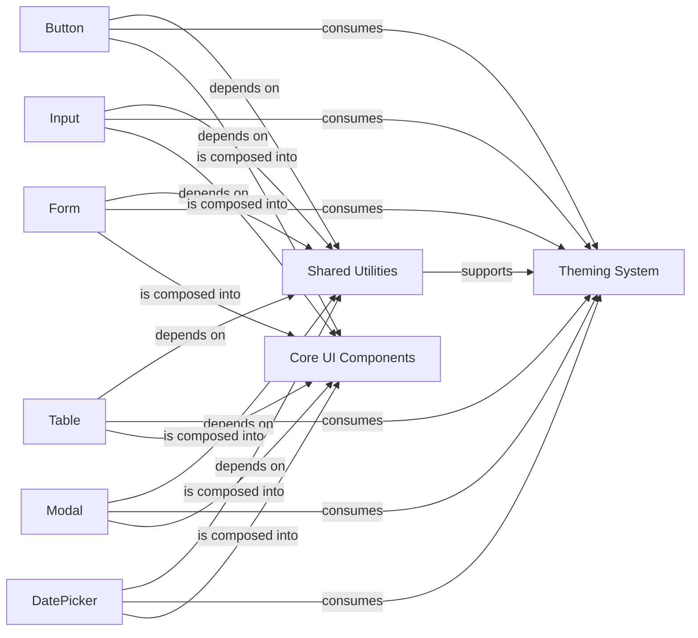

## Details

The Ant Design system's UI components subsystem is structured around a modular and reusable design, where individual components like Button, Input, Form, Table, Modal, and DatePicker serve as atomic building blocks. These components are designed to be highly customizable and adhere to a consistent visual language, facilitated by a centralized Theming System that applies design tokens and styles. A set of Shared Utilities provides common functionalities and hooks, promoting code consistency and reducing redundancy across the various UI elements. This architecture ensures that components can be easily integrated and maintained, forming a robust foundation for building complex user interfaces.

### Core UI Components [[Expand]](./Core_UI_Components.md)
A collection of individual, reusable UI components found within the `ant-design/components` directory, serving as the atomic building blocks of the Ant Design System. This is a conceptual grouping and does not have a single source file.

**Related Classes/Methods**: _None_

### Shared Utilities
Houses common utility functions, React hooks, and helper components reused across multiple core UI components, promoting consistency, reducing redundancy, and supporting cross-cutting concerns like accessibility, responsiveness, and animation. This is a conceptual grouping and does not have a single source file.

**Related Classes/Methods**: _None_

### Theming System
A centralized mechanism that individual components consume to apply design tokens and visual styles, indicated by the `ant-design/components/theme` directory and related utilities.

**Related Classes/Methods**:

- <a href="https://github.com/ant-design/ant-design/blob/master/components/tooltip/demo/colorful.tsx#L4-L18" target="_blank" rel="noopener noreferrer">`colors`:4-18</a>
- <a href="https://github.com/ant-design/ant-design/blob/master/components/_util/zindexContext.ts" target="_blank" rel="noopener noreferrer">`zindexContext`</a>

### Button
Responsible for rendering its specific UI element, handling user interactions, exposing a well-defined API for customization, managing internal state, and adhering to Ant Design's visual language and standards.

**Related Classes/Methods**:

- <a href="https://github.com/ant-design/ant-design/blob/master/components/button/index.tsx" target="_blank" rel="noopener noreferrer">`button.index`</a>
- <a href="https://github.com/ant-design/ant-design/blob/master/components/button/style/index.ts" target="_blank" rel="noopener noreferrer">`button.style.index`</a>

### Input
Responsible for rendering its specific UI element, handling user interactions, exposing a well-defined API for customization, managing internal state, and adhering to Ant Design's visual language and standards.

**Related Classes/Methods**:

- <a href="https://github.com/ant-design/ant-design/blob/master/components/input/OTP/OTPInput.tsx" target="_blank" rel="noopener noreferrer">`input.index`</a>
- <a href="https://github.com/ant-design/ant-design/blob/master/components/input/style/index.ts" target="_blank" rel="noopener noreferrer">`input.style.index`</a>

### Form
Responsible for rendering its specific UI element, handling user interactions, exposing a well-defined API for customization, managing internal state, and adhering to Ant Design's visual language and standards.

**Related Classes/Methods**:

- <a href="https://github.com/ant-design/ant-design/blob/master/components/form/index.tsx" target="_blank" rel="noopener noreferrer">`form.index`</a>
- <a href="https://github.com/ant-design/ant-design/blob/master/components/form/style/index.ts" target="_blank" rel="noopener noreferrer">`form.style.index`</a>

### Table
Responsible for rendering its specific UI element, handling user interactions, exposing a well-defined API for customization, managing internal state, and adhering to Ant Design's visual language and standards.

**Related Classes/Methods**:

- <a href="https://github.com/ant-design/ant-design/blob/master/components/table/index.tsx" target="_blank" rel="noopener noreferrer">`table.index`</a>
- <a href="https://github.com/ant-design/ant-design/blob/master/components/table/style/index.ts" target="_blank" rel="noopener noreferrer">`table.style.index`</a>

### Modal
Responsible for rendering its specific UI element, handling user interactions, exposing a well-defined API for customization, managing internal state, and adhering to Ant Design's visual language and standards.

**Related Classes/Methods**:

- <a href="https://github.com/ant-design/ant-design/blob/master/components/modal/index.tsx" target="_blank" rel="noopener noreferrer">`modal.index`</a>
- <a href="https://github.com/ant-design/ant-design/blob/master/components/modal/style/index.ts" target="_blank" rel="noopener noreferrer">`modal.style.index`</a>

### DatePicker
Provides an interactive calendar interface for selecting single dates or date ranges.

**Related Classes/Methods**:

- <a href="https://github.com/ant-design/ant-design/blob/master/components/date-picker/index.tsx" target="_blank" rel="noopener noreferrer">`date_picker.index`</a>
- <a href="https://github.com/ant-design/ant-design/blob/master/components/date-picker/style/index.ts" target="_blank" rel="noopener noreferrer">`date_picker.style.index`</a>

### [FAQ](https://github.com/CodeBoarding/GeneratedOnBoardings/tree/main?tab=readme-ov-file#faq)