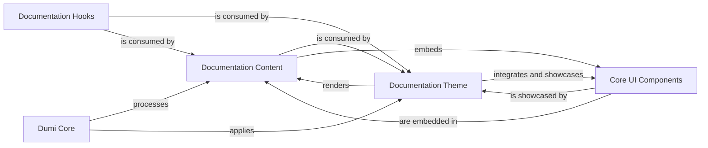

## Details

The Ant Design documentation subsystem operates by leveraging Dumi Core to process and render documentation content. Documentation Content, typically in MDX format, is parsed by Dumi Core, which then applies the Documentation Theme to present the information visually. The Documentation Theme, composed of various React components and styles, utilizes Documentation Hooks to add interactivity and dynamic behavior. Crucially, the Core UI Components of Ant Design are embedded within the Documentation Content and showcased by the Documentation Theme, providing live examples and API references. This architecture ensures a cohesive and interactive documentation experience, where Dumi acts as the backbone, the theme provides the presentation layer, and the content delivers the core information about the Ant Design components.

### Documentation Content
This component represents the actual documentation articles, examples, and API references for each UI component and design system aspect. It primarily consists of Markdown or MDX files, often rendered through React components. It's fundamental as it holds the information being conveyed.

**Related Classes/Methods**:

- <a href="https://github.com/ant-design/ant-design/blob/master/.dumi/pages/index/index.tsx" target="_blank" rel="noopener noreferrer">`index.tsx`</a>

### Documentation Theme
This component defines the visual layout, styling, and interactive elements of the documentation website. It includes React components for navigation, page templates, code block rendering, and live component examples. It's crucial for presenting the design system effectively.

**Related Classes/Methods**:

- <a href="https://github.com/ant-design/ant-design/blob/master/.dumi/theme/layouts/GlobalLayout.tsx" target="_blank" rel="noopener noreferrer">`GlobalLayout.tsx`</a>

### Documentation Hooks
These are custom React hooks used within the documentation theme or pages to encapsulate reusable logic, manage state, or interact with Dumi's runtime environment, enhancing the interactivity of the documentation. They enable dynamic and interactive documentation experiences.

**Related Classes/Methods**:

- <a href="https://github.com/ant-design/ant-design/blob/master/.dumi/hooks/useLocale.ts" target="_blank" rel="noopener noreferrer">`useLocale.ts`</a>

### Dumi Core
While an external dependency, Dumi is the foundational framework that parses the documentation content, applies the theme, generates the static site, and handles routing. It's the engine of the documentation platform, indispensable for its operation.

**Related Classes/Methods**:

- <a href="https://github.com/ant-design/ant-design/blob/master/.dumi/theme/builtins/Previewer/index.tsx" target="_blank" rel="noopener noreferrer">`Previewer/index.tsx`</a>

### Core UI Components [[Expand]](./Core_UI_Components.md)
The actual UI components developed in Ant Design, which are showcased and demonstrated by the documentation platform. These are the primary subject of the documentation and the reason for the platform's existence.

**Related Classes/Methods**:

- <a href="https://github.com/ant-design/ant-design/blob/master/components/button/index.tsx" target="_blank" rel="noopener noreferrer">`index.tsx`</a>

### [FAQ](https://github.com/CodeBoarding/GeneratedOnBoardings/tree/main?tab=readme-ov-file#faq)