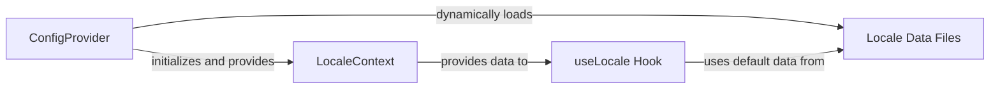

## Details

The `Internationalization (i18n) Module` is a core subsystem within the Ant Design project, dedicated to providing multi-language support for the documentation site and the UI components themselves. It ensures that the design system can be adapted to various linguistic and regional preferences, a critical feature for a global UI component library.

### ConfigProvider
This top-level component acts as the orchestrator for global Ant Design settings, including the active locale. It is responsible for loading the appropriate locale data and making it available throughout the application.

**Related Classes/Methods**:

- <a href="https://github.com/ant-design/ant-design/blob/master/components/config-provider/index.tsx#L685-L696" target="_blank" rel="noopener noreferrer">`ConfigProvider`:685-696</a>

### LocaleContext
A React Context that serves as the central repository for the application's current locale settings and translated strings. It efficiently passes locale data down the component tree, avoiding prop drilling.

**Related Classes/Methods**:

- <a href="https://github.com/ant-design/ant-design/blob/master/components/locale/context.ts" target="_blank" rel="noopener noreferrer">`LocaleContext`</a>

### useLocale Hook
This React hook is the primary interface for components to retrieve locale-specific text. It intelligently merges default locale data with any overrides provided through the `LocaleContext`, ensuring comprehensive translation support.

**Related Classes/Methods**:

- <a href="https://github.com/ant-design/ant-design/blob/master/components/locale/useLocale.ts" target="_blank" rel="noopener noreferrer">`useLocale Hook`</a>

### Locale Data Files
These files contain the actual key-value pairs of translated strings and locale-specific configurations for each supported language. They are the source of truth for all internationalized text within the Ant Design system.

**Related Classes/Methods**:

- <a href="https://github.com/ant-design/ant-design/blob/master/components/locale/en_US.ts" target="_blank" rel="noopener noreferrer">`Locale Data Files`</a>

### [FAQ](https://github.com/CodeBoarding/GeneratedOnBoardings/tree/main?tab=readme-ov-file#faq)