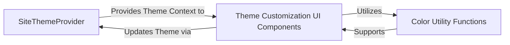

## Details

This subsystem focuses on providing a dynamic and customizable theming experience within the Ant Design documentation site. It centers around a `SiteThemeProvider` that establishes and manages the application's theme context. User interface components, grouped under `Theme Customization UI Components`, allow users to interactively modify various design tokens like colors and radii. These UI components consume the theme context provided by the `SiteThemeProvider` and, in turn, propagate user-driven changes back to it, enabling real-time theme updates. A `Color Utility Functions` component supports the customization process by providing essential color manipulation capabilities, ensuring consistency and accuracy in theme adjustments. The theming subsystem is orchestrated around the `SiteThemeProvider`, which acts as the central authority for theme data, making it accessible throughout the application via React Context. The `Theme Customization UI Components` form the interactive layer, allowing users to modify theme properties. These UI components consume the theme context to display current values and, crucially, communicate user-initiated changes back to the `SiteThemeProvider` to trigger theme updates. The `Color Utility Functions` component serves as a foundational helper, providing essential color processing capabilities that are leveraged by the `Theme Customization UI Components` to ensure accurate and consistent color manipulations during the customization process. This architecture ensures a clear separation of concerns, with the `SiteThemeProvider` managing the theme state and the UI components providing the interactive customization experience, all supported by dedicated utility functions.

### SiteThemeProvider
This component serves as the primary entry point for theme provision. It leverages React Context to make theme-related properties and design tokens available to all child components throughout the application. It is fundamental for establishing a consistent theming environment.

**Related Classes/Methods**:

- <a href="https://github.com/ant-design/ant-design/blob/master/.dumi/theme/SiteThemeProvider.tsx#L35-L85" target="_blank" rel="noopener noreferrer">`SiteThemeProvider`:35-85</a>

### Theme Customization UI Components
This group of components provides the user interface for interacting with and dynamically customizing design tokens (e.g., `ThemePicker`, `ColorPicker`, `RadiusPicker`). They are crucial for enabling user-driven personalization and demonstrating the flexibility of the design system.

**Related Classes/Methods**:

- <a href="https://github.com/ant-design/ant-design/blob/master/.dumi/pages/index/components/Theme/ThemePicker.tsx#L81-L90" target="_blank" rel="noopener noreferrer">`ThemePicker`:81-90</a>
- <a href="https://github.com/ant-design/ant-design/blob/master/components/config-provider/index.tsx" target="_blank" rel="noopener noreferrer">`ColorPicker`</a>
- <a href="https://github.com/ant-design/ant-design/blob/master/.dumi/pages/index/components/Theme/RadiusPicker.tsx#L10-L13" target="_blank" rel="noopener noreferrer">`RadiusPicker`:10-13</a>
- <a href="https://github.com/ant-design/ant-design/blob/master/.dumi/theme/builtins/ComponentOverview/index.tsx" target="_blank" rel="noopener noreferrer">`BackgroundImage`</a>
- <a href="https://github.com/ant-design/ant-design/blob/master/.dumi/pages/index/components/Theme/MobileCarousel.tsx#L82-L98" target="_blank" rel="noopener noreferrer">`MobileCarousel`:82-98</a>

### Color Utility Functions
This component provides a set of helper functions specifically for color manipulation and conversion. It ensures consistent and accurate processing of color inputs and outputs, supporting the dynamic customization features. While a utility, its direct and critical support for the theming and customization process makes it an integral part of this subsystem.

**Related Classes/Methods**:

- <a href="https://github.com/ant-design/ant-design/blob/master/.dumi/pages/index/components/Theme/colorUtil.ts#L1-L9999" target="_blank" rel="noopener noreferrer">`colorUtil`:1-9999</a>

### [FAQ](https://github.com/CodeBoarding/GeneratedOnBoardings/tree/main?tab=readme-ov-file#faq)