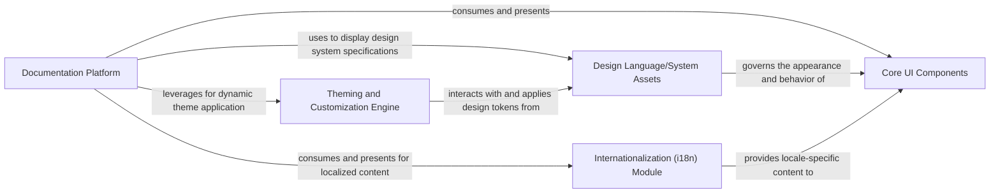

## Details

The Ant Design architecture is built around a central `Documentation Platform` that serves as the user-facing gateway to the entire design system. This platform dynamically integrates `Core UI Components`, allowing users to explore and interact with them. The visual presentation of both the documentation and the components is highly customizable through the `Theming and Customization Engine`, which applies design tokens defined within the `Design Language/System Assets`. To ensure global accessibility, the `Internationalization (i18n) Module` provides multi-language support across the platform and its components. This modular and interconnected design allows for a flexible, maintainable, and highly customizable UI component library.

### Documentation Platform [[Expand]](./Documentation_Platform.md)
The primary interface for showcasing, documenting, and interacting with UI components and the design system.

**Related Classes/Methods**:

- <a href="https://github.com/ant-design/ant-design/blob/master/.dumi/pages/" target="_blank" rel="noopener noreferrer">`content within .dumi/pages/`</a>
- <a href="https://github.com/ant-design/ant-design/blob/master/.dumi/theme/" target="_blank" rel="noopener noreferrer">`content within .dumi/theme/`</a>
- <a href="https://github.com/ant-design/ant-design/blob/master/.dumi/hooks/" target="_blank" rel="noopener noreferrer">`content within .dumi/hooks/`</a>

### Core UI Components [[Expand]](./Core_UI_Components.md)
The actual reusable UI components (e.g., buttons, inputs, cards) that form the building blocks for applications.

**Related Classes/Methods**:

- <a href="https://github.com/ant-design/ant-design/blob/master/components/" target="_blank" rel="noopener noreferrer">`content within components/`</a>

### Theming and Customization Engine [[Expand]](./Theming_and_Customization_Engine.md)
Manages visual themes and enables dynamic customization of design tokens.

**Related Classes/Methods**:

- <a href="https://github.com/ant-design/ant-design/blob/master/.dumi/pages/index/components/Theme/" target="_blank" rel="noopener noreferrer">`content within .dumi/pages/index/components/Theme/`</a>
- <a href="https://github.com/ant-design/ant-design/blob/master/.dumi/theme/SiteThemeProvider.tsx" target="_blank" rel="noopener noreferrer">`SiteThemeProvider.tsx`</a>

### Design Language/System Assets
Encapsulates foundational visual design guidelines, design tokens, and standardized styles.

**Related Classes/Methods**:

- <a href="https://github.com/ant-design/ant-design/blob/master/.dumi/theme/builtins/ColorPaletteTool/" target="_blank" rel="noopener noreferrer">`content within .dumi/theme/builtins/ColorPaletteTool/`</a>
- <a href="https://github.com/ant-design/ant-design/blob/master/.dumi/theme/builtins/ColorPalettes/" target="_blank" rel="noopener noreferrer">`content within .dumi/theme/builtins/ColorPalettes/`</a>

### Internationalization (i18n) Module [[Expand]](./Internationalization_i18n_Module.md)
Provides multi-language support for the documentation site and components.

**Related Classes/Methods**:

- <a href="https://github.com/ant-design/ant-design/blob/master/.dumi/hooks/useLocale.ts" target="_blank" rel="noopener noreferrer">`useLocale.ts`</a>

### [FAQ](https://github.com/CodeBoarding/GeneratedOnBoardings/tree/main?tab=readme-ov-file#faq)