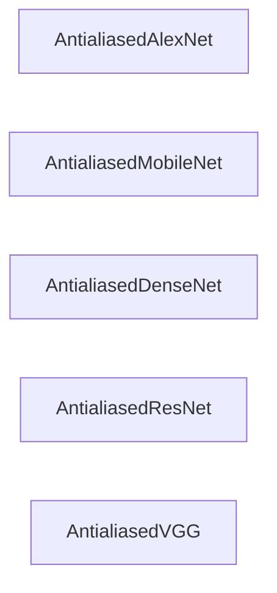

## Details

The antialiased_cnns subsystem provides a collection of antialiased convolutional neural network (CNN) architectures. Each central component within this subsystem, such as AntialiasedAlexNet or AntialiasedResNet, encapsulates the complete definition and implementation of its respective model. These components are designed to be self-contained, offering distinct, ready-to-use antialiased CNN models. The primary flow involves an external system utilizing one of these models for tasks like inference or training, with the model internally handling its specific architectural computations. There are no direct interaction pathways or dependencies between these distinct model implementations at this architectural level.

### AntialiasedAlexNet
Represents the antialiased AlexNet architecture, providing its complete definition and implementation. It encapsulates the network structure and methods to create instances of the antialiased AlexNet model.

**Related Classes/Methods**:

- <a href="https://github.com/adobe/antialiased-cnns/blob/master/antialiased_cnns/alexnet.py" target="_blank" rel="noopener noreferrer">`antialiased_cnns.alexnet:AntialiasedAlexNet`</a>

### AntialiasedMobileNet
Represents the antialiased MobileNetV2 architecture, including its core building blocks and overall structure. It defines and handles the construction of the MobileNetV2 model with integrated antialiasing.

**Related Classes/Methods**:

- <a href="https://github.com/adobe/antialiased-cnns/blob/master/antialiased_cnns/mobilenet.py" target="_blank" rel="noopener noreferrer">`antialiased_cnns.mobilenet:AntialiasedMobileNet`</a>

### AntialiasedDenseNet
Represents the antialiased DenseNet architecture, encompassing its definition, dense block components, and mechanisms for pre-trained weight handling. It manages the complete structure and instantiation of antialiased DenseNet models.

**Related Classes/Methods**:

- <a href="https://github.com/adobe/antialiased-cnns/blob/master/antialiased_cnns/densenet.py" target="_blank" rel="noopener noreferrer">`antialiased_cnns.densenet:AntialiasedDenseNet`</a>

### AntialiasedResNet
Represents the antialiased ResNet architecture, providing various layer types and the logic for constructing different ResNet variants. It defines and implements the antialiased ResNet models.

**Related Classes/Methods**:

- <a href="https://github.com/adobe/antialiased-cnns/blob/master/antialiased_cnns/resnet.py" target="_blank" rel="noopener noreferrer">`antialiased_cnns.resnet:AntialiasedResNet`</a>

### AntialiasedVGG
Represents the antialiased VGG architecture, defining its layer structure and handling model weight initialization. It provides the complete implementation of antialiased VGG models.

**Related Classes/Methods**:

- <a href="https://github.com/adobe/antialiased-cnns/blob/master/antialiased_cnns/vgg.py" target="_blank" rel="noopener noreferrer">`antialiased_cnns.vgg:AntialiasedVGG`</a>

### [FAQ](https://github.com/CodeBoarding/GeneratedOnBoardings/tree/main?tab=readme-ov-file#faq)