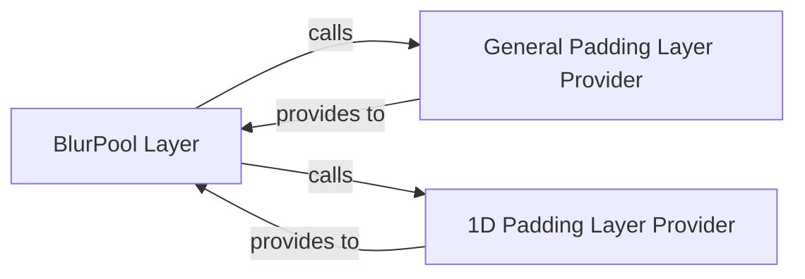

## Details

The antialiased_cnns.blurpool subsystem is designed around the BlurPool Layer, which is responsible for performing antialiased downsampling. This layer achieves its functionality by dynamically acquiring appropriate padding configurations from dedicated provider components. Specifically, it interacts with the General Padding Layer Provider for standard multi-dimensional padding and the 1D Padding Layer Provider for specialized one-dimensional padding. This modular design allows the BlurPool Layer to abstract the complexities of padding, ensuring that inputs are correctly prepared for the internal blur filter and pooling operations, thereby enhancing the shift-invariance of CNNs.

### BlurPool Layer
This is the central and most critical component of the subsystem. It implements the fundamental BlurPool layer, providing the core antialiased downsampling functionality by applying a blur filter before pooling operations. It acts as a plug-and-play module designed to replace standard pooling layers in Convolutional Neural Networks (CNNs) to enhance shift-invariance.

**Related Classes/Methods**:

- <a href="https://github.com/adobe/antialiased-cnns/blob/master/antialiased_cnns/blurpool.py#L13-L52" target="_blank" rel="noopener noreferrer">`antialiased_cnns.blurpool.BlurPool`:13-52</a>

### General Padding Layer Provider
A utility component responsible for configuring and returning a general-purpose padding layer. This component ensures that inputs to the blur filter within the BlurPool layer have appropriate boundary conditions, adapting to various input dimensions (e.g., 2D for images). It abstracts the details of padding creation.

**Related Classes/Methods**:

- <a href="https://github.com/adobe/antialiased-cnns/blob/master/antialiased_cnns/blurpool.py#L54-L63" target="_blank" rel="noopener noreferrer">`antialiased_cnns.blurpool.get_pad_layer`:54-63</a>

### 1D Padding Layer Provider
A specialized utility component that provides a 1D padding layer. This is specifically tailored for one-dimensional inputs or specific stages within the BlurPool operation where 1D convolutions or pooling might be applied, ensuring correct padding for such scenarios.

**Related Classes/Methods**:

- <a href="https://github.com/adobe/antialiased-cnns/blob/master/antialiased_cnns/blurpool.py#L107-L116" target="_blank" rel="noopener noreferrer">`antialiased_cnns.blurpool.get_pad_layer_1d`:107-116</a>

### [FAQ](https://github.com/CodeBoarding/GeneratedOnBoardings/tree/main?tab=readme-ov-file#faq)