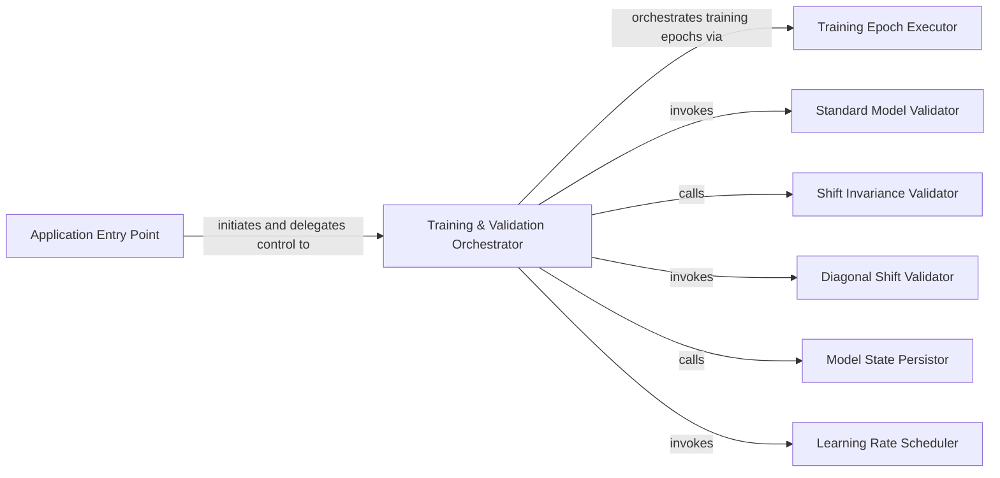

## Details

The `antialiased-cnns` project's core functionality revolves around a well-defined training and validation pipeline. The `Application Entry Point` (`main`) initializes the environment and delegates control to the `Training & Validation Orchestrator` (`main_worker`). This orchestrator is the central hub, managing the iterative training epochs, which are executed by the `Training Epoch Executor` (`train`). During or after training, the orchestrator leverages specialized validation components: `Standard Model Validator` (`validate`), `Shift Invariance Validator` (`validate_shift`), and `Diagonal Shift Validator` (`validate_diagonal`) to assess model performance and robustness. Furthermore, the `Model State Persistor` (`save_checkpoint`) handles the crucial task of saving and loading model states, while the `Learning Rate Scheduler` (`adjust_learning_rate`) dynamically optimizes the training process. This modular design ensures clear separation of concerns and facilitates focused development and evaluation of antialiased convolutional neural networks.

### Application Entry Point
Serves as the primary entry point for the entire application. It is responsible for parsing command-line arguments, initializing the environment (e.g., setting up distributed training, device configuration), and then delegating the core training and validation orchestration. This component acts as the initial bootstrap for the application.

**Related Classes/Methods**:

- <a href="https://github.com/adobe/antialiased-cnns/blob/master/main.py#L158-L193" target="_blank" rel="noopener noreferrer">`main`:158-193</a>

### Training & Validation Orchestrator
This component is the central control unit for the machine learning pipeline. It manages the overall execution flow of training and validation, including iterative training epochs, various validation routines (standard, shift invariance, diagonal shift), dynamic learning rate adjustments, and model checkpointing. It coordinates interactions with other components responsible for specific tasks within the training loop.

**Related Classes/Methods**:

- <a href="https://github.com/adobe/antialiased-cnns/blob/master/main.py#L196-L419" target="_blank" rel="noopener noreferrer">`main_worker`:196-419</a>

### Training Epoch Executor
Responsible for executing a single training epoch. This includes iterating through data batches, performing forward and backward passes, calculating loss, and updating model weights. It encapsulates the core training logic for an individual epoch.

**Related Classes/Methods**:

- <a href="https://github.com/adobe/antialiased-cnns/blob/master/main.py#L422-L492" target="_blank" rel="noopener noreferrer">`train`:422-492</a>

### Standard Model Validator
Performs standard model evaluation on a given dataset, typically calculating common metrics such as accuracy, precision, recall, or F1-score.

**Related Classes/Methods**:

- <a href="https://github.com/adobe/antialiased-cnns/blob/master/main.py#L494-L546" target="_blank" rel="noopener noreferrer">`validate`:494-546</a>

### Shift Invariance Validator
Specializes in evaluating the model's robustness to input shifts. This component assesses the model's shift invariance properties, which is a key focus of the antialiased-cnns project.

**Related Classes/Methods**:

- <a href="https://github.com/adobe/antialiased-cnns/blob/master/main.py#L549-L589" target="_blank" rel="noopener noreferrer">`validate_shift`:549-589</a>

### Diagonal Shift Validator
Conducts a specific type of shift invariance validation, focusing on the model's performance under diagonal shifts in the input data.

**Related Classes/Methods**:

- <a href="https://github.com/adobe/antialiased-cnns/blob/master/main.py#L591-L655" target="_blank" rel="noopener noreferrer">`validate_diagonal`:591-655</a>

### Model State Persistor
Handles the saving and loading of model checkpoints, optimizer states, and other training-related information. This ensures that training progress can be resumed or trained models can be deployed.

**Related Classes/Methods**:

- <a href="https://github.com/adobe/antialiased-cnns/blob/master/main.py#L665-L670" target="_blank" rel="noopener noreferrer">`save_checkpoint`:665-670</a>

### Learning Rate Scheduler
Manages the dynamic adjustment of the learning rate during the training process. This component implements various scheduling strategies to optimize convergence and improve model performance.

**Related Classes/Methods**:

- <a href="https://github.com/adobe/antialiased-cnns/blob/master/main.py#L691-L695" target="_blank" rel="noopener noreferrer">`adjust_learning_rate`:691-695</a>

### [FAQ](https://github.com/CodeBoarding/GeneratedOnBoardings/tree/main?tab=readme-ov-file#faq)