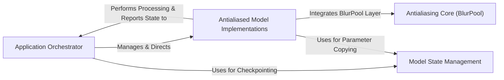

## Details

The Application Orchestrator serves as the central control unit, managing the overall execution flow from data loading to training and validation. It Manages & Directs the Antialiased Model Implementations, which are various CNN architectures integrated with the Antialiasing Core (BlurPool) for antialiased downsampling. The Antialiased Model Implementations Performs Processing & Reports State to the Application Orchestrator, providing processed data and model state information. The Model State Management component provides utility functions for handling model parameters and buffers, supporting both the Application Orchestrator for checkpointing and the Antialiased Model Implementations for parameter manipulation. The Antialiasing Core (BlurPool) is a foundational component, integrated directly into the Antialiased Model Implementations to provide the core antialiasing functionality.

### Application Orchestrator [[Expand]](./Application_Orchestrator.md)
Manages the overall execution flow, including data loading, training, validation, and checkpointing. It acts as the central control unit for the entire application.

**Related Classes/Methods**:

- <a href="https://github.com/adobe/antialiased-cnns/blob/master/main.py#L158-L193" target="_blank" rel="noopener noreferrer">`main`:158-193</a>

### Antialiasing Core (BlurPool) [[Expand]](./Antialiasing_Core_BlurPool_.md)
Implements the fundamental BlurPool layer, providing the core antialiased downsampling functionality. This is the project's key innovation.

**Related Classes/Methods**:

- <a href="https://github.com/adobe/antialiased-cnns/blob/master/antialiased_cnns/blurpool.py" target="_blank" rel="noopener noreferrer">`antialiased_cnns.blurpool`</a>

### Antialiased Model Implementations [[Expand]](./Antialiased_Model_Implementations.md)
Contains the definitions of various popular CNN architectures (e.g., AlexNet, MobileNet, ResNet, VGG, DenseNet) that have been modified to integrate the BlurPool layer.

**Related Classes/Methods**:

- <a href="https://github.com/adobe/antialiased-cnns/blob/master/antialiased_cnns/alexnet.py" target="_blank" rel="noopener noreferrer">`antialiased_cnns.alexnet`</a>
- <a href="https://github.com/adobe/antialiased-cnns/blob/master/antialiased_cnns/mobilenet.py" target="_blank" rel="noopener noreferrer">`antialiased_cnns.mobilenet`</a>
- <a href="https://github.com/adobe/antialiased-cnns/blob/master/antialiased_cnns/densenet.py" target="_blank" rel="noopener noreferrer">`antialiased_cnns.densenet`</a>
- <a href="https://github.com/adobe/antialiased-cnns/blob/master/antialiased_cnns/resnet.py" target="_blank" rel="noopener noreferrer">`antialiased_cnns.resnet`</a>
- <a href="https://github.com/adobe/antialiased-cnns/blob/master/antialiased_cnns/vgg.py" target="_blank" rel="noopener noreferrer">`antialiased_cnns.vgg`</a>

### Model State Management
Provides utility functions for manipulating and transferring model parameters and buffers, crucial for adapting pre-trained models and managing model states.

**Related Classes/Methods**:

- <a href="https://github.com/adobe/antialiased-cnns/blob/master/antialiased_cnns/util.py" target="_blank" rel="noopener noreferrer">`antialiased_cnns.util`</a>

### [FAQ](https://github.com/CodeBoarding/GeneratedOnBoardings/tree/main?tab=readme-ov-file#faq)