```mermaid
graph LR
    Appium_Core_Server_Orchestrator_["Appium Core Server (Orchestrator)"]
    API_Endpoints_Server_Listener["API Endpoints / Server Listener"]
    Request_Command_Processor["Request & Command Processor"]
    Session_Manager["Session Manager"]
    Driver_Manager["Driver Manager"]
    Plugin_Manager["Plugin Manager"]
    Configuration_Manager["Configuration Manager"]
    Appium_Core_Server_Orchestrator_ -- "coordinates with" --> Request_Command_Processor
    Appium_Core_Server_Orchestrator_ -- "delegates to" --> Session_Manager
    API_Endpoints_Server_Listener -- "forwards requests to" --> Request_Command_Processor
    Request_Command_Processor -- "receives requests from" --> API_Endpoints_Server_Listener
    Request_Command_Processor -- "routes commands to" --> Session_Manager
    Session_Manager -- "receives requests from" --> Request_Command_Processor
    Session_Manager -- "requests instances from" --> Driver_Manager
    Driver_Manager -- "receives requests from" --> Session_Manager
    Driver_Manager -- "utilizes configurations from" --> Configuration_Manager
    Plugin_Manager -- "integrates with" --> Appium_Core_Server_Orchestrator_
    Plugin_Manager -- "consults" --> Configuration_Manager
    Configuration_Manager -- "provides settings to" --> Appium_Core_Server_Orchestrator_
    Configuration_Manager -- "supplies capabilities to" --> Driver_Manager
    Configuration_Manager -- "supplies capabilities to" --> Plugin_Manager
```

## Details

The Appium Core Server acts as the central orchestrator of the Appium automation framework. Its architecture is designed for modularity and extensibility, adhering to Client-Server, Plugin, and Adapter patterns. The subsystem is composed of the following key internal components:

### Appium Core Server (Orchestrator)
The central hub of the Appium server, responsible for managing the overall server lifecycle (startup, shutdown), coordinating the flow of requests, and overseeing session management. It acts as the primary coordinator for all other internal components.

**Related Classes/Methods**:

- `appium.AppiumServer` (1:1)

### API Endpoints / Server Listener
This component exposes the Appium server's primary API (e.g., HTTP/WebDriver endpoints) and is responsible for listening for incoming client connections. It handles the initial reception of requests and sending of responses.

**Related Classes/Methods**:

- `HTTP server setup` (1:1)

### Request & Command Processor
Responsible for receiving, parsing, and validating incoming WebDriver/W3C commands from connected clients. It translates raw HTTP requests into structured internal command objects and prepares them for execution by the appropriate driver.

**Related Classes/Methods**:

- `CommandProcessor` (1:1)

### Session Manager
Manages the lifecycle of individual automation sessions. This includes creating new sessions based on desired capabilities, retrieving active sessions, and terminating sessions. It maintains the state and context for each active automation session.

**Related Classes/Methods**:

- `SessionManager` (1:1)

### Driver Manager
Acts as an abstraction layer for various platform-specific automation drivers (e.g., UIAutomator2, XCUITest). It is responsible for loading, initializing, and dispatching commands to the correct underlying driver instance for a given session. It embodies the Adapter Pattern.

**Related Classes/Methods**:

- `appium.AppiumDriver` (1:1)

### Plugin Manager
Manages the discovery, loading, and execution of Appium plugins. It provides a robust mechanism for plugins to extend or modify server behavior, add new commands, or alter capabilities, embodying the Plugin Architecture.

**Related Classes/Methods**:

- `PluginManager` (1:1)

### Configuration Manager
Handles all server-wide and session-specific configurations. This includes loading server settings, managing default capabilities, and processing plugin configurations, ensuring consistent behavior across the server.

**Related Classes/Methods**:

- `ConfigurationManager` (1:1)

### [FAQ](https://github.com/CodeBoarding/GeneratedOnBoardings/tree/main?tab=readme-ov-file#faq)