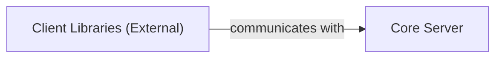

## Details

One paragraph explaining the functionality which is represented by this graph. What the main flow is and what is its purpose.

### Client Libraries (External) [[Expand]](./Client_Libraries_External_.md)
Language-specific libraries (e.g., Appium Java Client, Appium Python Client) that provide a high-level, convenient API for test scripts to interact with the Appium server. They abstract the complexities of the underlying WebDriver JSON Wire Protocol or W3C WebDriver Protocol, translating user-friendly commands into the appropriate requests for the server.

**Related Classes/Methods**: _None_

### Core Server [[Expand]](./Core_Server.md)
The central server component of Appium that processes WebDriver commands.

**Related Classes/Methods**: _None_

### [FAQ](https://github.com/CodeBoarding/GeneratedOnBoardings/tree/main?tab=readme-ov-file#faq)