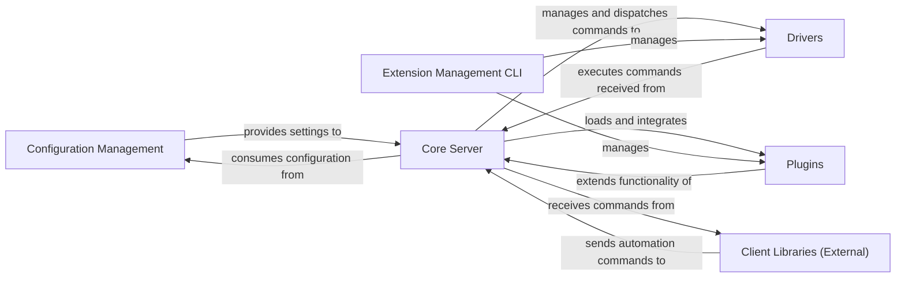

## Details

One paragraph explaining the functionality which is represented by this graph. What the main flow is and what is its purpose.

### Configuration Management [[Expand]](./Configuration_Management.md)
Handles the parsing, validation, and management of Appium's configuration settings. This includes server ports, driver paths, plugin settings, and other operational parameters, ensuring the server operates according to defined specifications.

**Related Classes/Methods**: _None_

### Core Server [[Expand]](./Core_Server.md)
The central component of the automation framework/test automation server, responsible for orchestrating test execution, managing sessions, and routing commands to appropriate drivers and plugins. It relies heavily on configuration settings for its operation.

**Related Classes/Methods**: _None_

### Drivers
Platform-specific components (e.g., Android, iOS, Web) that translate generic automation commands into native actions for the target device or application. They implement the Adapter Pattern to provide a unified interface to the Core Server.

**Related Classes/Methods**: _None_

### Plugins
Modular extensions that add new functionalities or modify existing behaviors of the Core Server, such as custom command handling, reporting, or logging. They embody the Plugin Architecture / Extensible Architecture pattern.

**Related Classes/Methods**: _None_

### Extension Management CLI [[Expand]](./Extension_Management_CLI.md)
A command-line interface tool responsible for installing, uninstalling, updating, and managing drivers and plugins. It interacts with the Core Server's extension mechanisms.

**Related Classes/Methods**: _None_

### Client Libraries (External) [[Expand]](./Client_Libraries_External_.md)
External language-specific libraries (e.g., Java, Python, JavaScript) that provide an API for users to write automation scripts. They communicate with the Core Server using a defined protocol (e.g., WebDriver Protocol).

**Related Classes/Methods**: _None_

### [FAQ](https://github.com/CodeBoarding/GeneratedOnBoardings/tree/main?tab=readme-ov-file#faq)