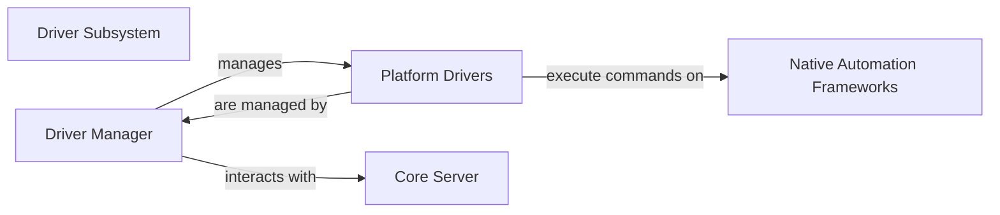

## Details

Analysis of Appium system components and their relationships, including Driver Subsystem, Driver Manager, Platform Drivers, Core Server, and Native Automation Frameworks.

### Driver Subsystem [[Expand]](./Driver_Subsystem.md)
Responsible for discovering, loading, initializing, and managing various platform-specific automation drivers (e.g., UiAutomator2 for Android, XCUITest for iOS). It provides a standardized interface for the Appium Core Server to interact with different automation backends, translating generic WebDriver commands into native automation framework calls. This subsystem is crucial for Appium's extensibility and multi-platform support, embodying the Adapter and Plugin architectural patterns.

**Related Classes/Methods**: _None_

### Driver Manager
This component is central to the Driver Subsystem, managing the entire lifecycle of automation drivers. Its responsibilities include discovering available drivers, dynamically loading them, and ensuring the correct driver instance is available for a given automation session. It acts as the primary interface between the Session Manager (part of the Core Server) and the specific Platform Drivers. The Driver Manager is architecturally important as it enables the "Plugin Architecture," allowing new platform drivers to be integrated seamlessly without modifying the core server logic, thus promoting modularity and scalability.

**Related Classes/Methods**: _None_

### Platform Drivers
These are concrete implementations of the driver interface, each tailored to a specific mobile or web automation platform (e.g., UiAutomator2 for Android, XCUITest for iOS). Their core responsibility is to translate generic WebDriver commands received from the Driver Manager into native API calls understood by the underlying automation framework of the target platform. Platform Drivers are architecturally significant as they embody the "Adapter Pattern," providing the essential abstraction layer that allows Appium to support diverse automation technologies while maintaining a consistent external interface.

**Related Classes/Methods**: _None_

### Core Server [[Expand]](./Core_Server.md)
Represents the central orchestrator of the Appium system. It manages client connections, session lifecycle, and routes automation commands to the appropriate `Driver Manager` and subsequently to the `Platform Drivers`. It acts as the primary interface for external clients (e.g., WebDriver test scripts).

**Related Classes/Methods**: _None_

### Native Automation Frameworks
These are external, platform-specific automation technologies (e.g., Android's UiAutomator2, iOS's XCUITest). They provide the low-level APIs that `Platform Drivers` interact with to perform actual UI automation on devices. They are external dependencies that Appium leverages.

**Related Classes/Methods**: _None_

### [FAQ](https://github.com/CodeBoarding/GeneratedOnBoardings/tree/main?tab=readme-ov-file#faq)