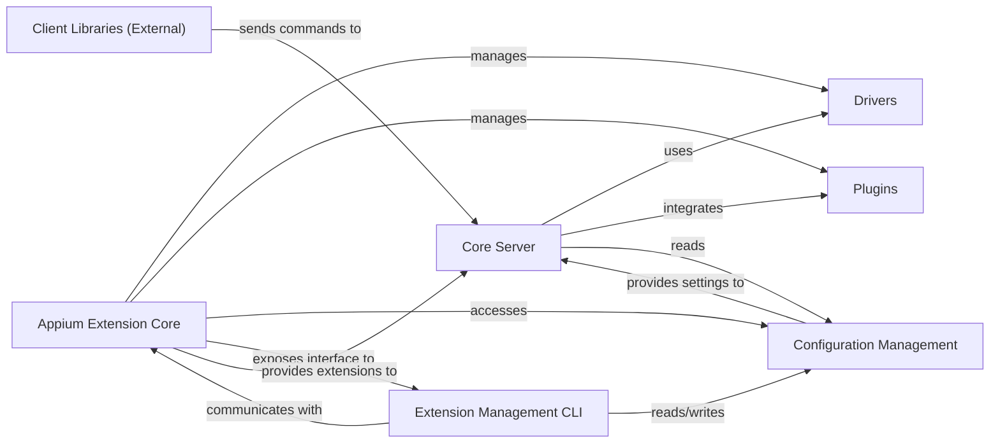

## Details

Abstract Components Overview

### Core Server [[Expand]](./Core_Server.md)
The central orchestrator of the Appium automation framework. It receives automation commands from clients, dispatches them to appropriate drivers, and manages the overall automation session lifecycle. It integrates with plugins to extend its capabilities.

**Related Classes/Methods**:

- `appium.lib.main`

### Drivers
Modular components responsible for interacting with specific automation technologies (e.g., Android, iOS, Web). They translate Appium commands into native automation calls and return results.

**Related Classes/Methods**:

- `appium.lib.extension.driver_config`
- `appium.lib.extension.index`

### Plugins
Extensible modules that add new features or modify existing behavior of the Appium server. They can hook into various stages of command processing or provide entirely new functionalities.

**Related Classes/Methods**:

- `appium.lib.extension.plugin_config`
- `appium.lib.extension.index`

### Client Libraries (External) [[Expand]](./Client_Libraries_External_.md)
External, language-specific libraries (e.g., Java, Python, Ruby) that provide an API for users to write automation scripts. They communicate with the Core Server using the WebDriver protocol.

**Related Classes/Methods**: _None_

### Configuration Management [[Expand]](./Configuration_Management.md)
Handles the loading, parsing, and persistence of Appium server and extension configurations. Ensures that the server and its components operate according to defined settings.

**Related Classes/Methods**:

- `appium.lib.config`
- `appium.lib.config_file`
- `appium.lib.schema`

### Appium Extension Core
An internal subsystem responsible for the discovery, loading, lifecycle management, and registry of Appium drivers and plugins. It acts as the central hub for all extension-related operations within the Appium ecosystem.

**Related Classes/Methods**:

- `appium.lib.extension.index`

### Extension Management CLI [[Expand]](./Extension_Management_CLI.md)
A dedicated command-line interface tool for managing Appium extensions (drivers and plugins). This includes functionalities like installing, uninstalling, updating, and listing available extensions, simplifying the management of Appium's modular components.

**Related Classes/Methods**:

- `appium.lib.cli.extension_command`
- `appium.lib.cli.driver_command`
- `appium.lib.cli.plugin_command`

### [FAQ](https://github.com/CodeBoarding/GeneratedOnBoardings/tree/main?tab=readme-ov-file#faq)