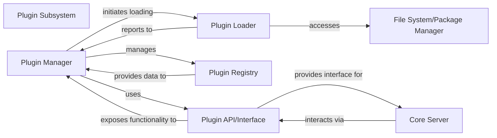

## Details

One paragraph explaining the functionality which is represented by this graph. What the main flow is and what is its purpose.

### Plugin Subsystem [[Expand]](./Plugin_Subsystem.md)
Manages the discovery, loading, and lifecycle of Appium plugins. Plugins extend Appium's functionality by adding new command handlers, modifying existing behaviors, or integrating with external services, promoting an extensible architecture.

**Related Classes/Methods**: _None_

### Plugin Manager
The central orchestrator responsible for the overall lifecycle management of plugins. It coordinates the discovery, loading, enabling, and disabling of plugins, ensuring they integrate seamlessly with the core server. It acts as the primary interface for the core server to interact with the plugin ecosystem.

**Related Classes/Methods**:

- `appium/lib/plugin/plugin-manager.js` (1:1)
- `appium/lib/plugin/plugin-controller.js` (1:1)

### Plugin Loader
Handles the technical aspects of locating plugin packages (e.g., from specified directories or npm modules) and dynamically loading their executable code into the Appium runtime. It performs initial validation to ensure plugins adhere to basic structural requirements before activation.

**Related Classes/Methods**:

- `appium/lib/plugin/plugin-loader.js` (1:1)
- `appium/lib/plugin/plugin-discovery.js` (1:1)

### Plugin Registry
A centralized data store that maintains a comprehensive catalog of all discovered, installed, enabled, and disabled plugins. It stores essential metadata for each plugin, such as its name, version, configuration, and current operational status, providing a single source of truth for plugin information.

**Related Classes/Methods**:

- `appium/lib/plugin/plugin-registry.js` (1:1)
- `appium/lib/plugin/plugin-data-store.js` (1:1)

### Plugin API/Interface
Defines the formal contract and set of functionalities that all Appium plugins must implement to interact with the core server. It also specifies the hooks, events, and services that the core server exposes to plugins, enabling them to extend commands, modify behaviors, or integrate with internal processes.

**Related Classes/Methods**:

- `appium/lib/plugin/plugin-api.js` (1:1)
- `appium/lib/plugin/base-plugin.js` (1:1)

### Core Server [[Expand]](./Core_Server.md)
The main Appium server that interacts with plugins.

**Related Classes/Methods**: _None_

### File System/Package Manager
Manages file system operations and package installations.

**Related Classes/Methods**: _None_

### [FAQ](https://github.com/CodeBoarding/GeneratedOnBoardings/tree/main?tab=readme-ov-file#faq)