```mermaid
graph LR
    Appium_Core_Server["Appium Core Server"]
    Driver_Subsystem["Driver Subsystem"]
    Plugin_Subsystem["Plugin Subsystem"]
    Configuration_Management["Configuration Management"]
    Extension_Management_CLI["Extension Management CLI"]
    Client_Libraries_External_["Client Libraries (External)"]
    Target_Device_Emulator_External_["Target Device/Emulator (External)"]
    Client_Libraries_External_ -- "Sends WebDriver commands to" --> Appium_Core_Server
    Appium_Core_Server -- "Routes commands to" --> Driver_Subsystem
    Appium_Core_Server -- "Integrates functionality from" --> Plugin_Subsystem
    Appium_Core_Server -- "Reads settings from" --> Configuration_Management
    Driver_Subsystem -- "Executes commands on" --> Target_Device_Emulator_External_
    Configuration_Management -- "Provides settings to" --> Driver_Subsystem
    Configuration_Management -- "Provides settings to" --> Plugin_Subsystem
    Extension_Management_CLI -- "Manages extensions in" --> Driver_Subsystem
    Extension_Management_CLI -- "Manages extensions in" --> Plugin_Subsystem
    click Appium_Core_Server href "https://github.com/CodeBoarding/GeneratedOnBoardings/blob/main/appium/Appium_Core_Server.md" "Details"
    click Driver_Subsystem href "https://github.com/CodeBoarding/GeneratedOnBoardings/blob/main/appium/Driver_Subsystem.md" "Details"
    click Plugin_Subsystem href "https://github.com/CodeBoarding/GeneratedOnBoardings/blob/main/appium/Plugin_Subsystem.md" "Details"
    click Configuration_Management href "https://github.com/CodeBoarding/GeneratedOnBoardings/blob/main/appium/Configuration_Management.md" "Details"
    click Extension_Management_CLI href "https://github.com/CodeBoarding/GeneratedOnBoardings/blob/main/appium/Extension_Management_CLI.md" "Details"
    click Client_Libraries_External_ href "https://github.com/CodeBoarding/GeneratedOnBoardings/blob/main/appium/Client_Libraries_External_.md" "Details"
```

## Details

Conceptual component analysis of Appium architecture based on available information, acknowledging limitations in providing specific source file references for internal components.

### Appium Core Server [[Expand]](./Appium_Core_Server.md)
The central orchestrator of Appium. It manages the server lifecycle, handles incoming client requests (WebDriver/W3C commands), routes these commands to the appropriate driver, and manages automation sessions. It exposes the primary API endpoints for clients.

**Related Classes/Methods**: _None_

### Driver Subsystem [[Expand]](./Driver_Subsystem.md)
Responsible for discovering, loading, initializing, and managing various platform-specific automation drivers (e.g., UiAutomator2 for Android, XCUITest for iOS). It provides a standardized interface for the Appium Core Server to interact with different automation backends, translating generic WebDriver commands into native automation framework calls.

**Related Classes/Methods**: _None_

### Plugin Subsystem [[Expand]](./Plugin_Subsystem.md)
Manages the discovery, loading, and lifecycle of Appium plugins. Plugins extend Appium's functionality by adding new command handlers, modifying existing behaviors, or integrating with external services, promoting an extensible architecture.

**Related Classes/Methods**: _None_

### Configuration Management [[Expand]](./Configuration_Management.md)
Handles the parsing, validation, and management of Appium's configuration settings. This includes server ports, driver paths, plugin settings, and other operational parameters, ensuring the server operates according to defined specifications.

**Related Classes/Methods**: _None_

### Extension Management CLI [[Expand]](./Extension_Management_CLI.md)
A dedicated command-line interface tool for managing Appium extensions (drivers and plugins). This includes functionalities like installing, uninstalling, updating, and listing available extensions, simplifying the management of Appium's modular components.

**Related Classes/Methods**: _None_

### Client Libraries (External) [[Expand]](./Client_Libraries_External_.md)
Language-specific libraries (e.g., Appium Java Client, Appium Python Client) that provide a convenient API for test scripts to interact with the Appium server. They translate user-friendly commands into WebDriver JSON Wire Protocol or W3C WebDriver Protocol requests.

**Related Classes/Methods**: _None_

### Target Device/Emulator (External)
The mobile device or emulator (physical or virtual) where automation actions are executed by the Drivers. This represents the environment Appium interacts with, rather than a software component of Appium itself.

**Related Classes/Methods**: _None_

### [FAQ](https://github.com/CodeBoarding/GeneratedOnBoardings/tree/main?tab=readme-ov-file#faq)