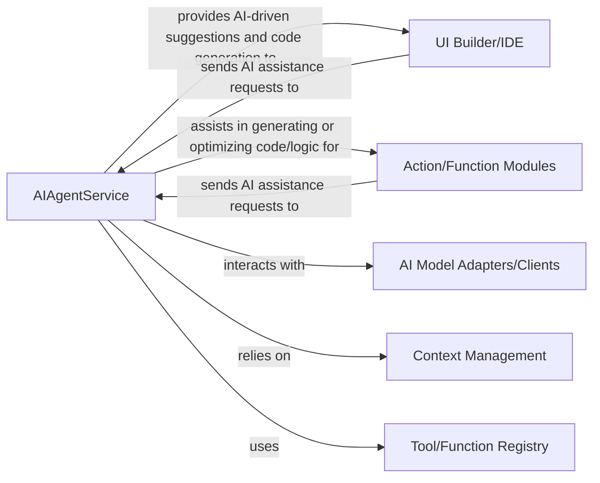

## Details

The project's architecture is centered around an AI-driven development workflow. The `UI Builder/IDE` serves as the user's primary interaction point, where development tasks are performed and AI assistance is requested. These requests are routed to the `AIAgentService`, the core orchestration component. The `AIAgentService` then intelligently interacts with `AI Model Adapters/Clients` to leverage various AI models, retrieves relevant information from `Context Management` to maintain conversational and project state, and consults the `Tool/Function Registry` to identify and utilize available platform capabilities. The AI-generated or optimized outputs are then applied to `Action/Function Modules`, which represent the functional building blocks of the application. This interconnected system ensures a seamless and intelligent development experience, with AI capabilities deeply integrated into the platform's core functionalities.

### AIAgentService
Core orchestrator of AI agent functionalities, managing AI interactions and integrating AI capabilities into the platform's development workflow. It is responsible for processing AI assistance requests, coordinating with AI models, managing context, and utilizing available tools to generate or optimize code and logic.

**Related Classes/Methods**:

### UI Builder/IDE [[Expand]](./UI_Builder_IDE.md)
The primary interface for users to interact with the platform, enabling the construction of user interfaces and providing a comprehensive development environment. It initiates requests for AI assistance to enhance the development process.

**Related Classes/Methods**:

### Action/Function Modules
A collection of modules that encapsulate the platform's operational logic and capabilities. These modules define specific actions and functions that can be generated, optimized, or invoked with AI assistance.

**Related Classes/Methods**:

### AI Model Adapters/Clients
Provides an abstraction layer for interacting with various internal or external AI models. This component is responsible for handling API calls, data formatting, and managing communication protocols specific to different AI services.

**Related Classes/Methods**:

### Context Management
Responsible for maintaining and providing contextual information relevant to AI interactions, including user session data, project details, conversation history, and other dynamic states. This ensures that AI agents have the necessary information to provide accurate and relevant assistance.

**Related Classes/Methods**:

### Tool/Function Registry
A centralized repository that registers and provides access to all available tools and functions within the platform. AI agents query this registry to discover and utilize appropriate tools to perform specific actions or retrieve information.

**Related Classes/Methods**:

### [FAQ](https://github.com/CodeBoarding/GeneratedOnBoardings/tree/main?tab=readme-ov-file#faq)