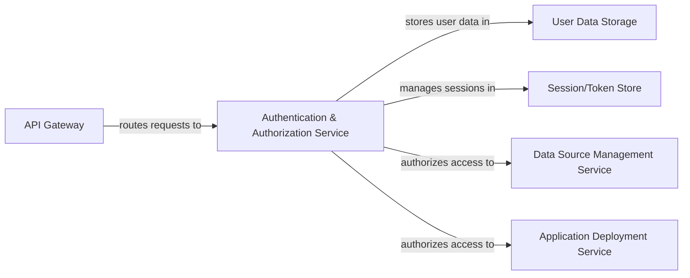

## Details

The system's core revolves around the `Authentication & Authorization Service`, which acts as the central authority for user identity and access control. All external requests first pass through the `API Gateway`, which routes authentication and authorization requests to this central service. The `Authentication & Authorization Service` relies on `User Data Storage` for persistent storage of user credentials and roles, and the `Session/Token Store` for managing active user sessions and tokens. Furthermore, it integrates with the `Data Source Management Service` and `Application Deployment Service` to enforce granular access control, ensuring users only interact with authorized data sources and deployed applications. This architecture establishes a secure and controlled environment for platform operations.

### Authentication & Authorization Service
The core component responsible for user authentication (login, registration, session management) and authorization (access control for platform features, resources, and deployed applications). It enforces security policies, supports granular access control, Role-Based Access Control (RBAC), integration with external identity providers, and API security.

**Related Classes/Methods**:

### API Gateway
Acts as the single entry point for all authentication and authorization requests, routing them to the `Authentication & Authorization Service` and other backend services. It handles initial request validation and security enforcement.

**Related Classes/Methods**:

### User Data Storage
A persistent storage solution (e.g., database) dedicated to securely storing user credentials, roles, permissions, and other identity-related information.

**Related Classes/Methods**:

### Session/Token Store
Manages the lifecycle of user sessions or authentication tokens (e.g., JWTs, OAuth tokens). It ensures efficient storage and retrieval of session data for active users.

**Related Classes/Methods**:

### Data Source Management Service
Manages the creation, modification, and access of data source configurations within the platform. The `Authentication & Authorization Service` interacts with it to authorize user access to specific data sources.

**Related Classes/Methods**:

### Application Deployment Service
Controls the deployment, management, and access of applications built on the platform. The `Authentication & Authorization Service` interacts with it to authorize user access to deployed applications.

**Related Classes/Methods**:

### [FAQ](https://github.com/CodeBoarding/GeneratedOnBoardings/tree/main?tab=readme-ov-file#faq)