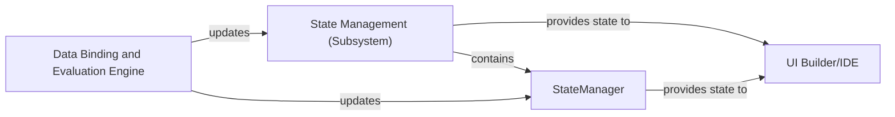

## Details

This analysis describes the core components and their interactions within a system, focusing on state management. The 'State Management (Subsystem)' is the central element, with 'StateManager' as its core. The 'Data Binding and Evaluation Engine' updates the state, and the 'UI Builder/IDE' consumes it for rendering. Source code references are provided where available, with placeholders for components whose source could not be retrieved.

### State Management (Subsystem)
The overarching subsystem responsible for managing the runtime state of the user's application, ensuring observability, predictability, performance, and extensibility. This is a fundamental component in an LCDP, enabling dynamic and interactive application behavior.

**Related Classes/Methods**: _None_

### StateManager
The core component within the State Management subsystem. It orchestrates and manages the application's runtime state, handling UI component states, global variables, application-wide settings, and integrating data from various sources to ensure consistency. This component is critical for the dynamic nature of LCDP applications.

**Related Classes/Methods**:

### Data Binding and Evaluation Engine
An external component responsible for evaluating expressions, updating data, and triggering actions. It plays a crucial role in updating the State Management system based on user interactions or data changes. This is essential for reactive UIs in an LCDP.

**Related Classes/Methods**: _None_

### UI Builder/IDE [[Expand]](./UI_Builder_IDE.md)
An external component that consumes the application state managed by the State Management subsystem. It is responsible for rendering and updating the user interface based on the current application state, providing the visual representation of the low-code application. This is the primary interface for users interacting with the built applications.

**Related Classes/Methods**: _None_

### [FAQ](https://github.com/CodeBoarding/GeneratedOnBoardings/tree/main?tab=readme-ov-file#faq)