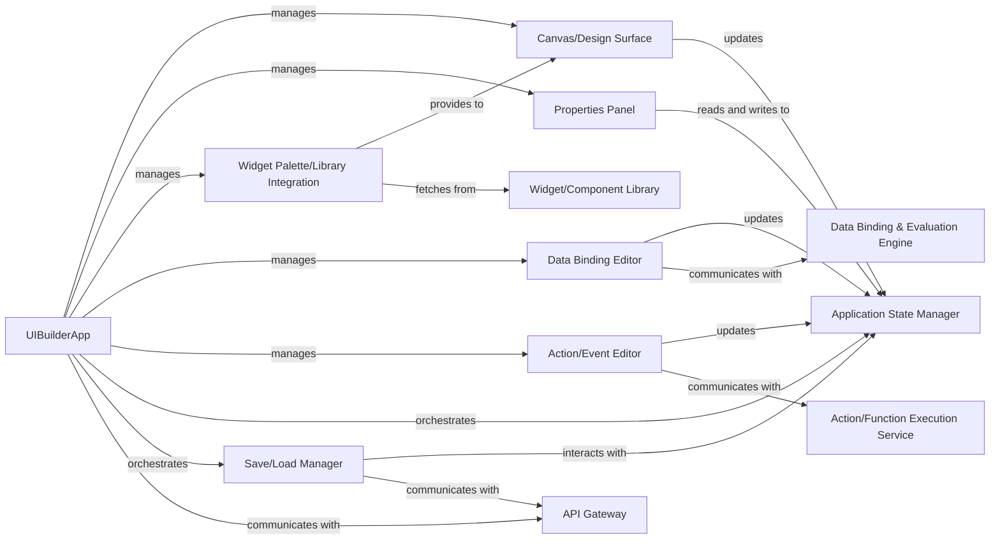

## Details

The UI Builder subsystem provides a comprehensive environment for visual application development. The `UIBuilderApp` acts as the central hub, coordinating various specialized components. The `Canvas/Design Surface` offers the interactive visual workspace, while the `Properties Panel` and `Widget Palette/Library Integration` facilitate widget configuration and selection. Data and event logic are managed through the `Data Binding Editor` and `Action/Event Editor`, respectively, which integrate with external execution engines. All design-time changes are consistently managed by the `Application State Manager`, ensuring a coherent representation of the application. Finally, the `Save/Load Manager` handles the persistence of the entire application definition by interacting with a backend `API Gateway`. This architecture ensures a clear separation of concerns, allowing for modular development and efficient management of the UI building process.

### UIBuilderApp
The central orchestrator of the UI building process. It initializes and manages the lifecycle of the design canvas, property panels, and various editors, delegating tasks to specialized internal components.

**Related Classes/Methods**:

- <a href="https://github.com/appsmithorg/appsmith/blob/release/app/client/src/pages/AppIDE/AppIDE.tsx" target="_blank" rel="noopener noreferrer">`UIBuilderApp`</a>

### Canvas/Design Surface
Renders the visual representation of the application being built, handling drag-and-drop operations, resizing, and positioning of widgets.

**Related Classes/Methods**:

- <a href="https://github.com/appsmithorg/appsmith/blob/release/app/client/src/pages/Editor/Canvas.tsx" target="_blank" rel="noopener noreferrer">`Canvas/Design Surface`</a>

### Widget Palette/Library Integration
Displays available widgets from the `Widget/Component Library` and facilitates their selection and addition to the canvas.

**Related Classes/Methods**:

- <a href="https://github.com/appsmithorg/appsmith/blob/release/app/client/src/pages/Editor/widgetSidebar/UIEntitySidebar.tsx" target="_blank" rel="noopener noreferrer">`Widget Palette/Library Integration`</a>

### Properties Panel
A dynamic interface that displays and allows users to configure the properties and attributes of selected widgets.

**Related Classes/Methods**:

- <a href="https://github.com/appsmithorg/appsmith/blob/release/app/client/src/pages/Editor/PropertyPane/index.tsx" target="_blank" rel="noopener noreferrer">`Properties Panel`</a>

### Data Binding Editor
A specialized interface for defining and managing data connections, expressions, and transformations for widgets, interacting with the `Data Binding & Evaluation Engine`.

**Related Classes/Methods**:

- <a href="https://github.com/appsmithorg/appsmith/blob/release/app/client/src/pages/Editor/PropertyPane/PropertyPaneConnections.tsx" target="_blank" rel="noopener noreferrer">`Data Binding Editor`</a>

### Action/Event Editor
An interface for users to define and configure event handlers and custom logic (e.g., JavaScript functions, API calls) triggered by user interactions or system events, interacting with the `Action/Function Execution Service`.

**Related Classes/Methods**:

- <a href="https://github.com/appsmithorg/appsmith/blob/release/app/client/src/PluginActionEditor/PluginActionEditor.tsx" target="_blank" rel="noopener noreferrer">`Action/Event Editor`</a>

### Application State Manager
Manages the real-time state of the application being designed, including widget hierarchy, properties, and data bindings.

**Related Classes/Methods**:

- <a href="https://github.com/appsmithorg/appsmith/blob/release/app/client/src/sagas/selectors.tsx" target="_blank" rel="noopener noreferrer">`Application State Manager`</a>

### Save/Load Manager
Handles the persistence of the application definition, communicating with the backend via the `API Gateway`.

**Related Classes/Methods**:

### API Gateway
External service for communication with the backend.

**Related Classes/Methods**: _None_

### Widget/Component Library
External repository or service providing available UI widgets and components.

**Related Classes/Methods**: _None_

### Data Binding & Evaluation Engine
External service responsible for processing and evaluating data bindings and expressions.

**Related Classes/Methods**: _None_

### Action/Function Execution Service
External service responsible for executing defined actions and functions.

**Related Classes/Methods**: _None_

### [FAQ](https://github.com/CodeBoarding/GeneratedOnBoardings/tree/main?tab=readme-ov-file#faq)