```mermaid
graph LR
    UI_Builder_IDE["UI Builder/IDE"]
    Data_Action_Management["Data & Action Management"]
    Query_Execution_Service["Query Execution Service"]
    State_Management["State Management"]
    API_Gateway["API Gateway"]
    Authentication_Authorization["Authentication & Authorization"]
    Application_Lifecycle_Management["Application Lifecycle Management"]
    AI_Agent_Service["AI Agent Service"]
    UI_Builder_IDE -- "dispatches actions to" --> State_Management
    State_Management -- "updates" --> UI_Builder_IDE
    UI_Builder_IDE -- "interacts with" --> AI_Agent_Service
    Application_Lifecycle_Management -- "manages applications from" --> UI_Builder_IDE
    Data_Action_Management -- "triggers and provides connection details to" --> Query_Execution_Service
    Data_Action_Management -- "uses" --> API_Gateway
    Data_Action_Management -- "interacts with" --> AI_Agent_Service
    Query_Execution_Service -- "makes requests via" --> API_Gateway
    Query_Execution_Service -- "sends data to" --> State_Management
    State_Management -- "triggers" --> Data_Action_Management
    API_Gateway -- "uses" --> Authentication_Authorization
    click UI_Builder_IDE href "https://github.com/CodeBoarding/GeneratedOnBoardings/blob/main/appsmith/UI_Builder_IDE.md" "Details"
    click State_Management href "https://github.com/CodeBoarding/GeneratedOnBoardings/blob/main/appsmith/State_Management.md" "Details"
    click Authentication_Authorization href "https://github.com/CodeBoarding/GeneratedOnBoardings/blob/main/appsmith/Authentication_Authorization.md" "Details"
    click AI_Agent_Service href "https://github.com/CodeBoarding/GeneratedOnBoardings/blob/main/appsmith/AI_Agent_Service.md" "Details"
```

## Details

This low-code/no-code platform facilitates application development through a visual UI Builder/IDE. Users define application logic and data interactions via Data & Action Management. When an application runs, the State Management component maintains its runtime state, dispatching actions that are processed by Data & Action Management. These actions often involve Query Execution Service to interact with external data sources, with all external communication routed through the API Gateway. Authentication & Authorization secures access to the API Gateway and other backend services. The AI Agent Service provides intelligent assistance throughout the development process, interacting with both the UI Builder/IDE and Data & Action Management. Finally, Application Lifecycle Management oversees the deployment and operational aspects of the created applications.

### UI Builder/IDE [[Expand]](./UI_Builder_IDE.md)
The visual development environment for designing applications.

**Related Classes/Methods**:

### Data & Action Management
Manages data source configurations and defines application logic/actions.

**Related Classes/Methods**:

### Query Execution Service
Executes defined actions and queries against data sources.

**Related Classes/Methods**:

### State Management [[Expand]](./State_Management.md)
Manages the runtime state of the user's application.

**Related Classes/Methods**:

### API Gateway
Centralizes all external API communication.

**Related Classes/Methods**:

### Authentication & Authorization [[Expand]](./Authentication_Authorization.md)
Handles user identity and access control.

**Related Classes/Methods**:

### Application Lifecycle Management
Manages the deployment and lifecycle of applications.

**Related Classes/Methods**:

### AI Agent Service [[Expand]](./AI_Agent_Service.md)
Provides AI-powered assistance for development.

**Related Classes/Methods**:

### [FAQ](https://github.com/CodeBoarding/GeneratedOnBoardings/tree/main?tab=readme-ov-file#faq)