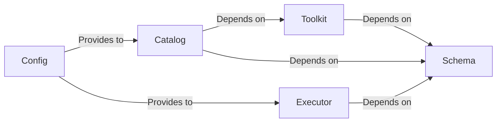

## Details

One paragraph explaining the functionality which is represented by this graph. What the main flow is and what is its purpose.

### Schema
Defines the foundational data contracts for the entire platform. It uses Pydantic models to ensure that all components, from tool definitions to execution results, adhere to a consistent and predictable data structure. This component is the ultimate source of truth for data representation.

**Related Classes/Methods**:

- `arcade_core/schema.py`

### Config
Manages engine-level configuration. It provides a centralized mechanism for initializing the system with the correct settings, such as authentication credentials, catalog locations, and other operational parameters.

**Related Classes/Methods**:

- `arcade_core/config.py`

### Toolkit
Serves as the primary organizational unit for developers, acting as a container for a collection of related tools. It is responsible for parsing and managing tool definitions based on the structures provided by the Schema component.

**Related Classes/Methods**:

- `arcade_core/toolkit.py`

### Executor
The core execution engine responsible for running a single tool with a given set of arguments. It validates inputs against the Schema and formats the results into a structured output, ensuring reliable and predictable tool execution.

**Related Classes/Methods**:

- `arcade_core/executor.py`

### Catalog
A high-level registry for discovering and managing Toolkits. It builds upon the Toolkit and Schema components by adding a layer for metadata and access control, making toolsets securely searchable and accessible across the platform.

**Related Classes/Methods**:

- `arcade_core/catalog.py`

### [FAQ](https://github.com/CodeBoarding/GeneratedOnBoardings/tree/main?tab=readme-ov-file#faq)